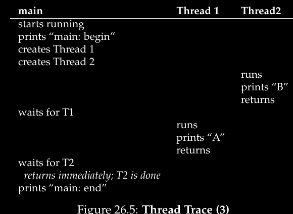

# ***CONCURRENCIA***

## ***Anotaciones sueltas***

### Tipos de interrupciones
- Interrupciones externas de hardware: mover el mouse
- Interrupciones que yo mismo produzco llamando a una syscall
- Interrupciones que se autoproducen por la ejecucion del programa: Segmentation fault, Page fault.

### Race condition
Hacer primero Test y luego Set provoca race conditions. Por ejemplo:

```c
if(m->flag == 0)
   m->flag = 1;
```

### Volatile
Volatile, es un tipo de variable, dice que nunca podemos suponer que si escribimos un valor por ejemplo 4, luego nunca vamos a poder que vale 4
La variable a la cual estoy marcando como volatil puede ser modifica por otro hardware. No necesariamente lo que escriba va a permanecer constante por mas que no la toque.

### Mythread
mythread es una función

### Hilos
Los hilos comparten variables globales, heap y código del programa del que son parte
Con concurrencia puede haber muchos hilos que concurrentemente estén tocando una variable.

### Race condition
Condición de carrera, es una lucha entre los hilos para ver quien agarra primero un pedazo de código. 

### No deterministico
No determinismo es cuando puede dar cualquier valor, por ejemplo 1 o 2 y no se la probabilidad de dicha cosa. Ausencia total del valor final que va tomar el programa

### Dynamic Voltage And Frequency Scaling (DVFS)
Regula el voltaje del procesador para cambiar su velocidad para que no se queme

## ***Threads o hilos***
Ahora vamos a introducir una nueva abstracción llamada ***threads o hilos***.

Anteriormente teníamos una noción algo pobre, asumíamos que siempre trabajábamos en un entorno single-thread, ahora vamos a hacerlo en uno multi-thread lo cual hace que tengamos mas de un punto de ejecución.

Una forma de pensar esto es como si se tratasen de procesos separados pero con una importante diferencia, comporten el mismo espacio de direccionamiento y por ende pueden acceder a la mismas direcciones e información.

### Diferencias mas en detalle
Tenemos un program counter (PC) que trackea de donde el programa esta tomando las instrucciones.

Cada thread tiene su propio set de registros. Por lo tanto si hubiera por ejemplo dos threads corriendo en un solo procesador cuando cambiemos de uno a otro se hace un context switch. El context switch entre threads es similar al de procesos, debemos guardar el estado del primer thread y restaurar el del segundo thread antes de volver a correrlo. En los procesos se guardaban en la process control block (PCB), ahora en los threads esto se guarda en el ***thread control block (TCBs)***. Notar que vamos a necesitar generalmente varios de estos. Ademas notar que cuando hacemos context switch ahora el espacio de direcciones no cambia.

Otra gran diferencia entre procesos y threads es con el stack. Si tenemos un solo thread no cambia nada, pero generalmente hay mas de uno haciendo que tengamos un multi-thread donde cada thread corre independientemente de los otros por lo que debe haber un stack para cada thread.


Entonces todo lo que pongamos en el stack como por ejemplo variables, parametros, valores de retorno y demas va a guardarse en un ***thread-local storage***.

Notar que el tener varios stacks arruina la idea de que crezca hacia arriba de forma teorica, pero en la practica los stack son pequeños por lo que no hay problema con ellos.

### ¿Por que usar threads?
Hay dos motivos principales por los cuales usar threads
#### Primer motivo: Paralelismo
Supongamos que estamos haciendo un programa que hace operaciones con arrays muy largos, si lo corremos en un solo procesador corre hasta que este listo. Si lo corremos con varios procesadores podemos disminuir el walltime. Esto se llama paralelizacion y es usual dejar un thread para que haga esto.

#### Segundo motivo: Evitar bloquear programas por I/O lentos
Imaginemos que escribimos un programa que hace varios I/O. Mientras espera la respuesta queremos que nuestro programa haga algo, usar threads es una forma de solucionar esto, el CPU scheduler puede cambiar a otro thread que esten en ready. Se conoce esto como ***threading*** lo cual activa ***overlap*** (o sea superponer I/O con otras actividades).

Obviamente podriamos usar multiples programas en lugar de threads, pero como los threads comparten el espacio de direccionamiento es mas facil compartir memoria entre ellos.

***Intercambiar de hilos es muy barato, solo hay que cambiar el CR3.*** Simplemente ahora el stack es otro.

### Ejemplo de creacion de un thread
Supongamos que queremos correr un programa que crea dos threads que hacen cosas independientes, en este caso uno imprime "A" y otro "B". El codigo es el siguiente:

```c
#include <stdio.h>
#include <assert.h>
#include <pthread.h>
#include "common.h"
#include "common_threads.h"

void *mythread(void *arg) {
	printf("%s\n", (char *) arg);
	return NULL;
}
int
main(int argc, char *argv[]) {
	pthread_t p1, p2;
	int rc
	printf("main: begin\n");
	Pthread_create(&p1, NULL, mythread, "A");
	Pthread_create(&p2, NULL, mythread, "B");
	// join waits for the threads to finish
	Pthread_join(p1, NULL);
	Pthread_join(p2, NULL);
	printf("main: end\n");
	return 0;
}
```

El main crea dos threads los cuales corren en mythread() y luego uno es ejecutado o puesto en ready segun el scheduler.

Luego de crear los dos threads, main llama phthread_join() que espera que un thread particular termine y lo hace dos veces para asegurarse de que los dos threads corran antes de permitir al main que corra otra vez. Cuando lo haga se printea "main: end" y se termina.

Entonces el orden de ejecucion que tenemos es el siguiente:


Pero notemos que no el unico caso posible, dependiendo del schduler se pueden dar otros como por ejemplo que cuando se cree el thread corra inmediatamente:


Tambien podria darse el caso en que imprima primero "B" y luego "A"



### Shared data
Veamos un ejemplo en el cual se comparte informacion: tenemos dos threads que quieren actualizar una variable global

```c
#include <stdio.h>
#include <pthread.h>
#include "common.h"
#include "common_threads.h"
static volatile int counter = 0;
// mythread()
//
// Simply adds 1 to counter repeatedly, in a loop
// No, this is not how you would add 10,000,000 to
// a counter, but it shows the problem nicely.
//
void *mythread(void *arg) {
	printf("%s: begin\n", (char *) arg);
	int i;
	for (i = 0; i < 1e7; i++) {
		counter = counter + 1;
	}
	printf("%s: done\n", (char *) arg);
	return NULL;
}
// main()
//
// Just launches two threads (pthread_create)
// and then waits for them (pthread_join)
//
int main(int argc, char *argv[]) {
	pthread_t p1, p2;
	printf("main: begin (counter = %d)\n", counter);
	Pthread_create(&p1, NULL, mythread, "A");
	Pthread_create(&p2, NULL, mythread, "B");
}
// join waits for the threads to finish
Pthread_join(p1, NULL);
Pthread_join(p2, NULL);
printf("main: done with both (counter = %d)\n",
counter);
return 0;
```

Luego si corremos este codigo generalmente nos debe dar 2millones el cual es el resultado esperado:

```js
prompt> gcc -o main main.c -Wall -pthread; ./main
main: begin (counter = 0)
A: begin
B: begin
A: done
B: done
main: done with both (counter = 20000000)
```

Pero puede darse el caso en que pase lo siguiente:

```js
prompt> ./main
main: begin (counter = 0)
A: begin
B: begin
A: done
B: done
main: done with both (counter = 19345221)
```

O también podría pasar esto:

```js
prompt> ./main
main: begin (counter = 0)
A: begin
B: begin
A: done
B: done
main: done with both (counter = 19221041)
```

Esto pasa por algo llamado uncontrolled scheduling.

### Uncontrolled scheduling
Para entender porque se dan estos casos debemos entender el segmento de código que actualiza a *"counter"*. En este caso simplemente queremos ir agregandole 1. El assembly seria el siguiente:

```js
mov 0x8049a1c, %eax
add $0x1, %eax
mov %eax, 0x8049a1c
```

En este código la instrucción **mov** obtiene el valor de la dirección **0x8049a1c** y lo pone en el registro **eax**. Luego agregamos 1 al registro **eax** y por ultimo guardamos el contenido de **eax** en la dirección de donde lo habíamos sacado originalmente actualizando así esta.

#### Ejemplo que podría pasar
Tenemos dos threads.

Supongamos que thread 1 entra a esta región de código, carga el valor del **counter** (supongamos que vale 50) en el registro **eax**, luego agrega 1 al **eax** pero sucede un timer interrupt por lo que el OS guarda el estado del thread en el threads control block (TCBs).

Ahora supongamos que pasa algo todavía peor, el scheduler elige al thread 2 para correr, entonces ejecuta la primera instrucción y como los threads tienen sus propios registros el valor que carga es 50, luego le suma 1 y lo termina guardando de nuevo en el registro de donde lo saco. Por lo que el valor de la dirección 0x8049A1C es 51.

Ahora supongamos que hay otro context switch y volvemos con el thread 1, por lo que resume en donde lo dejo y ejecuta la ultima instrucción que le faltaba "sobrescribiendo" el valor de 0x8049A1C con 51 pero este valor es el mismo que el anterior. Entonces vemos que en este caso no estaríamos sumando como querríamos ya que nos debería haber dado 52 bajo circunstancias normales. Ahora pensemos que como este programa hace millones de sumas esto podría pasar varias veces y por eso es posible que de valores distintos en cada ejecución.


#### Race condition
Con lo anterior demostramos el fenómeno conocido como ***race condition*** (o mas específicamente para este caso ***data race***) ya que los resultados dependen del timing de la ejecución. 

#### Deterministic y indeterminate
Con un poco de mala suerte podemos obtener resultados incorrectos en lugar de uno ***deterministico*** como se esperaría de una computadora. Cuando sucede que obtenemos el resultado incorrecto decimos que tenemos un resultado ***indeterministico*** ya que no sabemos cual va a ser la salida y puede variar según lo corramos.

#### Critical section
Cuando multiples threads ejecutando una parte del código puede provocar una race condition llamamos a esa parte ***critical section***, una parte del código que accede a una variable global o recurso compartido la cual no debe ser ejecutada de manera concurrente por mas de un thread.

#### Mutual exclusion
Lo que queremos para esa parte del código es una ***mutual exclusion*** lo cual nos garantiza que si un thread esta ejecutando una critical section los otros threads no podrán hacerlo.

### Atomicidad
Con "atómico" nos referimos a "una unidad" o "todo o nada".

Una forma de solucionar ese problema seria tener una instrucción mas poderosa que en un solo paso haga exactamente lo que queremos evitando así las posibles interrupciones. Por ejemplo algo así (aunque no existe esta instrucción):

```js
memory-add 0x8049a1c, $0x1
```

Vemos que una instrucción así se ejecutaría de manera atómica y por ende no podría ser interrumpida en mitad de se ejecución porque es precisamente lo que nos garantiza el hardware: cuando una interrupción ocurra la instrucción ya fue ejecutada en su totalidad o no fue ejecutada, no hay un estado medio.

### Synchronization primitives
Volviendo a nuestro caso real, no tenemos una instrucción así de poderosa por lo que debemos ejecutarlas como son:

```js
mov 0x8049a1c, %eax
add $0x1, %eax
mov %eax, 0x8049a1c
```

Podemos construir un set de lo que llamaríamos ***synchronization primitives*** la cual es una ayuda del hardware. Usando esto y con un poco de ayuda del SO podríamos construir un multi-thread code que acceda a las secciones criticas de una manera controlada y sincronizada para producir así el resultado esperado.

### Creacion de threads
La primera cosa que hay que hacer para escribir programas multi-thread es crear nuevos threads, se hace de la siguiente manera:

```c
#include <pthread.h>
int
pthread_create(pthread_t    *thread,
        const pthread_attr_t *attr,
        void    *(*start_routine)(void*),
        void    *arg);
```

Vemos que hay 4 argumentos:

- ***thread***: puntero a una estructura de tipo **pthread_t**, estructura la cual usamos para interactuar con este thread por lo que necesitamos pasarlo a **pthread_create()** para inicializarlo.
- ***attr***: se usa para especificar cualquier atributo que el thread pueda tener *por ejemplo el tamaño del stack o informacion sobre prioridad del planificador en el thread.* Generalmente le pasamos el valor NULL.
- ***start_routine***: es la mas compleja, nos debemos preguntar: ¿Que funcion debe comenzar a correr el thread?. En C llamamos a esto funcion puntero (o function pointer). Le pasamos void como argumento y devuelve void. (Tener un puntero void como argumento de esta funcion nos permite pasarle cualquier tipo de argumento. Tenerlo como return nos permite que el thread haga return de cualquier valor)
- ***arg***: es el argumento exacto que va a ser pasado a la funcion cuando el thread comience.

#### Ejemplo
En este ejemplo creamos un thread, le pasamos dos argumentos empaquetados (*myarg_t*). Una vez creado el thread simplemene casteamos su argumento con el tipo que espera y asi desempaquetamos.

Cuando creamos un thread tenemos otra live execution entity con su propio stack, corriendo en el mismo espacio de direcciones con los otros threads.

```c
#include<pthread.h>
#include<stdio.h>

typedef struct {
    int a;
    int b;
} myarg_t;

void *mythread(void *arg) {
    myarg_t *args = (myarg_t *) arg;
    printf("%d %d\n", args->a, args->b);
    return NULL;
}

int main(int argc, char *argv[]) {
    pthread_t p;
    myarg_t args = { 10, 20 };
    
    int rc = pthread_create(&p, NULL, mythread, &args);
    ...
}
```

### Esperar hasta que un thread termine
Si queremos esperar hasta que un thread termine debemos usar la rutina ***pthread_join()***:

```c
int pthread_join(pthread_t thread, void **value_ptr);
```

Esta rutina toma dos argumentos:

- ***phtread_t***: es usado para especificar por que thread esperar. Es inicializada por el thread creation routine (*pthread_create()*).
- El segundo argumento es un puntero hacia el valor de retorno que esperamos obtener. Como la rutina puede devolver cualquier cosa usamos void. Como *pthread_join()* routine cambia el valor del argumento pasado necesitamos pasar otro en un puntero hacia ese valor, no el valor en si y por eso es que usamos otro void.

#### Ejemplo 2
Veamos otro ejemplo: un solo thread es creado y se le pasa un par de argumentos via la estructura **myarg_t**. Para los valores de retorno el tipo **myret_t**. Una vez que el thread termine de correr el main thread que estaba esperando dentro de **pthread_join()** hace return y podemos acceder a los valores del thread que esta nombrado en **myret_t**.

```c
typedef struct { int a; int b; } myarg_t;
typedef struct { int x; int y; } myret_t;

void *mythread(void *arg) {
    myret_t *rvals = Malloc(sizeof(myret_t));
    rvals->x = 1;
    rvals->y = 2;
    return (void *) rvals;
}

int main(int argc, char *argv[]) {
    pthread_t p;
    myret_t *rvals;
    myarg_t args = { 10, 20 };
    Pthread_create(&p, NULL, mythread, &args);
    Pthread_join(p, (void **) &rvals);
    printf("returned %d %d\n", rvals->x, rvals->y);
    free(rvals);
    return 0;
}
```

Notemos algunas cosas:

1. Primero que algunas veces no es necesario empaquetar y desempaquetar los argumentos. Podriamos crear el thread sin argumentos pasandole NULL.
2. Si estamos pasando solo un valor (por ejemplo un long int) no es necesario empaquetarlo como argumento. 
3. Tenemos que ser muy cuidados con como los valores retornan del thread, especialmente nunca retornar un puntero que refiera a algo alojado en el thread's call stack.

## Locks
Los locks son funciones caras en rendimiento que proveen exclusión mutua a una región. Las rutinas mas básicas son:

```c
int pthread_mutex_lock(pthread_mutex_t *mutex);
int pthread_mutex_unlock(pthread_mutex_t *mutex);
```

Cuando tenemos una región de código que es una ***región critica*** y necesitamos protegerla para asegurar la operacion los locks son utiles. Por ejemplo podemos hacer lo siguiente:

```c
pthread_mutex_t lock;
pthread_mutex_lock(&lock);
x = x + 1; // or whatever your critical section is
pthread_mutex_unlock(&lock);
```

Si ningun otro thread tiene el lock cuando *pthread_mutex_lock()* es llamado el thread va a obtener el lock y entrar a la seccion critica. Si otro thread intenta hacer obtener el lock, el mismo no va a retornar hasta que lo obtenga lo cual implica que para ello el thread que tenia el lock debe haberlo dejado via **unlock**. Por lo tanto los thread pueden quedarse trabados esperando.

Aunque debemos notar algunas cosas, ya que el codigo anterior esta mal por dos importantes razones:

1. Falta de inicializacion, debemos iniciar el lock y se puede hacer de dos maneras:

	 - Usando **PTHREAD_MUTEX_INITILIZER**:

```c
pthread_mutex_t lock = PTHREAD_MUTEX_INITIALIZER;
```

setea el lock a los valores de defecto y lo hace usable.

- 
	- De manera dinamica haciendo una llamada a **pthread_mutex_init()**

```c
int rc = pthread_mutex_init(&lock, NULL);
assert(rc == 0); // always check success!
```

Donde el primer argumento de la rutina es la direccion del lock en si y el segundo es set de atributos el cual es opcional.

Aunque ambas formas funcionan ***normalmente usamos la forma dinamica***. Notemos tambien que es necesario realizar una llamada a **pthread_destroy()** cuando terminamos de hacer lo que queriamos con el lock.

2. El segundo problema con el codigo es que falla al chequear errores, habria que hacer algo asi:

```c
// Keeps code clean; only use if exit() OK upon failure
void Pthread_mutex_lock(pthread_mutex_t *mutex) {
    int rc = pthread_mutex_lock(mutex);
    assert(rc == 0);
}
```

### Condition variables
Las podemos pensar como esperas hasta que se cumplan una condicion.

El otro componente mayor de la libreria threads son las ***condition variables*** las cuales son utiles cuando queremos señalizar algo entre threads, por ejemplo si un thread esta esperando que otro haga algo antes de continuar. Las dos rutinas para esto son:

```c
int pthread_cond_wait(pthread_cond_t *cond,
                      pthread_mutex_t *mutex);
int pthread_cond_signal(pthread_cond_t *cond);
```

La primera rutina **pthread_con_wait**() pone el thread llamado a dormir esperando que otro thread lo señalice lo cual usualmente se da cuando algo en el programa cambio y que el thread que se durmio debe tener en cuenta. 

#### Ejemplo
Un ejemplo de uso tipico es el siguiente:

```c
pthread_mutex_t lock = PTHREAD_MUTEX_INITIALIZER;
pthread_cond_t cond = PTHREAD_COND_INITIALIZER;

Pthread_mutex_lock(&lock);
while (ready == 0)
    Pthread_cond_wait(&cond, &lock);
Pthread_mutex_unlock(&lock);
```

En este codigo luego de inicializacion del lock y de la condicion, un thread verifica si la variable **ready** es distinto que 0. Si no lo es el thread llama a la rutina wait para dormir el trhead hasta que otro thread lo despierte.

#### Wakeup thrad
El codigo para despertar un thread es el siguiente:

```c
Pthread_mutex_lock(&lock);
ready = 1;
Pthread_cond_signal(&cond);
Pthread_mutex_unlock(&lock);
```

Notemos algunas cosas de esta secuencia de codigo:

1. Cuando señalizamos debemos asegurarnos de tener el lock para asi evitar una race condition.
2. Vemos que la wait call toma el lock como segundo parametro mientras que el signal call toma solo un parametro. El motivo de esto es que la wait call ademas de hacer que el thread se duerma libera el lock cuando lo pone a dormir. Luego cuando se despierta recupera el lock con **pthread_cond_wait()**.
3. El thread que queda en waiting re-chequea la condition con un loop while.

### Compilacion y como correr
Incluimos la libreria **pthread.h**. Luego en la link line debemos especificar el link con la pthread library agregando la flag **-pthread**. Por ultimo para correrlo hacemos:

```js
prompt> gcc -o main main.c -Wall -pthread
```

## ***Locks***
### Introducción
Un lock es una variable y por eso es necesario declararlo (por ejemplo con mutex). Estos guardan el estado de lock en todo momento los cuales son **available(unlocked o free)** o **acquired(locked o held)**. También pueden guardar otra información como que trhead tiene el lock o una lista para el orden en que se hará acquired pero esta información esta escondida del usuario.

### Como funcionan
El funcionamiento de **lock()** y **unlock()** es sencillo: Llamando a *lock()* tratamos de adquirir el lock, si ningún otro thread lo tiene (o sea si esta free) lo acquire (adquirimos) y entramos a la seccion critica (esto generalmente se conoce como **owner del lock**). Si otro thread hace lock() de la misma variable de lock no va a retornar mientras el lock lo tenga otro thread.

Una vez que el owner hace *unlock()* el lock esta disponible. Si ningún otro thread esta esperando por el lock se pone en estado free. En cambio si hay threads esperando (estancados en lock() esperando) eventualmente notaran o serán informados que el lock esta libre y lo tomaran.

Para usarlos agregamos un poco de código alrededor de la sección critica:

```c
lock_t mutex; // some globally-allocated lock ’mutex’
...
lock(&mutex);
balance = balance + 1;
unlock(&mutex);
```

### Pthreads
El nombre que se la da a los locks en POSIX es ***mutex***:

```c
pthread_mutex_t lock = PTHREAD_MUTEX_INITIALIZER;

Pthread_mutex_lock(&lock); // wrapper; exits on failure
balance = balance + 1;
Pthread_mutex_unlock(&lock);
```

En lugar de tener un bloque grande que es usado cada vez que accedemos a la sección critica es mejor tener distintos locks que protejan la información permitiéndonos que varios threads tengan lock a la vez.

### Contruir un lock
Para construir un lock es necesario ayuda del hardware y del SO. Veremos la ayuda del SO mas en detalle.

### Evaluar el lock
Antes de propiamente construir el lock es necesario evaluarlo para saber si sera útil o no. El criterio que usaremos consta de 3 puntos claves:

- **Mutual exclusión**: Tenemos que asegurarnos que el lock previene que múltiples threads accedan al lock asegurando la exclusión mutua.
- **Fairness**: Hay que asegurarse que todos los threads que quieren el lock eventualmente lo obtengan y ninguno sufra de **starvation**.
- **Performance**: Usar lock empeora el rendimiento pero hay que ver cuanto porque hay varios casos. Un caso es del **no contention** donde un solo thread esta corriendo adquiere el lock y luego lo suelta. Otro es el caso en que múltiples threads están compitiendo por el lock con un solo CPU. También esta el caso en que haya múltiples CPUS... 

### Controlar las interrupciones 
Una de las primeras y mas primitivas soluciones para asegurar la exclusion mutua era desactivar las interrupciones en las secciones criticas, fue inventado para procesadores con un solo CPU.

```c
void lock() {
    DisableInterrupts();
}
void unlock() {
    EnableInterrupts();
}
```

De esta manera nos aseguramos que el código dentro de la sección critica no sera interrumpido y que se ejecutara como si fuera atómico. Cuando se termine le ejecución de la sección critica activamos de nuevo las interrupciones.

Lo positivo de esta implementacion es su sencillez pero tiene muchos **puntos negativos**:

- La implementacion requiere una operación privilegiada por lo que es necesario confiar en el código.
- No funciona con múltiples CPUS
- Desactivar las interrupciones por largos periodos de tiempo puede provocar fallos o perdida de información en el sistema.

### Usar loads y stores (Fallido)
Veamos una implementacion fallida la cual nos dará una idea general. Para ello usaremos una sola variable y accederemos a ella via loads y stores. El código es el siguiente:

```c
typedef struct __lock_t { int flag; } lock_t;

void init(lock_t *mutex) {
    // 0 -> lock is available, 1 -> held
    mutex->flag = 0;
}

void lock(lock_t *mutex) {
    while (mutex->flag == 1) // TEST the flag
         ; // spin-wait (do nothing)
    mutex->flag = 1;
 // now SET it!
}

void unlock(lock_t *mutex) {
    mutex->flag = 0;
}
```

La idea es sencilla, usar la variable flag para indicar si algún thread tiene el lock o no. El primer thread que entre a la sección critica llama a lock() el cual verifica si la flag es 1 o no, si no lo es la setea en 1 para indicar que ahora tiene el lock. Cuando termina llama a unlock y pone flag en 0. Si otro thread llama a lock cuando no esta libre entra en un **spin-wait** hasta que lo este.

El código tiene dos problemas, uno de **correctness** y otro de **performance**:

Imaginemos que el código se intercala de la siguiente manera cuando flag=0


Vemos que se produce un caso en que ambos threads setean flag=1 y por ende ambos entran a la seccion critica.

En cuanto el problema de performance se da cuando un thread espera que otro libre el lock porque queda infinitamente chequeando el valor de flag, queda en lo que se conoce como un **spin-wait**.

### Construir spin locks con Test-And-Set
Porque las implementacion anteriores no fueron utiles fue necesario crear otra, esta se conoce como la instruccion **test-and-set(o atomic exchange)**, funciona con el siguiente codigo:

```c
int TestAndSet(int *old_ptr, int new) {
	int old = *old_ptr; // fetch old value at old_ptr
	*old_ptr = new;     // store ’new’ into old_ptr
	return old;         // return the old value
}
```

Devuelve el valor viejo apuntado por `old_ptr` y simultáneamente lo actualiza al nuevo valor `new`. Se llama test-and-set porque nos permite testear el valor antiguo a la vez que seteamos el lugar de memoria del nuevo valor por lo que es una instruccion lo suficientemente poderosa como para construir un **spin lock**. Entonces veamos un ejemplo de ello:

```c
typedef struct __lock_t {
	int flag;
} lock_t;

void init(lock_t *lock) {
	// 0: lock is available, 1: lock is held
	lock->flag = 0;
}

void lock(lock_t *lock) {
	while (TestAndSet(&lock->flag, 1) == 1)
		; // spin-wait (do nothing)
}

void unlock(lock_t *lock) {
	lock->flag = 0;
}
```

Imaginemos un caso en que llamamos a lock() y esta libre por lo que flag=0. Cuando el thread llame a TestAndSet(flag=1) la rutina devolvera el valor viejo de flag el cual es 0 haciendo que el thread que estaba llamando a lock el cual ahora esta testando el valor de flag no caiga en un spin-wait y adquiera el lock. Finalmente cambia el valor a 0 y hace sus cosas hasta que libera el lock y pone flag en 0.

El segundo caso que nos podemos imaginar es que un thread ya tiene el lock. En este caso el thread que quiere el lock llama a lock() y a TestAndSet(flag, 1) pero esta vez este ultimo devuelve el valor viejo de flag el cual es 1 porque el lock esta ocupado a la vez que pone flag en 1 de nuevo. Hasta que no se libere el lock, flag sera 1 cayendo en un spin hasta que se libere. Cuando se libera sucede todo con normalidad.

Entonces haciendo el test del valor viejo y actualizando al nuevo valor en la misma operacion nos aseguramos que sea atomico.

#### Spin lock
Se llama spin lock porque esta en spin consumiendo CPU hasta que el lock este free.

### Peterson's algorithm
Este es un algoritmo que solucino los problemas con los locks:

```c
intintflag[2];
turn;

void init() {
	// indicate you intend to hold the lock w/ ’flag’
	flag[0] = flag[1] = 0;
	// whose turn is it? (thread 0 or 1)
	turn = 0;
}
void lock() {
	// ’self’ is the thread ID of caller
	flag[self] = 1;
	// make it other thread’s turn
	turn = 1 - self;
	while ((flag[1-self] == 1) && (turn == 1 - self))
		; // spin-wait while it’s not your turn
}
void unlock() {
	// simply undo your intent
	flag[self] = 0;
}
```

Posteriormente cayo en deshuso.

### Evaluemos el spin lock
Evaluemos la implementacion del spin lock propuesta (no la de peterson, la anterior):

Lo mas importante es si cumple el correctness o sea si da exclusion mutua lo cual es verdadero.

El siguiente punto es fariness, o sea si podemos asegurar los threads no sufran de starvation lo cual falla ya que es posible que un thread quede en spin infinitamente.

El ultimo punto es la performance. Aca nos tenemos que imaginar distintos escenarios. Primero supongamos que tenemos solo una CPU por lo que el rendimiento sera malo ya que mientras que un thread tiene el lock y esta en la seccion critica y otros threds quieren el lock estos tendran que ejecutarse para decirles que no pueden obtener el lock consumiendo ciclos de CPU.

En cambio si hay varios CPUS el rendmiento mejora ya que a esas comprobaciones las puede hacer otro CPU.

### Compare and swap
Es otra implementacion primitiva, se conoce como compare-and-swap o compare-and-exchange. Es una ayuda del hardware. Su codigo en C es el siguiente:

```c
int CompareAndSwap(int *ptr, int expected, int new) {
	int original = *ptr;
	if (original == expected)
		*ptr = new;
	return original;
}
```

Es muy similar a Test-And-Set, lo unico que cambia es el lock():

```c
void lock(lock_t *lock) {
	while (CompareAndSwap(&lock->flag, 0, 1) == 1)
		; // spin
}
```

### Load-linked and Store-Conditional
El código es el siguiente:

```c
int LoadLinked(int *ptr) {
	return *ptr;
}

int StoreConditional(int *ptr, int value) {
	if (no update to *ptr since LL to this addr) {
		*ptr = value;
		return 1; // success!
	} else {
		return 0; // failed to update
	}
}
```

La diferencia de esta implementacion con otras es en la parte de Store-Conditional. Solo es correcta (actualizando el valor guardado) si no se intervino en el store. En caso de exito devuelve 1 y se actualiza **ptr** con el valor de **value**. Si falla, **ptr** no es actualizado y se devuelve 0.

Ahora veamos como hacer un lock con Load-Linked and Store-Conditional

```c
void lock(lock_t *lock) {
	while (1) {
		while (LoadLinked(&lock->flag) == 1)
			; // spin until it’s zero
		if (StoreConditional(&lock->flag, 1) == 1)
			return; // if set-to-1 was success: done
					// otherwise: try again
	}
}

void unlock(lock_t *lock) {
	lock->flag = 0;
}
```

Esta es la parte interesante. Primero un thread hace spin esperando que **flag** se haga 0 (lo que indica que el lock no fue tomado). Una vez que el thread adquiere el lock via el Store-Conditional si tiene exito el thread atomicamente cambia el valor de flag a 1.

En caso de fallo, una vez que el thread llame a lock() y ejecute el Load-Linked devuelve 0. Antes de que pueda ejecutar el Store-Conditional es interrumpido y otro thread entra en el lock ejecuta el Load-Linked y obtiene tambien un 0.

En este punto dos threads ejecutaron Load-Linked y estan por ejecutar Store-Conditional pero solo uno de ellos va a ser capaz de setear flag en 1 mientras que el otro va a fallar.

### Fetch-And-Add
Es otra de las instrucciones primitivas. Atomicamente incrementa el valor retornando el valor viejo en una direccion particular. El codigo es el siguiente:

```c
int FetchAndAdd(int *ptr) {
	int old = *ptr;
	*ptr = old + 1;
	return old;
}
```

Ahora veamos como construir un lock:

```c
typedef struct __lock_t {
	int ticket;
	int turn;
} lock_t;

void lock_init(lock_t *lock) {
	lock->ticket = 0;
	lock->turn = 0;
}

void lock(lock_t *lock) {
	int myturn = FetchAndAdd(&lock->ticket);
	while (lock->turn != myturn)
		; // spin
}

void unlock(lock_t *lock) {
	lock->turn = lock->turn + 1;
}
```

En lugar de usar un solo valor esta implementacion utiliza un **ticket** y una variable de **turno** en combinacion para hacer el lock.

La operacion es simple: cuando un thread quiere adquirir un lock primero hace un Fetch-And-Add en la varriable **ticket**. Ese valor ahora contiene el valor **de quien es el turno (myturn)**. 

El registro global **lock->turn** es usado para determinar de que thread es el turno. Cuando **myturn == turn** para algun thread entonces es su turno para entrar en la seccion critica. 

Notemos una diferencia entre esta implementacion con las anteriores: se asegura que todos los threads puedan acceder al lock. Al usar un sistema de tickets el cual le asigna a cada thread un valor del ticket, nos aseguramos que en algun momento vaya a correr.

### Yield
#### Problematica
En algunas situaciones las implementaciones anteriores pueden ser ineficientes. Imaginemos que hay dos threads corriendo en un solo procesador. Tambien imaginemos que el *thread0 esta en la seccion critica y tiene el lock pero justo es interrumpido*. El *thread1 trata de adquirir el lock pero esta ocupado* por lo que empieza a hacer **spin** hasta que ocurre una interrupcion y thread0 corre de nuevo, termina y libera el lock. Luego thread1 va a poder adquirir el lock y hacer lo que deba.

Lo importante es notar que cuando un thread hace spin estamos desperdiciando un ciclo entero haciendo nada. El problema se vuelve peor cuando tenemos N threads porque N-1 estan haciendo nada. Entonces vemos que **es vital evitar el spinning**.

#### Solucion - yield()
Para poder evitar el spinning podemos darle al CPU otro thread para correr.

La funcion yield() cambia el estado del proceso que estaba corriendo de running a ready y promueve otro thread a running. Entonces vemos que el yield desplanifica el thread.

#### Sigamos con el ejemplo anterior
Pensemos en los dos threads que estaban corriendo en un solo CPU. En este caso si un thread llama a lock() se va a encontrar que el lock esta ocupado entonces hace yield al CPU por lo que otro thread va a correr y finalizar su seccion critica.

Ahora consideremos el caso en que hay 100 threads esperando por el lock. Si un thread adquiere el lock y se adelanta a liberarlo, los otros 99 threads van a llamar a lock(), se van a encontrar con que lock esta ocupado por lo que van a hacer yield al CPU. Asumiendo que tenemos algun tipo de RR cada uno de estos 99 van a ejecutar este run-and-yield pattern antes de que el thread que tiene el lock corra de nuevo.

Si bien esta implementacion tiene un costo que es hacer context switch es menor al costo de tener varios threads haciendo nada. 

Pero vemos que esta implementacion sufre de starvation porque un thread puede quedarse infinitamente en yield mientras otros threads entran y salen de la sección critica por que lo que otra implementacion sera necesaria.

### Sleep en lugar de Spinning
El problema real de las implementaciones anteriores (no la de tickets) es que dejan mucho en el aire porque es el scheduler el que decide quien es el siguiente en correr y si hace una mala elección el thread puede quedar en spin-waiting o hacer yield. En ambos casos hay rendimiento desperdiciado y no se evita el starvation.

Lo ideal seria tener ***control explicito*** sobre que thread sera el siguiente en adquirir el lock. Para ello necesitamos ayuda del SO para mantener registro de quienes esperan por el lock.

Podemos ayudarnos de dos instrucciones de Solaris:

- **park()**: pone un thread a dormir
- **unpark(threadID)**: despierta un thread particular

Estas dos instrucciones las podemos utilizar para construir un lock que lo ponga al que pide el lock a dormir si es que lock esta ocupado. SI el lock esta libre lo despierta. Veamos un ejemplo:

```c
typedef struct __lock_t {
	int flag;
	int guard;
	queue_t *q;
} lock_t;

void lock_init(lock_t *m) {
	m->flag = 0;
	m->guard = 0;
	queue_init(m->q);
}

void lock(lock_t *m) {
	while (TestAndSet(&m->guard, 1) == 1)
		; //acquire guard lock by spinning
	if (m->flag == 0) {
		m->flag = 1; // lock is acquired
		m->guard = 0;
	} else {
		queue_add(m->q, gettid());
		m->guard = 0;
		park();
	}
}

void unlock(lock_t *m) {
	while (TestAndSet(&m->guard, 1) == 1)
		; //acquire guard lock by spinning
	if (queue_empty(m->q))
		m->flag = 0; // let go of lock; no one wants it
	else
		unpark(queue_remove(m->q)); // hold lock
									// (for next thread!)
		m->guard = 0;
}
```

Primero combinamos la idea de Test-And-Set con una lista para acceder al lock explicita para hacer un lock mas eficiente.

Segundo usamos esa lista para ayudar a mantener el control sobre quien es el siguiente en acceder al lock y evitar el starvation.

Notemos algunas cosas, usamos una guarda como un spin-lock alrededor de la flag. Ademas esta implementacion no evita del todo el spin-waiting, un thread puede ser interrumpido mientras adquiere o suelta el lock causando que otros thread queden en spin-waiting. Sin embargo este tiempo es limitado por lo que es una implementacion razonable.

Tambien debemos notar que cuando un thread no adquiere el lock lo agregamos a la fila, seteamos la guarda en 0 y hacemos yield al CPU. Ademas hay que notar que cuando hacemos wakeup no ponemos la flag en 0.

Finalmente debemos notar que la race condition esta en parte soluciona pero en parte no porque ahora tenemos otra condition: la **wakeup/waiting race** porque si hay un context switch luego de poner la guarda en 0 y hacer park() se hace un deadlock.

para solucionar este problema Solaris agrega una tercer instruccion: **setpark()**. Llamandola , un thread puede indicar si esta a punto de hacer **park**. Si lo esta y es interrumpido y otro thread llama unpark() antes del park() actual, el otro park regresa inmediatamente en lugar de dormirse. Para esto se añade lo siguiente en el lock:

```c
queue_add(m->q, gettid());
setpark(); // new code
m->guard = 0;
```

### Lock de Linux
En Linux existe **futex** el cual es similar al de Solaris pero provee mas funcionalidades de kernel. Especificamente cada futex tiene asociado un lugar especifico en memoria. Podemos usar los futex para hacer sleep y wakeup.

Hay dos instrucciones disponibles:

- **futex_wait(address, expected)**: si el valor de address y expected es el mismo pone el thread a dormir. Si no lo es retorna.
- **futex_wake(address)**: despierta un thread que estaba esperando en la fila.

El codigo es el siguiente:

```c
void mutex_lock (int *mutex) {
	int v;
	// Bit 31 was clear, we got the mutex (fastpath)
	if (atomic_bit_test_set (mutex, 31) == 0)
		return;
	atomic_increment (mutex);
	while (1) {
		if (atomic_bit_test_set (mutex, 31) == 0) {
			atomic_decrement (mutex);
			return;
		}
		// Have to waitFirst to make sure futex value
		// we are monitoring is negative (locked).
		v = *mutex;
		if (v >= 0)
			continue;
		futex_wait (mutex, v);
	}
}

void mutex_unlock (int *mutex) {
	// Adding 0x80000000 to counter results in 0 if and
	// only if there are not other interested threads
	if (atomic_add_zero (mutex, 0x80000000))
		return;

	// There are other threads waiting for this mutex,
	// wake one of them up.
	futex_wake (mutex);
}
```

### Tabla comparativa
Entonces si hacemos una comparacion mas directa de todas las implementaciones hasta ahora tenemos:


| Solucion a la Critical Section                      | ¿Garantiza exclusion mutua? | ¿Es justa?                     | Desempeño                                                                                             | ¿Multicore? | ¿Requiere soporte especial del microprocesador?        |
| --------------------------------------------------- | --------------------------- | ------------------------------ | ----------------------------------------------------------------------------------------------------- | ----------- | ------------------------------------------------------ |
| **Solucion homeopatica**                            | No, no hay mutex            | Si                             | +++                                                                                                   | Si          | No                                                     |
| **Espera infinita(while 1)**                        | Si                          | No, depende del scheduler      | ?                                                                                                     | Si          | No                                                     |
| **Deshabilitar las interrupciones**                 | Si                          | No, garantiza de manera lineal | +++                                                                                                   | No          | No                                                     |
| **Flag simple (con spin-wait)**                     | No, hay race condition      | No, depende del scheduler      | Si la CS es corta +++.<br>Si la CS es larga ---                                                       | Si          | No                                                     |
| **Spin lock(con spin-wait)**                        | Si                          | No, depende del scheduler      | Si la CS es corta:<br>   Si es monocore: ---<br>   Si es multicore: +++.<br><br>Si la CS es larga --- | Si          | Si, requiere Test-And-Set                              |
| Spin lock CS (Compare-And-Swap)                     | ""                          | ""                             | IDEM, salvo que escribe menos a la memoria                                                            | ""          | ""                                                     |
| Spin lock LL/SC (Load-Linked and Store-Conditional) | ""                          | ""                             | ""                                                                                                    | ""          | Si, es medio raro tipo RISC                            |
| Spin lock FA (Fetch-And-Address)                    | ""                          | Si                             | ""                                                                                                    | ""          | ""                                                     |
| Peterson('81)                                       | Si                          | No                             | ""                                                                                                    | Dual-core   | No, solo con instrucciones estandar se arregla         |
| Dekker('68)                                         | Si                          | No                             | ""                                                                                                    | Dual-core   | No, solo con instrucciones estandar se arregla         |
| Tickets('74)                                        | Si                          | Si                             | ""                                                                                                    | Ilimitado   | Funciona en arquitecturas donde el store no es atomico |
| Yield()                                             |                             |                                |                                                                                                       |             |                                                        |

Notemos que todos los spinlocks son equivalentes.

| Thread 0                                                                   | Thread 1                                                                   |
| -------------------------------------------------------------------------- | -------------------------------------------------------------------------- |
| while (1) {<br>   lock()<br>   ...<br>   CS0<br>   ...<br>   unlock()<br>} | while (1) {<br>   lock()<br>   ...<br>   CS1<br>   ...<br>   unlock()<br>} |

```css
Homeopatica:
lock(): skip
unlock(): skip

Espera infinita:
lock(): while(1)
unlock(): skip

Deshabilitar interrupciones:
lock(): CLI (deshabilito antes de CS)
unlock(): STI (habilito despues de CS)

Flag simple:
lock(): while(lock);
		lock=1;
unlock(): lock=0;
```


## ***CONDITION VARIABLES***
Es otra de las primitivas para la sincronizacion, hasta ahora solo vimos locks.

Las podemos pensar como esperas hasta que se cumplan una condicion.
## Problema de la region critica
Supongamos que tenemos lo siguiente:

```c
{ cs=0 }
T0:                       T1:
	while(1) {                while(1) {
		cs=cs+1;                  cs=cs+1;
		CS0                       CS1
		cs=cs-1;                  cs=cs-1;
	}                         }

INV: 0<=cs<=1
(Decimos que en la critical section pueden haber 0 o 1 procesos, ni mas ni menos)
Pero vemos que con esta implementacion no se cumple el invariante. En cambio si hacemos:

T0:                       T1:
	while(1) {                while(1) {
		mutex_lock()              mutex_lock()
		cs=cs+1;                  cs=cs+1;
		CS0                       CS1
		cs=cs-1;                  cs=cs-1;
		mutex_unlock()            mutex_unlock()
	}                         }

De esta forma el problema de la region critica esta solucionado

Luego si hago esto pero con la logica de productor/consumidor tengo:

P:                       C:
	while(1) {                while(1) {
		--sync--                  --sync--
		p=p+1;                    c=c+1;
		PROD                      CONS
	}                         }

INV: 0 <= p-c <= N (El N es la distancia que puede haber entre productor y consumidor, por ejemplo si es 1 significa que se ejecuta un productir y luego si o si el consumidor, es el lugar donde guardar las cosas. El consumidor siempre esta por detras del productor. A medida que aumenta el N aumenta su capacidad de accion. Si el productor va mucho mas rapido que el consumidor eventualmente se va a llenar.)
```

### Condition variables
Locks no son la única primitiva necesaria para los programas concurrentes. Hay muchos casos en los que un therad quiere chequear una condición antes de seguir. Por ejemplo un thread padre podría querer chequear si su hijo termino su ejecución antes de seguir (*esto se llama join()*)

```c
void *child(void *arg) {
	printf("child\n");
	// XXX how to indicate we are done?
	return NULL;
}

int main(int argc, char *argv[]) {
	printf("parent: begin\n");
	pthread_t c;
	Pthread_create(&c, NULL, child, NULL); // child
	// XXX how to wait for child?
	printf("parent: end\n");
	return 0;
}
```

Podríamos usar una variable compartida pero seria muy ineficiente porque el padre haría spin desperdiciando ciclos de CPU como se puede observar:

```c
volatile int done = 0;

void *child(void *arg) {
	printf("child\n");
	done = 1;
	return NULL;
}

int main(int argc, char *argv[]) {
	printf("parent: begin\n");
	pthread_t c;
	Pthread_create(&c, NULL, child, NULL); // child
	while (done == 0)
		; // spin
	printf("parent: end\n");
	return 0;
}
```

**Lo que deberíamos hacer es de alguna manera poner al padre a dormir hasta que la condición sea verdadera.**

### Definition y rutines
Para esperar por una condición verdadera los threads pueden hacer uso de lo que se conoce como ***condition variable***. Los condition variables son una lista explicita en la que los threads se pueden poner cuando un estado de la ejecución no es el esperado. Otro thread luego cambia ese estado y puede despertar los threads que estaban esperando y permitir que continúen con sus ejecuciones.

### Declarar una condition variable
Para declarar una condition variable podemos simplemente escribir:

```c
pthread_cond_t c;
```

Declarando asi *"c"* como condition variable.

#### Operaciones
Una condition variable tiene dos operaciones asocidadas:

- **wait()**: se ejecuta cuando un thread se quiere dormir a si mismo.
- **signal()**: se ejecuta cuando un thread cambio algo en el programa y queremos despertar threads dormidos que esperaban por esa condicion.

Son de la siguiente manera:

```c
pthread_cond_wait(pthread_cond_t *c, pthread_mutex_t *m);
pthread_cond_signal(pthread_cond_t *c);
```

*Notemos que wait() toma un mutex como argumento asumiendo que esta ocupado cuando wait() es llamado. Esta función debe liberar el lock y poner el trhead a dormir atomicamente. Cuando el thread se levante volverá a adquirir el lock antes de retornar. De esta forma se preveen ciertas race condition cuando un thread trata de ponerse a si mismo a dormir.*

Aunque en esta implementacion hay dos casos a considerar en los cuales falla:

- El thread padre crea al thread hijo pero continua corriendo, llama a thr_join() para esperar que el hijo termine, pide el lock y se pone a dormir. El hijo corre y llama a thr_exit() para despertar al padre entonces ese codigo adquiere el lock, setea la variable done y señala que el padre se esta levantando. Finalmente el padre corre, adquiere el lock y termina lo que debia. Osea es el caso de exito.
- En el otro caso, el hijo corre inmediatamente luego de su creacion, setea done=1 y llama a signal para despertar al thread dormido pero no hay niguno por lo que retorna. Luego el padre corre, llama a thr_join(), ve que done=1 y entonces no hace nada y retorna. Este es un caso de error porque no hacemos nada.

*Notar que usamos while en lugar de if.*

Veamos una implementacion incorrecta:

```c
void thr_exit() {
	done = 1;
	Pthread_cond_signal(&c);
}

void thr_join() {
	if (done == 0)
		Pthread_cond_wait(&c);
}
```

Esta implementacion es incorrecta porque sufre del problema **producer/consumer**.

### Producer/Consumer problem
También conocido como bounded buffer problem. Es un problema de sincronizacion. Imaginemos que tenemos thread productores y threads consumidores. Los productores generan información y la ponen en un buffer mientras que los consumidores agarran esa información y la consumen de alguna manera.

La primera cosa que necesitamos es un buffer compartido en donde los productores pondrán la información y de donde los consumidores la tomaran. Usemos un entero para eso.

```c
int buffer;
int count = 0; // initially, empty

void put(int value) {
	assert(count == 0);
	count = 1;
	buffer = value;
}

int get() {
	assert(count == 1);
	count = 0;
	return buffer;
}
```

- **put()**: asume que el buffer esta libre y pone un valor en el y marca que esta lleno seteando **count=1**.
- **get()**: hace lo contrario, setea el buffer a vacio seteando **count=0** y devuelve el valor.

Ahora necesitariamos algunas rutinas para saber cuando esta bien acceder al buffer. Las condiciones para ello son:

- Solo poner información en el buffer cuando count=0
- Solo obtener información del buffer cuando count=1

### Solución incorrecta
Veamos una solucion que si bien tiene un problema nos acerca un poco mas a lo que queremos. Supongamos que tenemos un solo productor y un solo consumidor. Sabemos que poniendo un lock alrededor de ellos no funciona, necesitamos algo mas. Ese algo son las condition variables:

```c
int loops; // must initialize somewhere...
cond_t cond;
mutex_t mutex;

void *producer(void *arg) {
	int i;
	for (i = 0; i < loops; i++) {
		Pthread_mutex_lock(&mutex); // p1
		if (count == 1) // p2
			Pthread_cond_wait(&cond, &mutex); // p3
		put(i); // p4
		Pthread_cond_signal(&cond); // p5
		Pthread_mutex_unlock(&mutex);// p6
	}
}

void *consumer(void *arg) {
	int i;
	for (i = 0; i < loops; i++) {
		Pthread_mutex_lock(&mutex); // c1
		if (count == 0) // c2
			Pthread_cond_wait(&cond, &mutex); // c3
		int tmp = get(); // c4
		Pthread_cond_signal(&cond); // c5
		Pthread_mutex_unlock(&mutex); // c6
		printf("%d\n", tmp);
	}
}
```

Tenemos una sola condition variable **"cond"** asociada al lock **"mutex"**.

Examinemos el codigo: cuando un productor quiere llenar el buffer espera a que este vacio (p1-p3). El consumidor tiene la misma logica pero espera que este vacio (c1-c3). Con un solo consumidor y productor funciona pero si hay mas tendremos problemas:


Este problema se produce por una simple razon: luego de que el productor despierta a Tc1, pero antes de que Tc1 siquiera corra, el estado del bounded buffer cambio debido a Tc2. Un valor fue puesto en el buffer pero no hay garantia de que el thread que se desperto corra.

### Mejor pero todavia es incorrecta
Cambiemos el ***if por un while***. Ahora el consumidor Tc1 se despierta y como el lock esta ocupado inmediatamente chequea el estado de la variable compartida (c2). Si el buffer esta libre el consumidor se vuelve a dormir (c3). 

Usamos un while en lugar del if porque si bien a veces no es necesario rechequear la condición es bueno hacerlo.

Pero este codigo todavía tiene un bug: todos los 3 threads se pueden quedar durmiendo.


Entonces señalizar es claramente necesario y debe ser de manera mas directa. Un consumidor no debe despertar otros consumidores y un productor no debe despertar productor. Solo se deben hacer de manera cruzada.

### Solucion del Single buffer Producer/Consumer

La solución es algo corta: usar dos condition variables en lugar de una para así poder señalizar de manera apropiada que tipo de thread debe despertarse cuando el estado cambie.

```c
cond_t empty, fill;
mutex_t mutex;

void *producer(void *arg) {
	int i;
	for (i = 0; i < loops; i++) {
		Pthread_mutex_lock(&mutex);
		while (count == 1)
			Pthread_cond_wait(&empty, &mutex);
		put(i);
		Pthread_cond_signal(&fill);
		Pthread_mutex_unlock(&mutex);
	}
}

void *consumer(void *arg) {
	int i;
	for (i = 0; i < loops; i++) {
		Pthread_mutex_lock(&mutex);
		while (count == 0)
			Pthread_cond_wait(&fill, &mutex);
		int tmp = get();
		Pthread_cond_signal(&empty);
		Pthread_mutex_unlock(&mutex);
		printf("%d\n", tmp);
	}
}
```

Como vemos en el código, un thread productor espera por la condición **empty** y señala **fill**. De igual forma, un thread consumidor espera por **fill** y señala **empty**. De esta forma el problema es solucionado por diseño: un consumidor jamas podra de manera accidental despertar a un consumidor, y un productor jamas podra despertar a un productor.

### Uso correcto de la solución de Producer/Consumer
El ultimo cambio que haremos es para asegurar mas concurrencia y eficiencia. Agregamos mas buffer slots para que multiples valores puedan ser producidos antes de dormirse y que muchos valores puedan ser consumidos antes de dormirse. Ademas asi se es mas eficiente frent a los context switch.

El primer cambio es en la estructura del buffer, especificamente a los funciones **put()** y **get()**:

```c
int buffer[MAX];
int fill_ptr = 0;
int use_ptr = 0;
int count = 0;

void put(int value) {
	buffer[fill_ptr] = value;
	fill_ptr = (fill_ptr + 1) % MAX;
	count++;
}

int get() {
	int tmp = buffer[use_ptr];
	use_ptr = (use_ptr + 1) % MAX;
	count--;
	return tmp;
}
```

Tambien cambiamos un poco las condiciones que los productores y consumidores chequean para determinar si dormirse o no. Ademas mostramos la logica correcta del waiting y signaling:

```c
cond_t empty, fill;
mutex_t mutex;

void *producer(void *arg) {
	int i;
	for (i = 0; i < loops; i++) {
		Pthread_mutex_lock(&mutex); // p1
		while (count == MAX) // p2
			Pthread_cond_wait(&empty, &mutex); // p3
		put(i); // p4
		Pthread_cond_signal(&fill); // p5
		Pthread_mutex_unlock(&mutex); // p6
	}
}

void *consumer(void *arg) {
	int i;
	for (i = 0; i < loops; i++) {
		Pthread_mutex_lock(&mutex); // c1
		while (count == 0) // c2
			Pthread_cond_wait(&fill, &mutex); // c3
		int tmp = get(); // c4
		Pthread_cond_signal(&empty); // c5
		Pthread_mutex_unlock(&mutex); // c6
		printf("%d\n", tmp);
	}
}
```

Un productor solo puede dormir si todos los buffers estan llenos (p2). De igual forma un consumidor solo puede dormir si todos los buffers estan vacios (c2).

## ***SEMAFOROS***
Esta es la ultima primitiva que veremos para solucionar el problema de la sincronizacion.

Los podemos pensar como si contaramos elementos.

### Definicion
Un semaforo es un objeto con valor de **int** que podemos manipular con dos rutinas:

- sem_wait()
- sem_post()

Como el valor inicial del semaforo determina su comportamiento es necesario inicializar algunos valores:

```c
#include <semaphore.h>
sem_t s;
sem_init(&s, 0, 1);
```

*En este codigo simplemente declaramos el semaforo "s" y lo inicializamos. Los argumentos que pasamos son el nombre del semaforo que queremos inicializar, un valor que indique si el semaforo sera compartido entre threads del mismo proceso (en todos los casos que veremos si por eso es 0) y por ultimo el valor del semaforo*

Luego de inicializarlos podemos llamar a sus rutinas. Notemos algo de ellas:

```c
int sem_wait(sem_t *s) {
	decrement the value of semaphore s by one
	wait if value of semaphore s is negative
}

int sem_post(sem_t *s) {
	increment the value of semaphore s by one
	if there are one or more threads waiting, wake one
}
```

- **sem_wait()**: retorna inmediatamente o provoca que quien lo llama suspenda su ejecucion esperando por sem_post().
- **sem_post()**: no espera por nada en particular, incrementa el valor del semaforo y si hay un thread durmiendo que esperaba ese semaforo lo despierta
- Si el valor de un semaforo es negativo es equivalente al numero de semaforos dormidos

### Binary semaphores (Locks)
Podemos usar los semaforos como locks:

```c
sem_t m;
sem_init(&m, 0, X); // init to X; what should X be?

sem_wait(&m);
// critical section here
sem_post(&m);
```

Ahora seria valido preguntarnos que valor tendra "X" que es el valor inicial del semaforo. Este tendria que ser 1.

#### Posible escenario
Imaginemos que tenemos dos threads. El **thread0** llama a **sem_wait()** decrementando el valor a 0 provocando que el thread se duerma y que sem_wait retorne y que el thread que llamo a la rutina siga su ejecucion.

Ahora **thread0** es libre de entrar a la seccion critica. Si ningun otro thread trata de adquirir el lock mientras **thread0** esta en la seccion critica, cuando llame a **sem_post()** va a restaurar el valor del semaforo a 1.

La traza de ejecucion seria la siguiente:


#### Otro posible escenario
Otro escenario posible pero mas interesante es que llegamos hasta el punto en que **thread0** tiene el lock pero antes de poder hacer **sem_post()** el **thread1** trata de entrar a la seccion critica llamando a **sem_wait()**. En este caso **thread1** va a decrementar el valor del semaforo a -1 (*porque el valor del semaforo ya era 0*) haciendo que se duerma el thread.

Cuando **thread0** corra de nuevo eventualmente va a llamar a **sem_post()** incrementando el valor del semaforo a 0 despertando al **thread1** el cual va a adquirir el lock. Cuando **thread1** termine va a aumementar el valor del semaforo a 1 de nuevo.

La traza de ejecucion seria la siguiente:


### Semaforos para ordenar
Los semaforos tambien son utiles para ordenar eventos en un programa concurrente.

Por ejemplo, un thread podria querer esperar a que una lista tenga algun elemento para luego borrarlo. Generalmente tenemos un thread esperando que pase algo y otro thread haciendo que ese algo pase y señalando que paso para despertar al thread que estaba esperando eso.

#### Ejemplo
Veamos un ejemplo, supongamos que tenemos un thread que crea otro thread y quiere esperar hasta que complete su ejecucion. Tendriamos el siguiente programa:

```c
sem_t s;

void *child(void *arg) {
	printf("child\n");
	sem_post(&s); // signal here: child is done
	return NULL;
}

int main(int argc, char *argv[]) {
	sem_init(&s, 0, X); // what should X be?
	printf("parent: begin\n");
	pthread_t c;
	Pthread_create(&c, NULL, child, NULL);
	sem_wait(&s); // wait here for child
	printf("parent: end\n");
	return 0;
}
```

Si lo corremos obtendríamos el siguiente print:

```c
parent:begin
child
parent:end
```

#### Valor del semaforo
Esta es la forma la cual queremos usar los semáforos. Entonces la pregunta que nos podríamos hacer seria ¿Cual debe ser el valor inicial del semáforo?

**La respuesta es que debe ser 0**. Hay dos casos para considerar:

- Supongamos que el padre crea al hijo pero el hijo todavia no corrio. En este caso el padre va a llamar a **sem_wait()** antes de que el hijo llame a **sem_post()**. Lo ideal seria que el padre espere a que el hijo termine su ejecucion para correr pero esto solo podria pasar si el valor del semaforo no es mayor a 0. La justificacion es la siguiente: el padre corre decrementando el valor a -1 y se duerme, luego el hijo corre, llama a sem_post() e incrementa el valor del semaforo a 0 y despierta al padre el que retornara al llamar **sem_wait()** terminando asi el programa.


- El otro posible caso sucede cuando el hijo termina su ejecucion antes de que el padre sea capaz de llamar a **sem_wait()**. En este caso el hijo primero llamara a **sem_post()** incrementando el valor del semaforo a 1. Cuando el padre tenga la posibilidad de correr llamara a **sem_wait()** decrementara el valor del semaforo a 0 y retornara por el **sem_wait()** sin esperar. Notemos que cumple con lo que buscabamos.

### Producer/Consumer (Bounded buffer) problem
#### Primer intento
Para este primer intento introducimos dos semaforos: **vacio** y **lleno** los cuales los threads usaran para indicar si un buffer esta lleno o vacio respectivamente. Las rutinas **put()** y **get()** son las siguientes:

```c
int buffer[MAX];
int fill = 0;
int use = 0;

void put(int value) {
	buffer[fill] = value; // Line F1
	fill = (fill + 1) % MAX; // Line F2
}

int get() {
	int tmp = buffer[use]; // Line G1
	use = (use + 1) % MAX; // Line G2
	return tmp;
}
```

El codigo de la implementacion es el siguiente:

```c
sem_t empty;
sem_t full;

void *producer(void *arg) {
	int i;
	for (i = 0; i < loops; i++) {
		sem_wait(&empty); // Line P1
		put(i);           // Line P2
		sem_post(&full);  // Line P3
	}
}

void *consumer(void *arg) {
	int tmp = 0;
	while (tmp != -1) {
		sem_wait(&full);  // Line C1
		tmp = get();      // Line C2
		sem_post(&empty); // Line C3
		printf("%d\n", tmp);
	}
}

int main(int argc, char *argv[]) {
	// ...
	sem_init(&empty, 0, MAX); // MAX are empty
	sem_init(&full, 0, 0);    // 0 are full
	// ...
}
```

Veamos que hace el codigo. Primero el productor espera a que el buffer este vacio para poner informacion dentro, de manera similar el consumidor espera a que el buffer este lleno antes de usarlo.

El productor consume recursos vacios y produce recursos llenos. El consumidor espera a que haya recursos llenos y genera recursos vacios.
##### Situacion
Imaginemos que tenemos solo dos threads, uno productor y otro consumidor. Ademas imaginemos que MAX=1 y que solo tenemos un CPU.

Supongamos que primero corre el consumidor (C1), llamando a **sem_wait(&full)**. Como **full** fue inicializado con el valor 0 lo decrementamos a -1, bloqueamos al consumidor y esperamos a que otro thread llame a **sem_post()**.

Luego el productor corre (P1), llama a **sem_wait(&empty)** y lo decrementa (porque **empty** fue inicilizado con valor = **MAX** que en este caso es 1) dejandolo en 0 y luego pone su informacion en la primer entrada del buffer (P2). Luego se ejecuta P3 que llama a **sem_post(&full)** cambiando el valor del semaforo full de -1 a 0 y despertando al consumidor que se durmio.

***Ahora pueden suceder dos cosas:***

- Si el productor continua corriendo va a hacer loop y ejecuta de nuevo P1. Esta vez se bloqueara porque el semaforo **empty** vale 0.
- Si el productor es interrumpido y el consumidor comienza a correr va a retornar de **sem_wait(&full)** (C1), se encuentra con que el buffer esta lleno y lo consume

En ambos casos tenemos un comportamiento correcto.

##### Situacion MAX > 1
Supongamos que MAX es 10 y asumamos que hay multiples productores y consumidores. Entonces tendriamos una race condition debido a las funciones **put()** y **get()**.

Imaginemos que tenemos dos productores (Pa y Pb), ambos llamando a **put()** al mismo tiempo. Asumamos que el productor Pa corre primero y llena la primer entrada del buffer (fill=0 linea F1). Antes de que Pa tenga la chance de incrementar el valor de fill a 1 es interrumpido. El productor Pb comienza a correr y cuando llega a la linea F1 tambien pone su informacion en la primer entrada del buffer sobreescribiendo la informacion que estaba antes.

### Solucion: exclusion mutua
La implementacion anterior falla debido a que no usa exclusion mutua. Ahora agregemosla:

```c
void *producer(void *arg) {
	int i;
	for (i = 0; i < loops; i++) {
		sem_wait(&mutex);    // Line P0 (NEW LINE)
		sem_wait(&empty);    // Line P1
		put(i);              // Line P2
		sem_post(&full);     // Line P3
		sem_post(&mutex);    // Line P4 (NEW LINE)
	}
}

void *consumer(void *arg) {
	int i;
	for (i = 0; i < loops; i++) {
		sem_wait(&mutex);    // Line C0 (NEW LINE)
		sem_wait(&full);     // Line C1
		int tmp = get();     // Line C2
		sem_post(&empty);    // Line C3
		sem_post(&mutex);    // Line C4 (NEW LINE)
		printf("%d\n", tmp);
	}
}
```

Agregar locks alrededor de las funciones **put()** y **get()** parece que soluciona el problema pero no lo hace porque ahora sufrimos de otro: **Deadlock**.

#### Evitar el deadlock
Supongamos que tenemos dos threads siendo un productor y un consumidor respectivamente. El consumidor corre primero, adquiere el lock (C0) y llama a **sem_wait()** en el semaforo full (C1). Como no hay ninguna informacion ahi provoca que el consumidor se bloquee y haga yield al CPU sin haber liberado el lock.

Luego el productor corre y llama a **sem_wait()** (P0) pero como el lock esta ocupado el productor se queda esperando a que se libere infinitamente.

### Solucion final
Para solucionar este problema definitivamente debemos reducir el area de efecto del lock porque es muy grande:

```c
void *producer(void *arg) {
	int i;
	for (i = 0; i < loops; i++) {
		sem_wait(&empty);    // Line P1
		sem_wait(&mutex);    // Line P1.5 (lock)
		put(i);              // Line P2
		sem_post(&mutex);    // Line P2.5 (unlock)
		sem_post(&full);     // Line P3
	}
 }

void *consumer(void *arg) {
	int i;
	for (i = 0; i < loops; i++) {
		sem_wait(&full);        // Line C1
		sem_wait(&mutex);       // Line C1.5 (lock)
		int tmp = get();        // Line C2
		sem_post(&mutex);       // Line C2.5 (unlock)
		sem_post(&empty);       // Line C3
		printf("%d\n", tmp);
	}
}
```

Movemos el mutex para adquirir y liberar el lock unicamente alrededor de la zona verdaderamente critica dejando afuera a los wait y post tanto de full como de empty.

### Reader-Writer locks
Veamos muuy simplificadamente reader-writer:

```c
				{ r=0 & w=0}
R:                        W:
    while(1) {                while(1){
        ????                      ????
        r = r+1;                  w = w+1;
        READ                      WRITE
        ????                      ????
        r = r-1;                  w = w-1;
    }                         } 

		{ INV: 0<=r & 0<=w<=1 & w=1 -> r=0} =
		{ INV: w<=1 & w=1 -> r=0}
```

Este es un tipo especial de locks. Se basa en el problema de que queremos tener varios lectores de un thread pero solo uno puede modificar esa informacion:

```c
typedef struct _rwlock_t {
    sem_t lock;        // binary semaphore (basic lock)
    sem_t writelock;   // allow ONE writer/MANY readers
    int readers;       // number of readers in critical section
} rwlock_t;

void rwlock_init(rwlock_t *rw) {
    rw->readers = 0;
    sem_init(&rw->lock, 0, 1);
    sem_init(&rw->writelock, 0, 1);
}

void rwlock_acquire_readlock(rwlock_t *rw) {
    sem_wait(&rw->lock);
    rw->readers++;
    if (rw->readers == 1)  // first reader gets writelock
        sem_wait(&rw->writelock);
    sem_post(&rw->lock);
}

void rwlock_release_readlock(rwlock_t *rw) {
    sem_wait(&rw->lock);
    rw->readers--;
    if (rw->readers == 0)  // last reader releases writelock
        sem_post(&rw->writelock);
    sem_post(&rw->lock);
}

void rwlock_acquire_writelock(rwlock_t *rw) {
    sem_wait(&rw->writelock);
}

void rwlock_release_writelock(rwlock_t *rw) {
    sem_post(&rw->writelock);
}
```

Entonces solo un reader podra acceder al lock y ser writer, ese sera el que llegue primero mientras que los demas deberan esperar su turno.

Si un thread quiere actualizar la informacion debe llamar al nuevo par de sincronizacion:

- **rwlock_acquire_writelock()**: para adquirir el lock
- **rwlock_release_writelock()**: para liberar el lock

Estas operaciones usan el semaforo **writelock** para asegurarse de que solo un writer pueda adquirir el lock. Pero el sistema para adquirir el lock ahora es un poco mas complejo.

#### Adquirir el lock
Tambien debemos destacar el comportamiento de las rutinas para adquirir el lock. Cuando adquirimos un **read lock**, el **reader** primero adquiere el lock e incrementa la variable *readers* que trackea cuantos readers hay en el momento dentro. Algo importante a resaltar es que cuando el primer **reader** adquiere el lock tambien se convierte en **writer** adquiriedo su lock por medio de **sem_wait()** y la libera por medio de **sem_post()**.

De esta forma una vez que un **reader** adquiere el lock mas **readers** podran adquirirlo tambien pero cualquier thread que quiere adquirir el lock de **write** debera esperar hasta que todos los **readers** que llegaron antes lo hagan.

Notemos que esta implementacion tiene algunas cosas negativas ya que no es justa porque no asegura que todos los readers lleguen a adquirir el lock de write en algun momento y tampoco evita el starvation el cual es bastante facil de producir.

### The dining philosophers problem
Es un famoso problema de concurrencia el cual no tiene utilidad real pero es interesante y bastante conocido.


Hay 5 filosofos que se sientan en una mesa. Entre ellos hay un solo cubierto haciendo en total 5 cubiertos. Los filosofos pueden hacer dos cosas:

- Filosofar: para ello no necesitan nada
- Comer: para ello necesitan dos cubiertos, el de su izquierda y derecha (no pueden ser otros)

El loop basico seria el siguiente:

```c
while (1) {
	think();
	get_forks(p);
	eat();
	put_forks(p);
}
```

El objetivo es poder escribir las rutinas get_forks() y put_forks() evitando el deadlock y evitando que los filosofos sufran de starvation. 

Cuando un filosofo p trata de obtener el cubierto de su izquierda llama a left(p) y si quiere el de la derecha right(p).

Necesitamos algunos semaforos para resolver este problema, uno por cada cubierto por lo que: `sem_t forks[5]`

#### Solucion rota
Inicializamos cada semaforo en 1. Asumimos que cada filosofo sabe su numero (ubicacion). De esta forma podemos escribir las rutinas get_forks() y put_forks():

```c
void get_forks(int p) {
	sem_wait(&forks[left(p)]);
	sem_wait(&forks[right(p)]);
}

void put_forks(int p) {
	sem_post(&forks[left(p)]);
	sem_post(&forks[right(p)]);
}
```

Para adquirir un cubierto tenemos que adquirir un lock en cada lado, primero en la izquierda y despues en la derecha y cuando el filosofo termine de comer libera los locks.

Pero esto no funciona porque tenemos problemas de **deadlock**. Si cada filosofo trata de comer al mismo tiempo todos trataran de agarrar el cubierto a su izquierda de manera tal que todos podran hacerlo pero cuando traten de agarrar el cubierto de su derecha ninguno podra ya que todos los cubiertos estan ocupados y se quedaron esperando a que se liberen eternamente.

#### Solucion: romper la dependencia
La solucion mas simple para solucionar este problema es cambiar como se toman los cubiertos o al menos cambiar como lo hace el ultimo filosofo.

Supongamos que el utlimo filosofo (en este caso el 4) toma los cubiertos en otro orden, solamente los toma en otro orden, el put_forks() permanece igual:

```c
void get_forks(int p) {
	if (p == 4) {
		sem_wait(&forks[right(p)]);
		sem_wait(&forks[left(p)]);
	} else {
		sem_wait(&forks[left(p)]);
		sem_wait(&forks[right(p)]);
	}
}
```

Como el ultimo filosofo trata de adquirir primero el cubierto a su derecha y luego el de su izquierda no se produce la situacion de antes en la que se quedan esperando ya que ahora el filosofo que esta a su izquierda podra obtener ambos cubiertos, comer, liberarlos y dejar que el de su izquierda haga lo mismo y asi hasta que llegue el turno del ultimo filosofo (el 4).

##### Otros famosos problemas
Hay otros problemas famosos de concurrencia como **cigarette smoker's problem** o **sleeping barber problem**.

## ***Bugs - Problemas comunes de la concurrencia***
Para este topico vamos a basarnos en un estudio que analizo cuatro importantes programas open source:

- MySQL
- Mozilla
- Apache
- Open Office

En el estudio se examinan los bugs de concurrencia que fueron encontrados y arreglados, en total fueron 105:


Vemos que 31 fueron deadlocks y 74 no lo fueron.

### No deadlocks bugs
Si dejamos de lado los bugs de deadlock vemos que dentro de la concurrencia hay otros tipos de bugs, entre ellos resaltan estos dos: **atomicy violation** y **order violation**

#### Atomicy violation bugs
Los podemos entender como si **la serializacion deseada entre multiples accesos a memoria es violada**.

Veamos un ejemplo:

```c
Thread 1::
if (thd->proc_info) {
	fputs(thd->proc_info, ...);
}

Thread 2::
thd->proc_info = NULL;
```

En este ejemplo dos threads distintos tratan de acceder al campo *proc_info* en la estructura *thd*. El primer thread verifica si el valor es no nulo y lo imprime, el segundo thread setea ese valor a NULL.

Si el primer thread hace el chequeo pero es interrumpido antes de llamar a *fputs* y el segundo thread corre provocaria un puntero a NULL que cuando se resuma la ejecucion del thread 1 crashea.

Esto se puede solucionar agregando locks alrededor de las variables compartidas asegurandonos de que cada thread acceda  a *proc_info* solo cuando haya adquirido el lock (*proc_info_lock*):

```c
pthread_mutex_t proc_info_lock = PTHREAD_MUTEX_INITIALIZER;

Thread 1::
pthread_mutex_lock(&proc_info_lock);
if (thd->proc_info) {
	fputs(thd->proc_info, ...);
}
pthread_mutex_unlock(&proc_info_lock);

Thread 2::
pthread_mutex_lock(&proc_info_lock);
thd->proc_info = NULL;
pthread_mutex_unlock(&proc_info_lock);
```

### Order violation bugs
Es otro tipo de bug comun de concurrencia, lo podemos entender como si **el orden deseado entre dos grupos de acceso a memoria fuese intercambiado**.

Veamos un ejemplo:

```c
Thread 1::
void init() {
	mThread = PR_CreateThread(mMain, ...);
}

Thread 2::
void mMain(...) {
	mState = mThread->State;
}
```

El codigo en thread2 asume que la variable *mThread* ya fue inicializada y es distinta a NULL. Pero si thread2 corre inmediatamente luego de ser creado el valor de *mThread* todavia no habra sido seteado cuando accedamos a ella por medio de *mMain()* produciendo un crash por un **NULL-pointer deference**. Notemos que asumimos que el valor de *mThread* es inicialmente NULL, caso contrario pasarian cosas raras.

Para solucionar este bug se puede utilizar **condition variables**:

```c
pthread_mutex_t mtLock = PTHREAD_MUTEX_INITIALIZER;
pthread_cond_t mtCond = PTHREAD_COND_INITIALIZER;
int mtInit = 0;

Thread 1::
void init() {
	...
	mThread = PR_CreateThread(mMain, ...);
	
	// signal that the thread has been created...
	pthread_mutex_lock(&mtLock);
	mtInit = 1;
	pthread_cond_signal(&mtCond);
	pthread_mutex_unlock(&mtLock);
	...
}

Thread 2::
void mMain(...) {
	...
	// wait for the thread to be initialized...
	pthread_mutex_lock(&mtLock);
	while (mtInit == 0)
		pthread_cond_wait(&mtCond, &mtLock);
	pthread_mutex_unlock(&mtLock);

	mState = mThread->State;
	...
}
```

Agregamos la condition variable (mtCond) y el lock correspondiente (mtLock) ademas de la variable de estado (mInit).

Cuando el codigo de inicializacion corre setea el estado de mtInit a 1 y señala que lo hizo. Si el thread2 corrio antes va a estar esperando por la señal y el cambio de estado, si todaviia no corrio va a chequear el estado y vera que la inicializacion ya ocurrio y continuar de manera normal.

### Deadlock bugs
Los deadlocks ocurren por ejemplo cuando un thread1 adquirio el lock L1 y esta esperando por el lock L2 pero el thread2 adquirio el lock L2 y esta esperando por el lock L1. Ninguno realiza una avance, estan esperando un cambio de estado que nunca sucedera:

```c
Thread 1:                        Thread 2:
pthread_mutex_lock(L1);          pthread_mutex_lock(L2);
pthread_mutex_lock(L2);          pthread_mutex_lock(L1);
```

Notemos que con este codigo no necesariamente ocurre un deadlock pero podria suceder. 

La situacion seria la siguiente:


### ¿Por que suceden los deadlocks?
En codigos largos con muchas dependencias es comun que haya deadlocks, por lo que las estrategias de diseño deben ser hechas cuidadosamente.

Otra razon es por la naturalidad del **encapsulation**, o sea cuando tratamos de esconder detalles de la implementacion para hacer mas sencillo hacer el software de manera modular. Pero la modularidad no se lleva bien con los deadlocks.

### Condiciones del deadlock
Se necesitan 4 condiciones para un deadlock, si alguna de estas no ocurre entonces no hay un deadlock:

- **Mutual exclusion**: los threads adquieren control exclusivo de los recursos que adquieren -> no puedo darle un recurso a dos procesos a la vez
- **Hold-And-Wait**: threads adquieren los recursos guardados en ellos mientras esperan por recursos adicionales -> un proceso a un hilo debe tener un recurso y estar esperando por otro
- **No preemption**: Los recursos no pueden ser forzadamente removidos de los threads que los adquieren -> no hay apropiacion, una vez que alguien adquiere un recurso no se lo pueden quitar
- **Circular wait**: existe una cadena circular de threads que quieren adquirir uno o mas recursos que tambien los quiere el siguiente thread en la cadena -> todos hacen las cosas en cierto orden, por ejemplo los filosofos que leventan el cubierto izquierdo

### Prevencion de las condiciones de deadlock
#### Circular wait
La mejor manera de evitarlo es escribiendo el codigo de manera tal para que nunca suceda para obtener asi un **total ordering** en la adquisicion del lock, o sea que siempre adquiramos L1 antes de L2 por ejemplo.

En caso de haya mas de dos threads se puede hacer uso de un **partial ordering** y despues utilizar esa base para ir escalando.


#### Hold-and-wait
Puede ser evitado adquiriendo todos los locks a la vez de manera atomica:

```c
pthread_mutex_lock(prevention);
 // begin acquisition
pthread_mutex_lock(L1);
pthread_mutex_lock(L2);
...
pthread_mutex_unlock(prevention); // end
```

Al adquirir el lock *prevention* el codigo garantiza que haya context switch en mitad de adquisicion de un lock evitando asi el deadlock.

#### No preemption
Generalmente vemos los locks como ocupados hasta que son llamados, por lo que al hacer multiples adquisiciones de locks solemos tener problemas porque cuando esperamos por un lock estamos ocupando otro a su vez. Algunas librerias tienen algunas rutinas que nos pueden ayudar con esto, como por el ejemplo la rutina *pthread_mutex_trylock()* la cual adquiere el lock (si esta disponible) y retorna success en caso de exito o error en caso de que el lock este ya adquirido permitiendonos intentar adquirirlo mas tarde.

```c
top:
	pthread_mutex_lock(L1);
	if (pthread_mutex_trylock(L2) != 0) {
		pthread_mutex_unlock(L1);
		goto top;
	}
```

Pero notemos que esto trae consigo un problema: el **livelock**. Por ejemplo puede darse el caso en que dos threads intente hacer la secuencia de codigo anterior repetidamente y fallar al adquirir los dos lock. Por lo que tendriamos a ambos threds corriendo la secuencia de codigo infinitamente pero sin hacer un progreso verdadero (entendiendo verdadero como lo que queremos que hagan), como corre codigo pero no hace un progreso es que se llama livelock y no deadlock.

Hay soluciones para el livelock, por ejemplo podriamso agregar un delay random antes de volver al loop e intentar otra vez.

#### Mutual exclusion
Evitar el necesitar exclusion mutua es dificil pero posible. Una idea es diseñar varias estructuras de datos sin locks, o sea **locks free** usando isntrucciones de hardware mas poderosas para evitar asi el usar locks.

Supongamos que tenemos una instruccion *compare-and-swap*:

```c
int CompareAndSwap(int *address, int expected, int new) {
	if (*address == expected) {
		*address = new;
		return 1; // success
	}
	return 0; // failure
}
```

Imaginemos ahora que queremos incrementar el valor una cierta cantidad de manera atomica usando compare-and-swap, podriamos hacer lo siguiente:

```c
void AtomicIncrement(int *value, int amount) {
	do {
		int old = *value;
	} while (CompareAndSwap(value, old, old + amount) == 0);
}
```

En lugar de adquirir el lock, hacer la actualizacion y luego liberarlo, en su lugar podemos construir una implementacion que repetidamente trate de actualizar el valor en el nuevo lugar usando compare-and-swap para ello. Pero todavia el livelock es posible.

### Evitar el deadlock via scheduling
En lugar de prevenir el deadlock, en algunos escenarios es mejor evitarlo. Evitarlo requiere cierto conocimiento sobre que locks los threads podrian adquirir durante su ejecucion para poder planificarlos de manera tal que se garantice que el deadlock no ocurra.

Por ejemplo supongamos que tenemos 2 procesadores y 4 threads, thread1 adquiere los locks L1 y L2 (en algun orden), thread2 adquiere los locks L1 y L2 tambien, thread3 adquiere solo L2 y thread4 no adquiere ningun lock. Entonces tendriamos lo siguiente:


Su planificacion seria la siguiente:


Notemos que esta todo bien, nunca podria causar un deadlock porque solo agarra los locks de a uno.

Veamos otro ejemplo, supongamos que ahora tenemos la siguiente situacion:


Y tenemos esta posible planificacion:


Vemos que T1, T2 y T3 corren en el mismo procesador por lo que el wall tiem sera alto. A pesar de que es posible correr estas tareas concurrentemente, el miedo del deadlock hace que prefiramos no hacerlo perdiendo performance pero asegurandonos que no haya deadlocks.

### Deadlock detectors and recovers
Nuestra ultima estrategia es simplemente dejar que algunos deadlocks sucedan y tomar accion cuando lo detectemos.

Por ejemplo suopongamos que tenemos un SO que se bloquea una vez al año, entonces simplemente podriamos reiniciar la maquina una vez por año.

Si los deadlocks son raros a veces es posible dejarlos sin solucion.

Algunas bases de datos emplean un detector de deadlocks y tecnicas de recuperacion. Este detector corre periodicamente chequeando que no haya deadlocks.