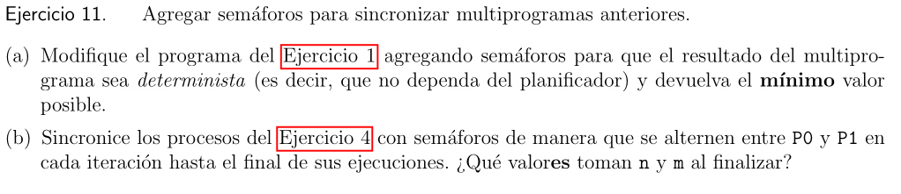
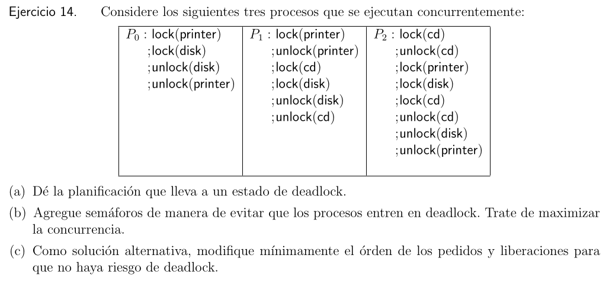

Las lineas son las siguientes en este orden:
***ABC12abc***

ABC => +1
12 => +2
abc =>+1

| Valor | Escenario de ejecucion                                                   |
| ----- | ------------------------------------------------------------------------ |
| 4     | ABC12abc<br>ABCabc12<br>12ABCabc<br>12abcABC<br>abc12ABC<br>abcABC12<br> |
| 1     | Aa12BCbc<br>aA12BCbc<br>y sus variantes                                  |
| 0     | No se puede                                                              |
| 2     | 1ABab2Cc<br>y sus varianes                                               |
| 3     | 12ABabCc<br>y sus variantes                                              |
| 5     | No se puede                                                              |


No, nunca termina. Puede tomar valores entre 2 y 0


ABab

| Valores X | Valores Y | Escenario     |
| --------- | --------- | ------------- |
| 1         | 4         | abA           |
| 2         | 4         | ABabA         |
| 4         | 4         | ABABabA       |
| 8         | 4         | ABABABabA     |
| 16        | 4         | ABABABABabA   |
| 32        | 4         | ABABABABABabA |
| 64        | 4         | ABABABABaABbA |


Aabcbc... hasta que n=100 => context switch: A=>n=200 mientras m=99 entonces pueden diferir hasta 101.

minimo 51, maximo 101

Pueden tomar desde 100 hasta 201


Hay que poner mutex_lock(l) y mutex_unlock(l) antes y depues de las operaciones


P0 y P1 corren el mismo codigo de manera paralela.
P0: 12345678 context switch P1: 123456789 context switch P0: 9

En esa situacion ambos entrarron a la region critica


| Solucion a la Critical Section                      | ¿Garantiza exclusion mutua? | ¿Es justa?                     | Desempeño                                                                                             | ¿Multicore? | ¿Requiere soporte especial del microprocesador?        |
| --------------------------------------------------- | --------------------------- | ------------------------------ | ----------------------------------------------------------------------------------------------------- | ----------- | ------------------------------------------------------ |
| **Solucion homeopatica**                            | No, no hay mutex            | Si                             | +++                                                                                                   | Si          | No                                                     |
| **Espera infinita(while 1)**                        | Si                          | No, depende del scheduler      | ?                                                                                                     | Si          | No                                                     |
| **Deshabilitar las interrupciones**                 | Si                          | No, garantiza de manera lineal | +++                                                                                                   | No          | No                                                     |
| **Flag simple (con spin-wait)**                     | No, hay race condition      | No, depende del scheduler      | Si la CS es corta +++.<br>Si la CS es larga ---                                                       | Si          | No                                                     |
| **Spin lock(con spin-wait)**                        | Si                          | No, depende del scheduler      | Si la CS es corta:<br>   Si es monocore: ---<br>   Si es multicore: +++.<br><br>Si la CS es larga --- | Si          | Si, requiere Test-And-Set                              |
| Spin lock CS (Compare-And-Swap)                     | ""                          | ""                             | IDEM, salvo que escribe menos a la memoria                                                            | ""          | ""                                                     |
| Spin lock LL/SC (Load-Linked and Store-Conditional) | ""                          | ""                             | ""                                                                                                    | ""          | Si, es medio raro tipo RISC                            |
| Spin lock FA (Fetch-And-Address)                    | ""                          | Si                             | ""                                                                                                    | ""          | ""                                                     |
| Peterson('81)                                       | Si                          | No                             | ""                                                                                                    | Dual-core   | No, solo con instrucciones estandar se arregla         |
| Dekker('68)                                         | Si                          | No                             | ""                                                                                                    | Dual-core   | No, solo con instrucciones estandar se arregla         |
| Tickets('74)                                        | Si                          | Si                             | ""                                                                                                    | Ilimitado   | Funciona en arquitecturas donde el store no es atomico |
| Yield()                                             |                             |                                |                                                                                                       |             |                                                        |


Las asignaciones se pueden hacer de las siguientes maneras:


| (c0, t) = (true, 1) | c0=true;<br>t=1; | t=1;<br>c0=true; |
| ------------------- | ---------------- | ---------------- |
| (c1,t) = (true, 0)  | c1=true;<br>t=0; | t=0;<br>c1=true; |

Y otra con un orden en P0 y el otro en P1. Entonces hay 4 formas de mezcclar los ordenes:

```c
						t=0 & ~c0 & ~c1
P0:                                     P1:
1:    while(1) {                        A:    while(1) {
2:        {Region no critica}           B:        {Region no critica}
3:        t=1;                          C:        t=0;
4:        c0=true;                      D:        c1=true;
5:        while(t!=0 && c1)             E:        while(t!=1 && c0)
6:            SKIP;                     F:            SKIP;
7:        {Region critica}              G:        {Region critica}
8:        c0=false;                     H:        c1=false;
9:    }                                 I:    }

Veamos si se puede entrar a la zona critica con ambos a la vez. Si no se dan las condiciones del while entonces paso a la region critica (es un loop infinito)
123ABCDEG4568 (Porque c0=false como precond no se cumple el while y paso ese loop infinito)
Entonces no sirve porque ambos pueden entrar a la zona critica
```

```c
						t=0 & ~c0 & ~c1
P0:                                     P1:
1:    while(1) {                        A:    while(1) {
2:        {Region no critica}           B:        {Region no critica}
3:        t=1;                          C:        c1=true;
4:        c0=true;                      D:        t=0;
5:        while(t!=0 && c1)             E:        while(t!=1 && c0)
6:            SKIP;                     F:            SKIP;
7:        {Region critica}              G:        {Region critica}
8:        c0=false;                     H:        c1=false;
9:    }                                 I:    }

123ABCDEG457

```

```c
						t=0 & ~c0 & ~c1
P0:                                     P1:
1:    while(1) {                        A:    while(1) {
2:        {Region no critica}           B:        {Region no critica}
3:        c0=true;                      C:        t=0;
4:        t=1;                          D:        c1=true;
5:        while(t!=0 && c1)             E:        while(t!=1 && c0)
6:            SKIP;                     F:            SKIP;
7:        {Region critica}              G:        {Region critica}
8:        c0=false;                     H:        c1=false;
9:    }                                 I:    }

ABC123457DEG

```

```c
						t=0 & ~c0 & ~c1
P0:                                     P1:
1:    while(1) {                        A:    while(1) {
2:        {Region no critica}           B:        {Region no critica}
3:        c0=true;                      C:        c1=true;
4:        t=1;                          D:        t=0;
5:        while(t!=0 && c1)             E:        while(t!=1 && c0)
6:            SKIP;                     F:            SKIP;
7:        {Region critica}              G:        {Region critica}
8:        c0=false;                     H:        c1=false;
9:    }                                 I:    }

Funciona correctamente, antes siempre haciamos que falle el c1 o c0, ahora asi nos aseguramemos que siempre sea true.

```


Cuando hay dos consumidores funciona mal.
Supongamos que c0 ejecuta 17, 18, 19, 20, 21 y ahi espera al productor.
Luego el productor ejecuta 5, 6, 7, 8, 9, 11, 12, 13 entonces ya estan dadas las condiciones para el consumidor pueda consumir pero se ejecuta c1
c1 hace 17, 18, 19, 20, 21, 23 y hay otro context switch
Vuelve c0 y ya puede pasar la 22 pero al llegar a 23 no hay nada que consumir y da error.


a)
A
sem_up(s1)
sem_down(s1)
B
sem_up(s2)
sem_down(s2)
C
sem_up(s3)
sem_down(s3)
D





es un productor consumidor





No. Si hay procesos en deadlock eventualmente seran matados sacandolos del deadlock.