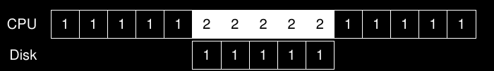

# ***PERSISTENCIA***
## **Curiosidades - anotaciones libres**
Todo dispositivo es una computadora

### Tipos de dispositivos
Hay dos tipos de dispositivos en el mundo de UNIX:

- Dispositivos de bloque: ej disco duro porque solo se puede escribir de a bloques como 4KB
- Dispositivos de caracteres: se puede leer a caracter. Ej el teclado
## Estandares de conexion


Por ejemplo el estandar SATA no es solo el cable sata si no que es todo, incluido el de poder y el conector sata1

## ***I/O devices***
I/O es critico para las computadoras, un programa sin ningun input produciria siempre el mismo resultado, un programa sin output no tendria siquiera sentido correrlo. Entonces debemos pensar mas cuidadosamente ¿Como deben ser integrados los I/O?

### Arquitecturas del sistema
Veamos una imagen para entender como es una arquitectura de sistema:


Notemos que mientras mas abajo menor potencia requiere.

- Tenemos un solo CPU unido a la memoria principal del sistema por medio de un tipo de **memory bus**. 
- Algunos dispositivos estan conectados al sistema por un **I/O bus** general (algun derivado de **PCI**).
- Tenemos el **peripheral bus** (**SCSI, SATA, USB**) al que se conectan dispositivos lentos como **discos, teclados, mouse**, etc.

Mientras mas rapido sea un bus, mas corto debe ser. Hacer buses para tener un alto rendimiento es costoso, es por eso que componentes de alto rendimiento como tarjetas graficas estan cerca del CPU mientras que otros componentes de menor rendimiento como discos o perifericos estan mas alejados.

#### Diagrama aproximado del Intel Z270 Chipset


El CPU se conecta al chip I/O via **DMI(Direct Media Interface)** de la cual Intel ses propietaria y el resto de los dispositivos se conecta a este chip por medio de distintos interconectores, por ejemplo los discos se pueden conectar por la interfaz **eSATA** **(a la que ATA(AT Attachment), SATA(Serial ATA) y eSATA(external SATA) pertencen)**. Debajo estan los **USB(Universal Serial Bus)**. Finalmente, en el lado izquierdo otros dispositivos de alto rendimiento pueden ser conectados via **PCIe(Peripheral Component Interconnect Express)**. *(Notemos que en el diagrama la network interface es un dispositivo de alto rendimiento de almacenamiento como un NVMe)*

### Como esta formado un dispositivo
Veamos un dispositivo(no real) para entender el funcionamiento de esto. Tenemos la siguiente imagen:


Un dispositivo tiene 2 importantes componentes:

- **Hardware interface**: el hardware debe presentar alguna interfaz que permita al controlar sus operaciones
- **Internal structure**: es el responsable de implementar la abstraccion que se le presenta al sistema. Dispositivos simples tienen algunos chips para sus funcionalidades en cambio dispositivos complejos pueden incluir una simple CPU y memoria.

Vemos que tiene 3 registros:

- **Status register**: puede ser leido para obtener el estado actual del dispositivo
- **Command register**: para decirle al dispositivo que haga cierta tarea.
- **Data register**: para pasarle u obtener data del registro

**Leyendo y escribiendo estos registros es que el SO controla el comportamiento del dispositivo.**

#### Ejemplo
Veamos un ejemplo de una interaccion tipica que podria tener el SO con un dispositivo para que haga algo:

```c
While (STATUS == BUSY)
	; // wait until device is not busy
Write data to DATA register
Write command to COMMAND register
	(starts the device and executes the command)
While (STATUS == BUSY)
	; // wait until device is done with your request
```

El protocolo tiene 4 pasos:

1. Primero el SO espera hasta que el dispositivo este listo para recibir un comando, chequea esto leyendo repetidamente el status register (esto se llama **polling**)
2. El So envia informacion por medio del data register. Cuando el CPU este involucrado en esto nos referimos a un **programmed I/O (PIO)**
3. El SO escribe un comando el command register haciendo que el dispositivo comience la ejecucion del comando porque ya tiene la informacion y el comando
4. El SO espera que el dispositivo termine de ejecutar el comando haciendo polling

Este protocolo es simple y funcional pero perdemos rendimiento porque al hacer polling desperdiciamos muchos ciclos de CPU

### Interrupts
Para mejorar la interaccion (cosa que perdimos por el polling) usamos algo que ya sabemos: interrupciones. En lugar de hacer polling el SO puede hacer una peticion, poner el proceso que llama a dormir y hacer context switch a otro. Cuando el dispositivo realmente haya terminado su operacion hace una interrupcion por hardware provocando que el CPU salte al SO por un **interrupt service routine (ISR)** o un **interrupt handler** (es una parte del SO que finaliza las peticiones). Luego despierta al proceso que esperaba por I/O y prosigue normalmente.

#### Problema
Las interrupciones nos permiten hacer **overlap**, veamos el problema con los I/O:


El proceso1 corre un tiempo y llega un pedido de I/O para que el disco lea data. Sin interrupciones el sistema hace polling (el CPU se ocupa de eso, por eso la p) al estado del disco hasta que termine y luego el proceso 1 sigue su ejecucion.

En cambio si utilizamos interrupciones y permitimos el overlap el SO podria hacer otra cosa mientras espera por el disco:



De esta forma aprovechamos tanto al disco como al CPU. 

Aunque esta solucion no es siempre la mejor, por ejemplo podria darse el caso en que el dispositivo hace lo que se le pide muy rapido haciendo que el primer polling ya de como resultado que termino, en ese caso el hacer un interrupt haria las cosas mas lentas. Tambien puede darse el caso en que sea mejor optar por una solucion hibrida, hacer polling un tiempo y luego usar interrupts

### Mover informacion eficientemente con DMA
Cuando hacemos **programmed I/O (PIO)** para transferir informaciones de gran tamaño el CPU se satura con lo que consideramos una tarea trivial:


Vemos que el proceso1 corre y quiere escribir algo en el disco entonces inicia el I/O que copia la informacion de la memoria hacia el dispositivo, una letra a la vez (por eso la c). Cuando se termina el I/O comienza pero ahora en el disco y recien ahi el CPU puede ser usado para otra tarea.

La solucion a esto es usar **Direct Memory Access (DMA)**, es un sistema que puede orquestar transferencias entre dispositivos y la memoria sin mucho esfuerzo del procesador.

#### Funcionamiento
Veamos como funciona con un ejemplo:

Para transferir informacion a un dispositivo, el SO programa el DMA diciendole donde esta la informacion en memoria, cuanta es y a que dispositivo se la debe enviar. En ese punto el SO ya termino con lo debe hacer y puede hacer otras cosas mientras DMA se ocupa de ello. Cuando DMA termina hace una interrupcion para que el SO sepa que termino:


### Metodos de interaccion de los dispositivos
Hasta ahora no dijomos como el SO se comunica con los dispositivos lo cual es muy importante en sistemas modernos.

Existen dos principales metodos de comunicacion:

1. **Explicit I/O instructions**: es un metodo antiguo, las instrucciones especifican una forma para el SO pueda enviar informacion a registros especificos del dispositivo permitiendo la construccion de protocolos como el de los interrupts. *Por ejemplo en x86 las instrucciones in y out son usadas para enviar informacion a un dispositivo, el que llama especifica un registro con la informacion dentro y un puerto con el nombre del dispositivo objetivo. Generalmente estas innstrucciones son privilegiadas*
2. **Memory mapped I/O**: el hardware hace registros del dispositivo disponibles como si fueran espacios de memoria. Para acceder a un registro en particular el SO hace un load (para leer) y un store (para escribir) la direccion, mientras que el hardware dirige el load o store hacia el dispositivo en lugar de la memoria.

Ambos metodos se utilizar todavia.

### Device driver
Ahora debemos pensar como meter los dispositivos los cuales tienen distintas interfaces en el SO. Es valido preguntarse como mantener el SO lo mas neutral en cuanto a dispositivos (que no este hecho para algunos en especifico) escondiendo los detalles de interaccion.

Este problema es resuelto mediante la **abstraccion**. A bajo nivel una pieza de software en el SO debe conocer en detalle como funciona un dispositivo, esta pieza la podemos llamar **device driver**.

Un device driver se encarga de comunicarse con la capa de arriba (Specific Block Interface) y la de abajo (el dispositivo en si). Debe traducir las instrucciones que vienen de arriba para que el dispositivo las ejecute y al revez tambien.

Veamos el file system software stack de linux:


El file system es completamente ajeno al tipo de disco que esta usando. El diagrama nos muestra **raw interfaces** devices, las cuales permiten aplicaciones especificas (*como un file-system checkero un disk desfragmentation tool*) que directamente lean y escriban bloques son utilizar la abstraccion.

El fyle system es el que esta en medio de la API, es el software que media entre la API y el dispositivos de bloque. Notar que tambien pueden pasar mensajes asi nomas, por eso el raw

### Caso para ejemplificar
Veamos un ejemplo con un dispositivo: un IDE disk drive:

```c
Control Register:
	Address 0x3F6 = 0x08 (0000 1RE0): R=reset,
					E=0 means "enable interrupt"

Command Block Registers:
	Address 0x1F0 = Data Port
	Address 0x1F1 = Error
	Address 0x1F2 = Sector Count
	Address 0x1F3 = LBA low byte
	Address 0x1F4 = LBA mid byte
	Address 0x1F5 = LBA hi byte
	Address 0x1F6 = 1B1D TOP4LBA: B=LBA, D=drive
	Address 0x1F7 = Command/status
	
Status Register (Address 0x1F7):
	  7    6     5    4    3    2    1    0
	BUSY READY FAULT SEEK DRQ CORR IDDEX ERROR
	
Error Register (Address 0x1F1): (check when ERROR==1)
	  7   6     5    4    3    2    1    0
	BBK  UNC   MC   IDNF MCR  ABRT TONF AMNF

BK   = Bad Block
UNC  = Uncorrectable data error
MC   = Media Changed
IDNF = ID mark Not Found
MCR  = Media Change Requested
ABRT = Command aborted
T0NF = Track 0 Not Found
AMNF = Address Mark Not Found
```

El IDE disk presenta una interfaz simple para controlar el sistema, consiste de 4 tipos de registros:

- **control**
- **command block**
- **status**
- **error**

El protocola basico para interactuar con el dispositivo es el siguiente (asumiendo que ya fue inicializado):

- Espera a que el dispositivo este listo
- Escribe parametros en el command register
- Comienza el I/O
- Se transfiere la informacion
- Se manejan las interrupciones
- Se manejan los errores