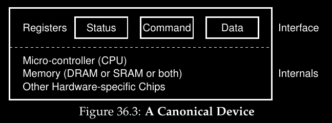
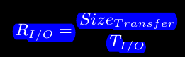

# ***PERSISTENCIA***
## **Curiosidades - anotaciones libres**
Todo dispositivo es una computadora

### Tipos de dispositivos
Hay dos tipos de dispositivos en el mundo de UNIX:

- Dispositivos de bloque: ej disco duro porque solo se puede escribir de a bloques como 4KB
- Dispositivos de caracteres: se puede leer a caracter. Ej el teclado
## Estandares de conexion


Por ejemplo el estandar SATA no es solo el cable sata si no que es todo, incluido el de poder y el conector sata1

## ***I/O devices***
I/O es critico para las computadoras, un programa sin ningun input produciria siempre el mismo resultado, un programa sin output no tendria siquiera sentido correrlo. Entonces debemos pensar mas cuidadosamente ¿Como deben ser integrados los I/O?

### Arquitecturas del sistema
Veamos una imagen para entender como es una arquitectura de sistema:


Notemos que mientras mas abajo menor potencia requiere.

- Tenemos un solo CPU unido a la memoria principal del sistema por medio de un tipo de **memory bus**. 
- Algunos dispositivos estan conectados al sistema por un **I/O bus** general (algun derivado de **PCI**).
- Tenemos el **peripheral bus** (**SCSI, SATA, USB**) al que se conectan dispositivos lentos como **discos, teclados, mouse**, etc.

Mientras mas rapido sea un bus, mas corto debe ser. Hacer buses para tener un alto rendimiento es costoso, es por eso que componentes de alto rendimiento como tarjetas graficas estan cerca del CPU mientras que otros componentes de menor rendimiento como discos o perifericos estan mas alejados.

#### Diagrama aproximado del Intel Z270 Chipset


El CPU se conecta al chip I/O via **DMI(Direct Media Interface)** de la cual Intel ses propietaria y el resto de los dispositivos se conecta a este chip por medio de distintos interconectores, por ejemplo los discos se pueden conectar por la interfaz **eSATA** **(a la que ATA(AT Attachment), SATA(Serial ATA) y eSATA(external SATA) pertencen)**. Debajo estan los **USB(Universal Serial Bus)**. Finalmente, en el lado izquierdo otros dispositivos de alto rendimiento pueden ser conectados via **PCIe(Peripheral Component Interconnect Express)**. *(Notemos que en el diagrama la network interface es un dispositivo de alto rendimiento de almacenamiento como un NVMe)*

### Como esta formado un dispositivo
Veamos un dispositivo(no real) para entender el funcionamiento de esto. Tenemos la siguiente imagen:



Un dispositivo tiene 2 importantes componentes:

- **Hardware interface**: el hardware debe presentar alguna interfaz que permita al controlar sus operaciones
- **Internal structure**: es el responsable de implementar la abstraccion que se le presenta al sistema. Dispositivos simples tienen algunos chips para sus funcionalidades en cambio dispositivos complejos pueden incluir una simple CPU y memoria.

Vemos que tiene 3 registros:

- **Status register**: puede ser leido para obtener el estado actual del dispositivo
- **Command register**: para decirle al dispositivo que haga cierta tarea.
- **Data register**: para pasarle u obtener data del registro

**Leyendo y escribiendo estos registros es que el SO controla el comportamiento del dispositivo.**

#### Ejemplo
Veamos un ejemplo de una interaccion tipica que podria tener el SO con un dispositivo para que haga algo:

```c
While (STATUS == BUSY)
	; // wait until device is not busy
Write data to DATA register
Write command to COMMAND register
	(starts the device and executes the command)
While (STATUS == BUSY)
	; // wait until device is done with your request
```

El protocolo tiene 4 pasos:

1. Primero el SO espera hasta que el dispositivo este listo para recibir un comando, chequea esto leyendo repetidamente el status register (esto se llama **polling**)
2. El So envia informacion por medio del data register. Cuando el CPU este involucrado en esto nos referimos a un **programmed I/O (PIO)**
3. El SO escribe un comando el command register haciendo que el dispositivo comience la ejecucion del comando porque ya tiene la informacion y el comando
4. El SO espera que el dispositivo termine de ejecutar el comando haciendo polling

Este protocolo es simple y funcional pero perdemos rendimiento porque al hacer polling desperdiciamos muchos ciclos de CPU

### Interrupts
Para mejorar la interaccion (cosa que perdimos por el polling) usamos algo que ya sabemos: interrupciones. En lugar de hacer polling el SO puede hacer una peticion, poner el proceso que llama a dormir y hacer context switch a otro. Cuando el dispositivo realmente haya terminado su operacion hace una interrupcion por hardware provocando que el CPU salte al SO por un **interrupt service routine (ISR)** o un **interrupt handler** (es una parte del SO que finaliza las peticiones). Luego despierta al proceso que esperaba por I/O y prosigue normalmente.

#### Problema
Las interrupciones nos permiten hacer **overlap**, veamos el problema con los I/O:


El proceso1 corre un tiempo y llega un pedido de I/O para que el disco lea data. Sin interrupciones el sistema hace polling (el CPU se ocupa de eso, por eso la p) al estado del disco hasta que termine y luego el proceso 1 sigue su ejecucion.

En cambio si utilizamos interrupciones y permitimos el overlap el SO podria hacer otra cosa mientras espera por el disco:


De esta forma aprovechamos tanto al disco como al CPU. 

Aunque esta solucion no es siempre la mejor, por ejemplo podria darse el caso en que el dispositivo hace lo que se le pide muy rapido haciendo que el primer polling ya de como resultado que termino, en ese caso el hacer un interrupt haria las cosas mas lentas. Tambien puede darse el caso en que sea mejor optar por una solucion hibrida, hacer polling un tiempo y luego usar interrupts

### Mover informacion eficientemente con DMA
Cuando hacemos **programmed I/O (PIO)** para transferir informaciones de gran tamaño el CPU se satura con lo que consideramos una tarea trivial:


Vemos que el proceso1 corre y quiere escribir algo en el disco entonces inicia el I/O que copia la informacion de la memoria hacia el dispositivo, una letra a la vez (por eso la c). Cuando se termina el I/O comienza pero ahora en el disco y recien ahi el CPU puede ser usado para otra tarea.

La solucion a esto es usar **Direct Memory Access (DMA)**, es un sistema que puede orquestar transferencias entre dispositivos y la memoria sin mucho esfuerzo del procesador.

#### Funcionamiento
Veamos como funciona con un ejemplo:

Para transferir informacion a un dispositivo, el SO programa el DMA diciendole donde esta la informacion en memoria, cuanta es y a que dispositivo se la debe enviar. En ese punto el SO ya termino con lo debe hacer y puede hacer otras cosas mientras DMA se ocupa de ello. Cuando DMA termina hace una interrupcion para que el SO sepa que termino:


### Metodos de interaccion de los dispositivos
Hasta ahora no dijomos como el SO se comunica con los dispositivos lo cual es muy importante en sistemas modernos.

Existen dos principales metodos de comunicacion:

1. **Explicit I/O instructions**: es un metodo antiguo, las instrucciones especifican una forma para el SO pueda enviar informacion a registros especificos del dispositivo permitiendo la construccion de protocolos como el de los interrupts. *Por ejemplo en x86 las instrucciones in y out son usadas para enviar informacion a un dispositivo, el que llama especifica un registro con la informacion dentro y un puerto con el nombre del dispositivo objetivo. Generalmente estas innstrucciones son privilegiadas*
2. **Memory mapped I/O**: el hardware hace registros del dispositivo disponibles como si fueran espacios de memoria. Para acceder a un registro en particular el SO hace un load (para leer) y un store (para escribir) la direccion, mientras que el hardware dirige el load o store hacia el dispositivo en lugar de la memoria.

Ambos metodos se utilizar todavia.

### Device driver
Ahora debemos pensar como meter los dispositivos los cuales tienen distintas interfaces en el SO. Es valido preguntarse como mantener el SO lo mas neutral en cuanto a dispositivos (que no este hecho para algunos en especifico) escondiendo los detalles de interaccion.

Este problema es resuelto mediante la **abstraccion**. A bajo nivel una pieza de software en el SO debe conocer en detalle como funciona un dispositivo, esta pieza la podemos llamar **device driver**.

Un device driver se encarga de comunicarse con la capa de arriba (Specific Block Interface) y la de abajo (el dispositivo en si). Debe traducir las instrucciones que vienen de arriba para que el dispositivo las ejecute y al revez tambien.

Veamos el file system software stack de linux:


El file system es completamente ajeno al tipo de disco que esta usando. El diagrama nos muestra **raw interfaces** devices, las cuales permiten aplicaciones especificas (*como un file-system checkero un disk desfragmentation tool*) que directamente lean y escriban bloques son utilizar la abstraccion.

El fyle system es el que esta en medio de la API, es el software que media entre la API y el dispositivos de bloque. Notar que tambien pueden pasar mensajes asi nomas, por eso el raw

### Caso para ejemplificar
Veamos un ejemplo con un dispositivo: un IDE disk drive:

```c
Control Register:
	Address 0x3F6 = 0x08 (0000 1RE0): R=reset,
					E=0 means "enable interrupt"

Command Block Registers:
	Address 0x1F0 = Data Port
	Address 0x1F1 = Error
	Address 0x1F2 = Sector Count
	Address 0x1F3 = LBA low byte
	Address 0x1F4 = LBA mid byte
	Address 0x1F5 = LBA hi byte
	Address 0x1F6 = 1B1D TOP4LBA: B=LBA, D=drive
	Address 0x1F7 = Command/status
	
Status Register (Address 0x1F7):
	  7    6     5    4    3    2    1    0
	BUSY READY FAULT SEEK DRQ CORR IDDEX ERROR
	
Error Register (Address 0x1F1): (check when ERROR==1)
	  7   6     5    4    3    2    1    0
	BBK  UNC   MC   IDNF MCR  ABRT TONF AMNF

BK   = Bad Block
UNC  = Uncorrectable data error
MC   = Media Changed
IDNF = ID mark Not Found
MCR  = Media Change Requested
ABRT = Command aborted
T0NF = Track 0 Not Found
AMNF = Address Mark Not Found
```

El IDE disk presenta una interfaz simple para controlar el sistema, consiste de 4 tipos de registros:

- **control**
- **command block**
- **status**
- **error**

El protocola basico para interactuar con el dispositivo es el siguiente (asumiendo que ya fue inicializado):

- Espera a que el dispositivo este listo
- Escribe parametros en el command register
- Comienza el I/O
- Se transfiere la informacion
- Se manejan las interrupciones
- Se manejan los errores

## ***DISCOS DUROS***
Ahora veremos lo relacionado a los discos duros que son fundamentales

### Interfaz
Entendamos primero la interfaz de un disco duro moderno. Consiste de un largo numero de sectores (512-bytes blocks) donde cada uno puede ser leido o escrito. Los sectores van del 0 al N-1 por lo que lo podemos ver como un array de sectores siendo el 0 al N-1 el address space del disco.

Operaciones multisectores son posibles, muchos file systems leen o escriben 4KB al mismo tiempo pero solo pueden hacer un write de 512-bytes de forma atomica el cual se completara o no completara. *Por ejemplo si estas moviendo un archivo y se corta la luz antes de terminar, solo una porcion se va a completar la cual se conoce como torn write*.

### Geometria del disco
Acceder a bloques contiguos o cercanos es mas rapido que hacerlo a los que estan lejos, esto es debido a la geometria del mismo.

### Componentes del disco
Veamos los componentes del disco:

- Platter: una superficie circular dura en donde la informacion es almacenada persistentemente (porque conserva la informacion cuando se apaga) haciendo uso del magnetismo. Un disco puede tener varios platters.
- Surface: cada platter tiene dos lados, cada lado se conoce como surface
- Spindle: Los platters son todos puestos sobre un spindle el cual esta conectado a un motor que hace girar los platters a una velocidad constante entre 5400 y 15000 RPM (Notemos que nos interesara el tiempo de una sola rotacion, ej 10000RPM => 1 rotacion cada 6ms)
- Track: son los circulos del disco, en nuestro ejemplo tenemos 1 track o 3, los discos de verdad tienen muchisimos mas. Dentro de los tracks estan los sectors.
- Sector: es donde se guarda la informacion, cada varios tracks que a su vez tienen miles de sectores
- Disk head: acompaña el proceso de escritura y lectura. Hay uno por surface
- Disk arm: es el brazo que sostiene la disk head, se mueve a traves de la surface para posicionar la disk head en el track deseado

### Como funciona un disco
Veamos como funciona un disco, para ello construyamoslo de ***un solo track*** por partes:


Este track tiene 12 sectores, cada uno de 512bytes que van del 0 al 11. Tenemos un solo platter que gira al rededor del spindle.

Para leer o escribir en los sectores se necesita un disk head conectado a un disk arm girando a contrareloj.


#### Ejemplo para leer un bloque
Supongamos que queremos leer el bloque 0. Entonces debemos esperar hasta que el sector que queremos este debajo del disk head. Esto se llama **rotational delay**.

*Si el tiempo total de un rotation delay es R, entonces en nuestro ejemplo tomaria R/2 esperar a que 0 este debajo del disk head. El pero caso seria que quisieramos esperar por el bloque 5 ya que nos tomaria casi un rotation delay entero.*

### Multiples tracks
Tener un solo track no es realista, asique agreguemos mas, en este caso seran 3 en total:


La disk head esta posicionada sobre track interno que contiene los bloques 24 al 35 luego el track del medio contiene los bloques 23 al 12 y el track externo contiene los bloques 11 al 0. Notemos que por simple geometria mientras mas externo es el track mayor numero de bloques tendra.

*Notemos que la cantidad de sectores es la misma para todos los tracks, cambian el tamaño de los sectores lo que provoca un cambio en la cantidad de informacion que pueden almacenar*

Veamos como hacer una lectura en el sector 11: el disco tiene que mover el disk arm al track externo mediante un proceso que se llama **seek**. Los seeks y las rotation son las operaciones mas costosas de los discos.

El seek tiene varias fases:

- Primero la *acceleration* donde el disk arm se mueve
- *Coasting* mientras en disk arm se mueve a maxima velocidad
- *Deceleration* mientras en disk arm baja su velocidad
- *Settling* cuando la disk head es posicionada en el track deseado

Notemos que el settling time es significativo, tomando de 0.5ms a 2ms.

Luego del seek, el disk arm ya pudo posicionar la disk head debajo del track deseado:


Como el disk arm se movio y esto toma tiempo, el platter tambien se movio siendo 3 sectores en este caso por lo que ahora mismo esta a punto de pasar el sector 9 por debajo de la disk head. Entonces solo debemos esperar a que sea el sector 11 el que este debajo.

Cuando el sector 11 este debajo comienza la fase final del I/O conocida como **transfer** ya que la informacion es leida o escrita del track.

Entonces el proceso que realiza un disco duro para leer o escribir informacion es el siguiente resumidamente:

- **Hace seek** (mueve el disk arm al track correspondiente)
- **Espera por el waiting rotational delay**
- **Hace el transfer**

### Otros detalles
Veamos algunos detalles que no nombramos. Muchos discos emplean un sistema de **track skew** (*cambio de track, skew es un cambio de direccion repentino*) para asegurarse de las lecturas secuenciales pueden ser hechas correctamente. Volvamos a nuestro ejemplo:


Los sectores son alterados de esta forma ya que al cambiar de track a otro el disco necesita tiempo para reposicionr la disk head. Sin el skew (la alteracion) la disk head se moveria al siguiente track pero el siguiente bloque ya habria rotado por simple geometria. Es por eso que es necesario el skew, no podemos cambiar entre tracks como si todos tuvieran el mismo tamaño.

La idea de esto es que por ejemplo al querer pasar del sector 11 al 12 se pueda hacer directamente sin tener que esperar una vuelta entera.

Otra cosa a resaltar es que los tracks exteriores tienen mas sectors. Estos tracks son usualmente referidos como multi-zoned disk drives.

Finalmente es importante resaltar la **cache** la cual es una pequeña memoria (usualmente de 8MB a 16MB) que el disco usa para mantener informacion leida o escrita del disco.

En las escrituras el disco tiene dos posibles acciones:

- **Write back caching**: avisa que la escritura fue completada al poner la informacion en memoria. Este metodo puede ser peligroso porque tiende a provocar errores, sin embargo es mas rapido.
- **Write through**: avisa que la escritura fue completada al realmente escribir en el disco.

### Calcular el tiempo de una rotacion
Para calcular el tiempo de una rotacion debemos usar la tecnica de cancelacion. Por ejemplo supongamos que quermos calcular cuanto tarda una rotacion de un disco en ms, siendo el disco de 10000RPM. Entonces tendriamos lo siguiente:

```c
Empezamos poniendo lo que queremos obtener

time(ms)
---------
1 Rotacion

Luego vamos poniendo lo que sabemos cancelando unidades
```


```c
Empezamos poniendo que 10k rotaciones toman un minuto, lo sabemos porque el disco es de 10K RPM

Luego debemos cancelar el minuto porque queremos dar el tiempo en ms, por lo que sabemos que 1 minuto = 60 segundos.
Luego como debemos cancelar los segundos tambien ponemos que 1000ms = 1 seg

Cancelamos las unidades y nos queda 60000ms/10000 rotaciones

Entonces dividimos y nos queda que una rotacion toma 6ms
```

Veamos otro ejemplo:

```c
Supongamos que tenemos un disco con una velocidad de 100MB/segundo
¿Cuantos ms toma transferir un bloque de 512KB?

Entonces nuevamente arrancamos poniendo lo que queremos obtener que en este caso es time(ms)/1 request

Luego ponemos que 1 request es de 512KB, luego para cancelar eso sabemos que 1M son 1024KB, sabemos que el disco tarda 1seg cada 100MB asi que ponemos eso tambien y por ultimo ponemos que 1000ms es 1seg. Cancelamos y listo
```


### Matematica del I/O
Veamos la disk performance, esta depende de 3 factores:


Notemos que en las comparaciones se usa el rate del TI/O:



#### Comparacion entre dos discos
Supongamos que tenemos dos discos con las siguientes caracteristicas:


El primero es un disco caro mientras que el segundo es uno barato.

Asumamos que hay dos trabajos:

- Uno random, lee pequeños espacios (ej 4KB) del disco de lugares aleatorios
- Uno secuencial, tambien lee espacios grandes y contiguos

Obtenemos los siguientes resultados luego de varias cuentas:


Vemos que hay una gran diferencia tanto entre los trabajos como entre los discos en si. 

Si leo archivos pequeños en distintos lugares la velocidad va a estar dominada por el seek, en cambio si leo todo de manera contigua va a estar dominada por la velocidad maxima.

Pero por ejemplo si hago tareas no pesadas como ver una pelicula no va a haber ninguna diferencia entre los dos discos

### Disk scheduling
Como existen operaciones de alto costo es importante saber planificar las operaciones de los discos. Para ello existe el **disk scheduler** que examina y decide que planificar a continuacion.

A diferencia de los procesos, con los discos podemos saber cuanto tiempo aproximado tomaria un trabajo estimando el seek y el rotational delay.

Por lo tanto el disk scheduler trata de seguir la politica **SJB(Shortest Job First)** aplicada a discos.

#### SSTF: Shortest Seek Time First
Ordena la cola de I/O por track tomando aquellas que tardaran menos primero.

*Por ejemplo asumamos que la posicion de la disk head esta sobre el track interior y tenemos peticiones del sector 21 (track del medio) y del sector 2 (track exterior). Entonces por logica debemos atender primero a la del track de en medio y luego a la del track externo.*


Pero SSTF no es perfecto ya que esta geometria que usamos para decidir que track peticion atender primero segun su track el SO la desconoce totalmente ya que solo ve al disco como un array de bloques. Este problema es solucionado con el planificador **NBF(Nearest Block First)**.

Pero este planificador y el NBF sufren de un problema grave: el starvation

#### Elevator (SCAN o C-SCAN)
Es otro planificador, se mueve por el disco atendiendo de manera ordenada.

Digamos que una pasada por el disco es un *sweep*. Entonces si una peticion viene de un bloque en un track que ya fue antendido en el ultimo sweep no es atendido inmediatamente sino que es puesto en cola para el siguiente sweep.

SCAN tiene varias variantes como F-SCAN o C-SCAN.

SCAN y sus variantes se conocen como el algoritmo del elevador porque se comparta de esa manera ya que sube o baja dependiendo del orden en que hayan sido solicitadas las peticiones sin basarse en quien esta mas cerca evitando totalmente el starvation.

Pero SCAN y sus variantes no son el mejor planificador ya que no atienden al proposito de SJF porque ignoran las rotaciones del disco.

#### SPTF (Shortest Positioning Time First)
Si nos preguntamos como implementar un algoritmo que respete SJF y que tome en cuenta el seek y las rotation SPTF es la respuesta.

Veamoslo con un ejemplo:


Vemos que la disk head esta posicionada en el track interior sobre el sector 30. Ahora supongamos que tenemos dos peticiones una al sector 16 (track del medio) y una al sector 8 (track exterior) ¿Cual deberia atender primero?

La respuesta es depende ya que hay que fijarse en el rotational delay y el seek time.

Si el seek time es bastante mayor que el rotational delay entonces SSTF (el primer planificador que vimos) funcionaria correctamente. Pero si el seek time es ligeramente mayor que el rotatinal delay entonces lo logico seria atender al sector 8 primero cosa que SSTF no haria.

### Otros problemas del scheduling
Veamos un poco los problemas del scheduling que no nombramos

Primero es donde sucede el scheduling. La respuesta es dentro del disk controller.

Un concepto importante es el relacionado al merging que hacen los discos en el I/O. Volvamos al ejemplo este:


Supongamos que vienen tres peticiones en el siguiente orden: una al sector 33, otra al sector 8 y otra al sector 34. El scheduler lo que hara sera mergear (juntar) las peticiones del sector 33 y 34 como si fuera una sola de peticion de dos sectores.

Haciendo merge se reduce el numero de peticiones enviadas al disco y se evita saturarlo.

Otro problema que enfrentan los discos es cuanto debe esperar el sistema antes de hacer un I/O al disco. Hay dos posiciones al respecto:

- Work-conserving: el disco nunca va a estar libre mientras haya peticiones que atender
- Non-work-conserving: esperar a que vengan varias peticiones para asi planificarlas y atenderlas de manera mas eficiente


## ***FILES AND DIRECTORIES***
Vamos a ver lo relacionado a almacenar informacion de manera persistente, es el tipo de informacion que realmente le importa al usuario

### Files
Un archivo es un array linear de bytes que se puede leer o escribir. Cada archivo tiene algun tipo de **low-level name** que los usuarios no conocen. Nos referiremos a este como **inode number (i-number)**.

Los SO no saben mucho acerca de la estructura de un archivo, es responsabilidad del file system guardar la informacion de manera persistente en el disco y devolverla cuando se pida.

#### Crear files
Se pueden crear archivos de muchas maneras por ejemplo usando la syscall **open** llamando a **open()** y pasandole la flag **O_CREAT**. *Notemos que open() devuelve un file descriptor que es un valor de tipo int el cual se puede usar para leer o escribir el archivo*.

#### Leer y escribir files
Tambien se puede hacer de varias maneras, por ejemplo podemos leer usando el comando **cat**:

```js
prompt> echo hello > foo
prompt> cat foo
hello
prompt>
```

*Notemos que cat usa la syscall **read()**.*

La escritura se hace de varias maneras con la syscall **write()**. Cuando un programa llama a esta syscall le esta diciendo al sistema: porfavor escribi esta informacion de manera persistente en algun momento futuro.

#### Leer y escribir de manera no secuencial
Para ello podemos usar la syscall **lseek()**:

```c
off_t lseek(int fildes, off_t offset, int whence);
```

*El primer argumento es un fd, el segundo es el offset que posiciona el file offset a un lugar en particular y el tercero determina donde es realizado el seek*

#### Fork y dup
El fork copia todo, incluso el inodo:


El dup() y sus variantes permiten al proceso crear un nuevo fd que se refiera a la misma copia que usamos:

```c
int main(int argc, char *argv[]) {
	int fd = open("README", O_RDONLY);
	assert(fd >= 0);
	int fd2 = dup(fd);
	// now fd and fd2 can be used interchangeably
	return 0;
}
```


#### Renombrar files
Para ello se usa la syscall **rename()** que usualmente esta implementada de manera atomica.

#### Obtener informacion de los archivos
Tenemos mucha informacion de los archivos que al usuario no le interesa generalmente, esta informacion la llamamos **metadata**. Para poder ver la metadata tenemos que usar el comando **stat** o la syscall **fstat()**. Estos nos muestran mucha informacion del archivo como su tamaño, su inode-number, el dueño del archivo, cuando fue modificado y accedido, etc

```c
struct stat {
    dev_t     st_dev;     // ID of device containing file
    ino_t     st_ino;     // inode number
    mode_t    st_mode;    // protection
    nlink_t   st_nlink;   // number of hard links
    uid_t     st_uid;     // user ID of owner
    gid_t     st_gid;     // group ID of owner
    dev_t     st_rdev;    // device ID (if special file)
    off_t     st_size;    // total size, in bytes
    blksize_t st_blksize; // blocksize for filesystem I/O
    blkcnt_t  st_blocks;  // number of blocks allocated
    time_t    st_atime;   // time of last access
    time_t    st_mtime;   // time of last modification
    time_t    st_ctime;   // time of last status change
};
```

```js
prompt> echo hello > file
prompt> stat file
	File: ‘file’
	Size: 6    Blocks: 8    IO Block: 4096    regular file
Device: 811h/2065d Inode: 67158084    Links: 1
Access: (0640/-rw-r-----) Uid: (30686/remzi)
	Gid: (30686/remzi)
Access: 2011-05-03 15:50:20.157594748 -0500
Modify: 2011-05-03 15:50:20.157594748 -0500
Change: 2011-05-03 15:50:20.157594748 -0500
```

Cada archivo usualmente mantiene la metadata en una estructura llamada **inode** las cuales osn estructuras de datos persistentes que residen en el disco.

#### Borrar files
Para borrar archivos se usa el comando **rm** pero este usa syscall un poco rara:**unlink()** la cual toma el nombre del archivo y devuelce 0 en caso de exito. Para entender como funciona esta syscall antes hay que entender como funcionan los directorios.

### Directorio
Los directorios al igual que los archivos tienen un inodo pero este contiene otras cosas: una lista de pares con el nombre del archivo y el inode number.

*Por ejemplo si tenemos un archivo con el inodo "10" y es referido por el nombre "foo", el directorio en el que "foo" reside tendra la entrada ("foo", "10")*

Practicamente todos los sistemas de archivos realizan una division entre el archivo y su nombre. El nombre puede ser cualquier cosa, el archivo es otra cosa: todos los bytes que tiene que son los datos y tiene otra parte importante que son los metadatos

Poniendo directorios en otros directorios se crea un **directory tree**, bajo el todos los archivos son almacenados. Los directorios comienzan con el **root directory** al que nos referimos con **/** y se usa un separador para los subdirectorios siguientes. *Por ejemplo creamos el directorio "foo" en la raiz y creamos el archivo "bar.txt" dentro del directorio. Entonces nos podriamos referir a ese archivo como un **absolute pathname** que seria "/foo/bar.txt"*


*Notar que por ejemplo "main.c" no necesariamente hace referencia a un archivo de codigo C, el usar ese punto es solamente por convenio.*

##### Caminos absolutos y caminos relativos
Se diferencian en que los caminos absolutos comienzan con una ***/***, por ejemplo **/SistOp/Labs** mientras que los caminos relativos no.
#### Crear directorios
Para ello se usa la syscall **mkdir()**:

```js
prompt> strace mkdir foo
...
mkdir("foo", 0777)
...
prompt>
```

Cuando un directorio es creado se lo considera vacio aunque en realidad si tiene contenido, tiene dos entradas:

- Una se refiere a si mismo y se denota con un **.**
- Otra se refiere al padre y se denota con **..**

Si hacemos `ls -a` podremos verlos:

```js
prompt> ls -a
./ ../
prompt> ls -al
total 8
drwxr-x--- 2 remzi remzi
 6 Apr 30 16:17 ./
drwxr-x--- 26 remzi remzi 4096 Apr 30 16:17 ../
```

#### Leer directorios
Usamos el comando `ls` el cual usa las syscalls **opendir(), readdir() y closedir()**.

#### Borrar directorios
Usamos el comando `rmdir()` pero este no funciona salvo que el directorio este vacio.

### Links
Existen dos tipos de links

#### Hard link
Es otra forma de crear una entrada en el directory tree, se hace mediante una syscall llamada **link()** la cual toma dos argumentos: el pathname viejo y el nuevo. Cuando hacemos link de un nombre nuevo a uno viejo lo que en realidad hacemos es crear otra manera a la cual referirnos al mismo archivo.

Si usamos el comando `ln` nos daremos cuenta ya que imprimen lo mismo:

```js
prompt> echo hello > file
prompt> cat file
hello
prompt> ln file file2
prompt> cat file2
hello
```

El link hace que nos refiramos al mismo inode number del archivo original (el pathname viejo), ojo ***el archivo no copiado ni duplicado***. Esto se puede ver si listamos los inode number de los archivos con `ls -i`:

```js
prompt> ls -i file file2
67158084 file
67158084 file2
prompt>
```

#### Unlink
Cuando creamos un archivo estamos haciendo dos cosas:

- Estamos haciendo una estructura (inode) que va a guardar informacion relevante del archivo
- Estamos linkeado un nombre legible con el archivo y guardando este link en el directorio

Luego de crear el hard link hacia un archivo, el file system no encuentra diferencias entre el original y el creado por el link.

Entonces para borrar un archivo del file system usamos la syscall **unlink()**. Antes si borramos el archivo original el creado por el link seguia funcionando:

```js
prompt> rm file
removed ‘file’
prompt> cat file2
hello
```

Esto es porque cuando el file system hace unlink chequea un **reference count**(**link count**) con los inodes, esta variable permite trackear cuantos nombres distintos fueron linkeados a un inode.

Por lo tanto cuando la syscall es llamada borra el link entre el nombre que le pasaron y su inode y luego decrementa el reference count. Cuando este valga 0 sera ahi cuando el file system libere el inode y sus metadatos borrando realmente el archivo.

Para ver el valor de reference count podemos usar el comando `stat`:

```js
prompt> echo hello > file
prompt> stat file
... Inode: 67158084    Links: 1 ...
prompt> ln file file2
prompt> stat file
... Inode: 67158084    Links: 2 ...
prompt> stat file2
... Inode: 67158084    Links: 2 ...
prompt> ln file2 file3
prompt> stat file
... Inode: 67158084    Links: 3 ...
prompt> rm file
prompt> stat file2
... Inode: 67158084    Links: 2 ...
prompt> rm file2
prompt> stat file3
... Inode: 67158084    Links: 1 ...
prompt> rm file3
```

#### Symbolic links
Tambien conocidos como **soft link**. En windows su equivalente vendria a ser el acceso directo.

Los hard links son utiles pero tienen limitaciones como no poder crear uno de un directorio en si o no poder hacerlos de archivos en otras particiones. Estas limitaciones no las tienen los symbolic links.

Para crear uno tambien usamos el comando ln pero con el flag -s:

```js
prompt> echo hello > file
prompt> ln -s file file2
prompt> cat file2
hello
```

El original tambien puede accedido mediante su nombre al igual que el symbolic link, tendran el mismo print.

Pero la diferencia con los hard link radica en los symbolic link son un tipo de archivo distinto, se puede ver con el comando `stat`:

```js
prompt> stat file
... regular file ...
prompt> stat file2
... symbolic link ...
```

Si hacemos un `ls -al` (*a por archivos regulares, l por symbolic link* ) veremos lo siguiente:

```js
prompt> ls -al
drwxr-x--- 2 remzi remzi    29 May    3 19:10 ./
drwxr-x--- 27 remzi remzi 4096 May    3 15:14 ../
-rw-r----- 1 remzi remzi     6 May    3 19:10 file
lrwxrwxrwx 1 remzi remzi     4 May    3 19:10 file2 -> file
```

Veremos que file2 pesa 4bytes. Esto es porque los symbolic links estan formados el pathname del archivo al que estan linkeados.

Por lo tanto si borramos el archivo original y luego queremos ver el symbolic link no podremos:

```js
prompt> echo hello > file
prompt> ln -s file file2
prompt> cat file2
hello
prompt> rm file
prompt> cat file2
cat: file2: No such file or directory
```

### Permition Bits
Si volvemos a uno de los ejemplos anteriores vemos que teniamos algo asi:

```js
prompt> ls -l foo.txt
-rw-r--r-- 1 remzi wheel   0 Aug 24 16:29 foo.txt
```

Hagamos foco en la parte del **-rw-r--r--**. Esto son los bits de permiso que nos dicen que tipo de archivo es y quien puede hacer que cosa.

El primer caracter nos dice que tipo de archivo es:

- **-**: por un archivo regular (*como por ejemplo foo.txt*)
- **d**: un directorio
- **l**: un symbolic link

Los siguientes bits son propiamente los bits de permiso que estan representados por 9 caracteres. Estos determinan quien puede acceder al archivo y como puede hacerlo.

Consisten de 3 grupos de 3 caracteres:

- Que puede hacer el **owner** del archivo
- Que puede hacer alguien en un **group**
- Que puede hacer cualquiera, usualmente referido como **other**

En el ejemplo de arriba los 3 primeros caracteres eran **rw-** que nos indican que el archivo puede ser leido y escrito por el owner. Luego los siguientes 3 **r--** dicen que puede ser leido por miembros del grupo *wheel*. Los ultimos 3 **r--** indican que cualquiera en el sistema puede leer el archivo.

Estos permisos se pueden cambiar haciendo uso del comando `chmod`. Por ejemplo para permitir solo al owner acceder podemos hacer:

```js
prompt> chmod 600 foo.txt
```


