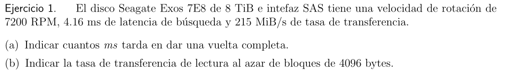

```c
1min     x  60seg  x  1000ms = 8.33ms
7200rot     1min      1seg   


b)
Queremos la tasa de transferencia de lectura al azar, o sea que queremos:
Ri/o = SIZEtransfer / Ti/o

Ti/o = Tseek + Trotation + Ttransfer
	Tseek = 4.16ms
	Trotaion = (0ms + 8.33ms)/2 (Media entre el mejor y peor caso)
	Ttransfer = Cuanta tarda en transferirse un archivo de 4096B. Para ello hago la cuenta:

	4096B    x   1KB    x  1MB     x  1seg    x  1000ms = 0.018ms por pedido
	1pedido      1024B     1024KB     215MB      1seg

Entonces

Ti/o = 4.16ms + 4.16ms + 0.018ms
     = 8.338ms

Entonces
Ri/o = 4096B / 8.338ms
     = 491B por ms
     = 0.479KB por ms
     = 0.000468MiB por ms
     = 0.468MiB por seg

Entonces es mucho mas lento buscar datos de manera random que contigua
```


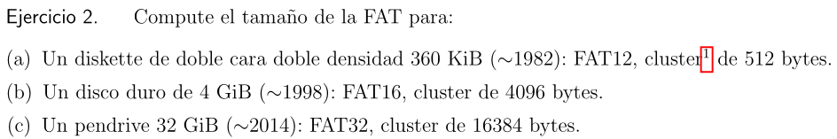

Un cluster es un bloque.

Para determinar el tamaño total de la FAT necesito:

```js
Tamaño FAT = Numero de Clusters * Tamaño de cada entrada(bytes)

Numero de clusters = Tamaño total del disco(bytes) / Tamaño del cluster(bytes)
```

Entonces

```c
a)
cluster  => 512bytes
Diskette => 360KiB   => 368640B
FAT12    => 12bits   => 1.5bytes (tamaño de cada entrada)

Numero de clusters = 368640B / 512B
                   = 720

Tamaño de FAT = 720 * 1.5B
              = 1080B
```

```c
b)
Cluster => 4096B 
Disco   => 4GiB   => 4096MiB => 4194304KiB => 4294967296B
FAT16   => 16bits => 2bytes (tamaño de cada entrada)

Numero de cluster = 4294967296B / 4096B
                  = 1048576

Tamaño de FAT = 1048576 * 2B = 2097152B = 2MiB
```

```c
tamaño cluster => 16384B
tamaño pendrive => 32GiB => 34359738368B
formato FAT32 => 32bits => 4bytes

Numero de clusters = 34359738368B / 16384B = 2097152

Tamaño de la FAT = 2097152 * 4bytes = 8388608B = 8MiB
```


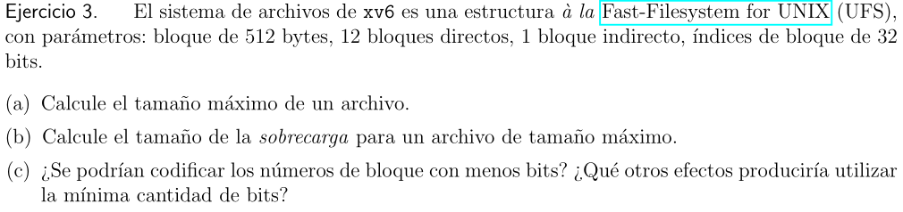

```c
Tenemos bloques de 512bytes
indice de bloque 32bits => 4bytes
12 bloques directos => 12 * 512B = 6144B = 6MiB
1 bloque indirecto => 512bytes / 4bytes = 128 bloques
                   => 128 * 512bytes = 65536B = 64KiB
                   
Entonces 64KiB + 6KiB = 70KiB es el maximo de un arcivo

```

```c
Por sobrecarga entendemos el extra que va a pesar un archivo sin contar la informacion que se guarda, si no las cosas extras como inodos
Para el tamaño de la sobrecarga tenemos 128 bloques de con indice 4bytes
128 * 4B = 512B
Tambien tenemos 12bloques => 12 * 4B = 48B

Entonces 512B + 48B = 560B
```


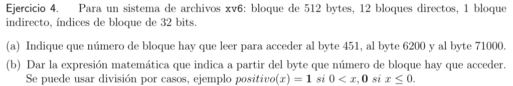

```c
a)
Tenemos bloques de 512bytes
Indeces de bloques de 32bits => 4bytes
12 bloques directos
1 bloque indirecto => 512/4 = 128 bloques

En el punto anterior dijimos que el tamaño maximo es de 70KiB => 71680B
Los bloques van de 512B en 512B.

Entonces los bloques directos van del 0B al 6143B
Los bloques indirectos van del 6144B al 71679B

Tenemos que acceder a direcciones dadas en bytes
byte 451 esta en el bloque 0
byte 6200 esta en el bloque 13
byte 71000 esta en el bloque 136

b)

```


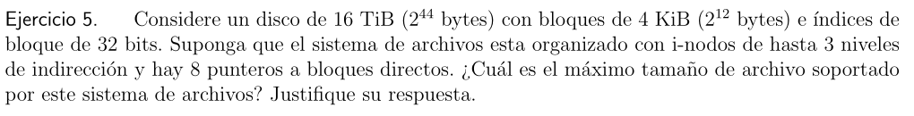

```c
Disco de 16TiB => 2⁴⁴bytes
Tamaño de bloques de 4KiB => 2¹²bytes
Indices de bloque de 32bits => 4bytes
Inodos de hasta 3 niveles de indireccion
Puntero a bloques directos hasta 8

¿Tamaño maximo de archivo soportado?

Tenemos que usar el tamaño de los bloques. Sabemos que el tamaño maximo esta dado por (bloques directos + bloques indirectos) x tamaño de bloque (en este caso bloques de indireccion de 3 niveles, osea triplemente indirecto)
O sea:

Tmaximo = CantBloques * TamañoBloque

Cada puntero ocupa 4bytes

Entonces 4KiB/4bytes = 1024 que es la cantidad de punteros que apuntan a otros bloques de 4KiB. En

Entonces:
bloques directos => 8
bloques indirectos => 1024
bloques doblemente indirectos => 1024²
bloques triplemente indirectos => 1024³

CantBloques = 1074791432

Tmaximo = 1074791432 * 4KiB
        = 4299165728KiB = 4TiB
```

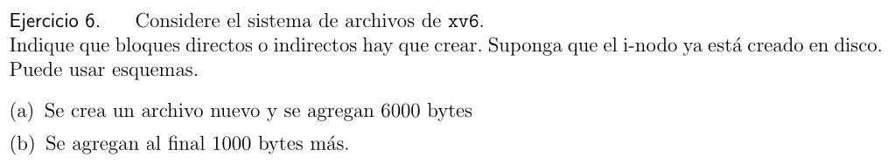

```c
a)
6000/512B = 11.71 => Con los primeros 12 bloques nos alcanza (Consume 6000bytes + 4)

b)
512*12 =6144 - 6004 = 140 
1000 - 140 = 860 => necesito 2 bloques indirectos

```


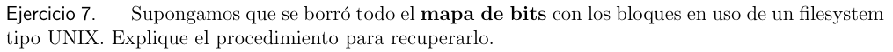

```c
Es posible recuperarlos gracios a los inodos, photorec perimite hacer eso.
Es ver el inodo por medio del superbloque e ir poniendo en 1 los bits que dice el inodo.
```


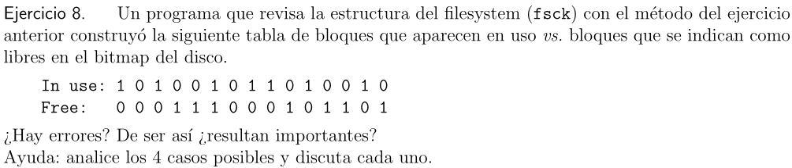

```c
Hay 4 casos

In use=0 & Free=0
El bloque no esta en uso pero no se marca como libre. Es un error pero no grave porque solamente reduciriamos la capacidad que tenemos

In use=1 & Free=0
El bloque esta en uso y esta marcadado como que no esta libre. Es correcto

In use=0 & Free=1
El bloque no esta en uso y esta marcado como libre. Es correcto

In use=1 & Free=1
El bloque esta en uso y esta marcado como libre. Este es un caso catastrofico porque podriamos sobreescribir informacion
```


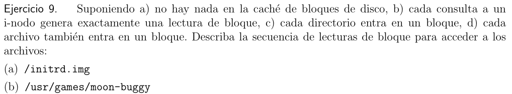

```c
a)
Secuencia de lectura:
/initrd.img

- Llamo a open(initrd.img)
    -read root inode       => Consulto el inodo de la raiz
    -read root data        => Busco el string /initrd.img, me dice el inodo
    -read initrd.img inode => Consutlo el inodo del string
- Llamo a read() => porque ya llegue al archivo que queria abrir
	-read initrd.img inode  => Veo otras cosas, como longitud,permisos,bloque,etc
	-read bloque[0] initrd.img => Leo el primer bloque
	-write initrd.img inode => Escribo en el inodo que accedi al archivo
- Repito la llamada a read() segun la cantidad de bloques que necesite


b)
/usr/games/moon-buggy

- Llamo a open(moon-buggy)
	- read root inode      => Consulto el inodo raiz
	- read root data       => Me dice el inodo del string que quiero
	- read usr inode       => Consulto el inodo de /usr
	- read usr data        => Me dice el inodo de la parte del string que sigue
	- read games inode     => Consulto inodo del string que tengo
	- read games data      => Me dice el inodo de la parte que falta
	- read moon-buggy inode => Consulto el inodo del string y llegue
- Llamo a read()      => Porque ya llegue a lo que queria
	- read moon-buggy inode => Consulto el inodo para ver long,permisos,bloque...
	- read bloque[0] moon-buggy => Leo el primer bloque
	- write moon-buggy inode => Escribo que lei el archivo
Repito la la parte del read() por la cantidad de bloques que debo leer
```

Si tuvieramos que hacer un write seria:

```c
Write /foo/bar

- Llamo a create(/foo/bar)
	- read root inode  => Leo el inodo raiz
	- read root data => Consulto el string que falta
	- read foo inode  => Leo el inodo del string que obstuve
	- read foo data => Consulto el string que falta
	- read inode bitmap => Como no esta consulto el bitmap
	- write inode bitmap => Indico en el bitmap que voy a crear el archivo
	- write foo data => Escribo en el inode de foo que cree el nuevo archivo
	- read inode bar => Consulto el string que falta, es el ultimo
	- write bar data => actualizo que fui el ultimo en entrar
	- write foo inode => actualizo tambien en el inode de foo
- Llamo a write()
	- read bar inode => vuelvo a leer el inode para ver otras cosas que no estan
	- read data bitmap => verifico que la info no esta
	- write data bitmap => escribo la info del archivo del bitmap
	- write data[0] bar => escribo propiamente la info del archivo
	- write inode bar => escribo la info que agregue
Repito el write por cada bloque que necesite
```


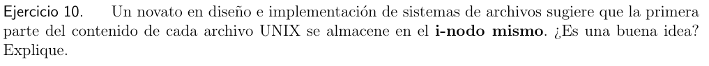

```c
No es buena idea, hacer eso provocaria que tengamos que ampliar en gran medida los espacios para los inodos, ademas de que constantemente deberiamos hacer busquedas al inodo mas de las que ya se hacen sobrecargandolos mas todavia.
```


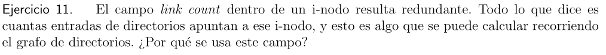

```c
Es necesario para saber cuando se debe efectivamente borrar un archivo, cuando este vale 1 se realiza el borrado del ultimo link este cambia a 0 y es ahi cuando se borra definitivamente el archivo.

Si hicieramos estos recorriendo los grafos, cada vez que hagamos un link o unlink tendriamos que recorrerlos lo cual es costoso
```


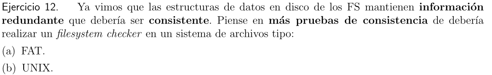

```c

```


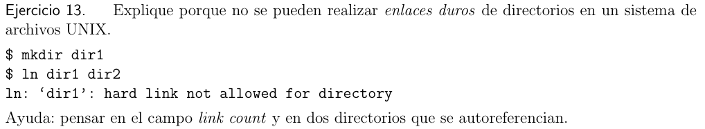

```c
No se puede porque alteraria el orden de jerarquia de arbol.

root
	dir1 =>dir2
		cosas
	dir2 => dir1
		cosas2

Si sucede algo asi tendriamos un caso de bucle infinito. Esto provocaria conflictos ya que un enlace duro hace que nos refiramos al mismo inode con otro nombre, por lo tanto el hacer eso con directorios y no con archivos romperia la logica del directorio dando problema a comandos como ls.

En cambio los soft link permiten hacer esto porque no se refieren al mismo inodo si no que se refieren al string al cual esta asociado el inodo (string que le pasamos como argumento), entonces si se borra o se cambia de lugar no funciona mas. Esto no sucede con los hardlinks no cual daria problemas con los directorios.
```


```c
Los cambios se registran en ambos pero es el log en donde se mantiene registro de todo, en cambio en el journal es un registro temporal. El log se usa en memoria flash y el journal en PC
```


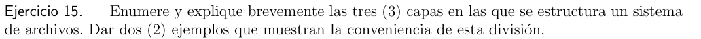


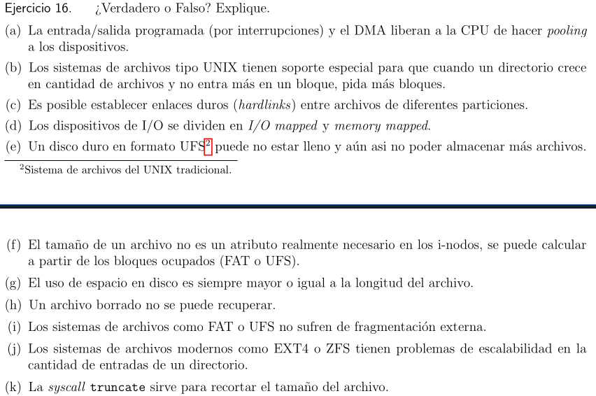


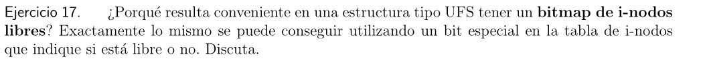


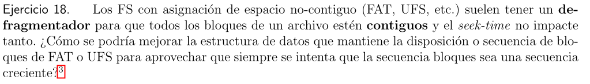
