yi# VIRTUALIZACION
## **Curiosidades - anotaciones libres**
### Basurero de linux
La direccion /dev/null es el inodoro de linux.
### Watchdog
Toda computadora debe tener un watchdog (computadoras caras)
Es una pequeña computadora aparte de la computadora principal que esta todo el tiempo mirando si la computadora principal esta funcionando. Cuando detecta que no esta funcionando la reseta. Por ejemplo las computadoras que están en los satélites tienen un watchdog.
El reset es una interrupción por tiempo que se produce de vez en cuando, funciona de igual forma que un timer.
### Sitios webs
En los sitios webs puedo poner parámetros en la url para hacer cosas malas, se hace con
?a=10&b=11 por ejemplo o oculto=10 y así. Con esto podes obtener información para que esto no pase deben estar protegidos los sitios webs.
### Close - como funciona
Con close(STDOUT_FILENO) cierra el file descriptor, luego el open busca el primer file descriptor libre lo va a ocupar. Entonces como se cerré el STDOUT es el primero libre y por lo tanto se hace ahí.
### Variables de entorno
Las variables de entorno asocian llaves a valores, por ejemplo cual es el log name y devuelve el nombre de usuario del login.
### Poling
Poling es preguntar a cada rato si los I/O ya están listos.
### Scheduler
Cada nucleo del procesador tiene un scheduler
### Mostrar traza de todos los accesos a memoria
`valgrind --tool=lackey --trace-mem=yes ./a.out`
Me muestra todos los accesos a memoria que hace el programa cuando ejecuta en la memoria
- **I**: es un acceso a memoria de instrucción
- **L**: hizo una carga de la memoria
- **S**: escribió en la memoria
Primero muestra la dirección y luego la cantidad de bytes
### Software y hardware
Ambos deben trabajar y diseñar en conjunto los avances, por ejemplo el crear el MMU se dio gracias a una necesidad de software y se termino implementando en el hardware.

---

## **Multiplexación**
Veamos el uso del comando para ejecutar un programa, en este caso tengo un programa llamado .**/cpu** que hace ciertas cosas:
`./cpu` me devuelve `usage: cpu<string>` *(significa que debo pasarle un string para que funcione)*
Entonces si ejecuto `./cpu Hola` vemos que imprime **Hola** indefinidamente, luego con ***ctrl+c*** lo termino o si no también puedo hacer ***ctrl+alt+t***(abrir otro terminal)*, escribir `htop`, posicionarme en el proceso y apretar ***f9*** y luego ***enter*** para matarlo.
Con `bg`*(background)* hago que siga corriendo, y de esta forma puedo ejecutar dos ./cpu al mismo tiempo. Luego para volver a hacer lo mismo debo poner primero `fg`*(foreground, vuelve arriba)* y luego ***ctrl+z***  
Con esto podemos hacer creer al usuario que estamos ejecutando muchas cosas a la vez cuando en realidad no lo estamos ejecutando a la vez. Se llama ***MULTIPLEXACIÓN*** en tiempo.
### Técnicas de multiplexacion
A su vez, también existen distintos tipos o mejor dicho técnicas de multiplexacion
- Multiplexacion por tiempo: Por ejemplo un solo mozo tiene que atender varias mesas, entonces atiende un rato a cada una. El claro ejemplo es si tuviera un solo núcleo y varios procesos corriendo, el procesador se multiplexaria solo por tiempo
- Multiplexacion por espacio: Por ejemplo tengo un terreno y lo divido en distintas partes para su uso. Si tuviera 128 núcleos y 30 procesos solo se multiplexaria por espacio ya que podría dedicarle un núcleo a cada proceso
Pero en la realidad son muy raros los casos en los que solo se utiliza una técnica, el la gran mayoría de situaciones ambas técnicas trabajan en conjunto, por ejemplo la pantalla es un claro caso ya que la multiplexo en espacio al dividir el espacio para distintos programas y la multiplexo en tiempo al dejar de usar un programa y usar otro
Por lo tanto vemos que ***el sistema operativo es el encargado de sacarle provecho a una maquina***.

---
## **Procesos**
***Proceso/=programa***. Un programa puede tener varios procesos distintos.  
Los procesos puede estar en 4 estados (se ve en el htop)  
- **R**   *Corriendo*  
- **I**    *Listo, esperando, ready*
- **S**   *Bloqueado, esta esperando por algo, por ejemplo que hagamos algo*
- **Z**   *Este es mas raro, es el zombie*
El proceso zombie(se marca con Z), es el mas raro. Esta muerto pero todavía no se pueden liberar los recursos porque hay otros procesos que dependen de el que todavía no han devuelto información.
Podríamos tener 0 procesos corriendo, que es lo que busca el sistema operativo  
Podemos tener 0 procesos en ready, cada proceso que tenga acá al menos va a ocupar 256 bytes(en 64bits), entonces **la cantidad máxima de procesos va a estar dada por la cantidad de memoria RAM**. El proceso pasa de ready a running cuando haya espacio en la CPU, mientras se guarda en la RAM. 
### Como se pasan de un estado a otro
Cuando aprieto una tecla hace un system call, lo pone en ready y eventualmente pasa a running y se ejecutan las instrucciones, donde la cantidad de tiempo que esta en running es ínfima, son nanosegundos.
Los procesos también pasan de running a ready, cada 100ms el procesador ve quien esta corriendo y si uno esta corriendo hace 100ms pasa a ready para no monopolizar el uso de la cpu, luego el **planificador** elige otro proceso que estaba en ready y lo pasa a running. Caso contrario no tendría control de la maquina  
*Por ejemplo si hago un programa que lea mi teclado el proceso va a estar en estado S hasta que toque una tecla pero cuando la toque va a ser tan rápido que no voy a poder llegar a ver que cambie el estado del proceso en el htop. Entonces si el teclado no tiene nada para dar el sistema operativo pone el programa a dormir*.
### Archivos del proceso
Todo proceso cuando se inicia tiene 3 archivos abiertos:  
- ***stdin***(file descriptor 0)(se lo conecta al teclado) (es de entrada)  
- ***stdout***(file descriptor 1)(se lo conecta a la pantalla) (es de salida)  
- ***sterr***(file descriptor 2)(se lo conecta a la pantalla) (es de salida)
### API
API es Aplication program Interface, o sea son las funciones que provee un sistemas operativos para trabajar con procesos. Vamos a ver solamente la API de UNIX.
### Bomba Fork
Si la cantidad de procesos que tengo es demasiado alta en algun momento mi sistema linux no va a poder con todos ellos y voy a tener que apagar la maquina. A eso se lo conoce como bomba fork. Para evitar esto debería crear un archivo para que cada que se abra un shell limite la cantidad de procesos y así evito la bomba fork.

---
## **Argumentos**
- ***argc*** (arguments count)
- ***argv*** (vector de los argumentos, es char_*argv)
Entonces por ejemplo si ejecuto el programa ./p1 1 2 3 4 la cantidad de argc es 1 2 3 4 5, mientras que el argv es un vector que contiene al string 1, al string 2, al string 3 y al string 4. Ademas los argumentos recibidos no son solo 1 2 3 4, son esos y el nombre del programa, en este caso ./p1
Hay comandos que son distintos en su llamda pero hacen lo mismo. El argc es siempre >=0, por eso puedo nombrar distinto a varios comandos y que hagan lo mismo, por ejemplo podría hacer un grep que se llame papa
### Como modificar un archivo redirigiendo las entradas y salidas
Si yo cierro el **STDOUT**, lo puedo hacer con *close(STDOUT_FILENO)* y luego abro un archivo, se va a abrir en donde estaba el **STDOUT** ya que el open busca el primer espacio libre y al cerrar STDOUT **este** es el primer espacio **vació**. Por lo tanto redirige la **salida estándar** al archivo que abrí. Luego si vemos ese archivo va a tener el contenido de la salida
Entonces simplemente **redirigiendo las entradas, salidas y errores puedo modificar un archivo**. Por lo tanto en lugar de hacer algo como `wc -l p4.c > salida.txt` simplemente antes de hacer el **execpv** tengo que desconectar el **STDOUT***(que es el 1)* y en ese lugar hacer un open con el archivo **salida.tx**.

---
## **Procesos Hijos**
### Fork
En cierto sentido, usamos **fork** para "*crear*" un proceso (*ya que se usa para duplicar un proceso y asi crear un hijo)* y **exit** para destruirlo (*el exit destruye y devuelve la memoria junto a los recursos que se hayan pedido para ese proceso*). Poner varios fork bien seguidos es como hacer potencias. El fork siempre inicia en 0.
Cuando los padres mueren los hijos también. Aunque se puede romper esa relación si al ejecutar el hijo uso el **&.** En ese caso el padre muere y el hijo queda vivo y ahora pasaría a ser hijo del proceso superior al padre. *Se puede hacer un ejemplo así ejecutando un programa con la terminal ./programa & y luego esa misma y terminal la cierro con exit y el programa seguiría funcionando siendo hijo de systemd*
**systemd es el proceso padre de todo el sistema.**
### Posible situación
Si tenemos un programa que crea un hijo y que imprima primero el padre y luego el hijo, al ejecutarlo muchas veces, como por ejemplo usando un for, se puede dar el caso en que se ejecute primero el hijo y luego el padre debido a que si no se especifica en el código para que primero se ejecute el padre y luego el hijo el planificador podría darle mas prioridad al hijo. Mientras mayor sea la carga de la maquina mas probable es que pase ya que los **sistemas bajo carga se comportan distinto a los sistemas normal**. Para evitar eso podría usar un wait(NULL) y así hago que se ejecute primero uno y luego el otro, el wait espera hasta que el proceso anterior termine, solemos usar rc(return code) como variable para el fork. int rc = fork(); Básicamente wait sincroniza entre procesos.
### Wait
El wait es una llamada entre el sistema operativo y el programa, lleva **NULL** para que no me interese el estatus del proceso, solemos usar como variable el wc (wait code) int wc = wait(NULL);
Un ejemplo claro de wait es cuando ejecutamos algún programa con el terminal y mientras ese programa se ejecuta no podemos hacer nada con el terminal, ya que esta en wait. Con el **&** hago que no se le ponga el wait y así sigo pudiendo usar el terminal. *Esto era útil hace mucho ya que solo podíamos tener una consola, no existía la multiplexacion*
### Sleep
El sleep(1) por ejemplo hace el sleep y salta al return 0. El return 0 es lo mismo que exit(0)
### Sturup
Strdup retorna un puntero a un nuevo string que es el duplicado del string que es, obtiene la memoria con malloc y luego duplica.

---
## Execvp
execvp, esta pensado para funcionar con fork. Agarra el primero de los argumentos que es una cadena de caracteres y busca ese programa dentro del sistema de archivos, lo carga en memoria con los argumentos y empieza a ejecutar ese programa desde cero, o sea desde main. Entonces lo que pasa es que la memoria de todo el programa que estaba ejecutando desaparece porque se reemplaza por otro, se pisa. Entonces podemos decir que fork es copiar otro y execvp lo pisa. El execpv lo que hace es cambiar todo el mapa de memoria, entonces el hijo no muere si no que se transforma. Entonces con esta función o comando no debemos chequear errores ya que si hay algún error la función se transforma. Por ejemplo podemos hacer que de un error pasandole como argumento un comando no valido.
Por ejemplo cada vez que hago gcc de un programa creo un proceso hijo del gcc, lo que hago es un execvp de gcc y el padre que es el shell le esta pasando información al hijo. Por lo tanto hay traspaso de información del padre al hijo mediante los parámetros que le siguen al programa.c. Puedo saber que el padre me comunica algo porque me devuelve un código de error que lo puedo saber si hago:
`echo $?`
**Por lo tanto el padre comunica al hijo mediante los parámetros y el hijo comunica al padre mediante los códigos de error** *(el código de retorno de la función main, por ejemplo si es 0 esta todo bien).*
### IPC (inter process comunication)
El mecanismo básico de creación de procesos involucra comunicarle parámetros básicos de entrada al proceso y cuando ese proceso hijo termina le muestra el resultado al padre.

---
## User space y kernel space
***Hay procesadores que aceptan programas que otras no debido que manejan otras instrucciones mas modernas.***
Hay programas que tienen permisos especiales para poder hacer mas cosas sensibles como leer un puerto mientras que otros programas no tienen dichos permisos. Uno es el **user space** y el otro el **kernel space**, donde en el **espacio de usuario puedo hacer algunas cosas restringidas** para que en el espacio de kernel tenga todo el control y programas que se comporten mal se puedan agarrar y devolver todos los recursos que tenían
El modo usuario es un modo en el que no podemos hacer cosas malas, **al modo kernel no podemos acceder pero este puede hacer todo** y debemos confiar en el. El usuario cuando quiere acceder al hardware tiene que pasar por el kernel.
### System call y trap
system call es una función del sistema operativo.
Entonces el usuario le pide permiso al **kernel** para hacer cosas como leer en la pantalla a través de las **system calls**, el usuario le pide permiso al kernel para hacer cosas. **Cuando sucede esto se abre una puerta, se llama** **trap**, **es un momento donde paso de espacio usuario a espacio kernel** *ya sea por algún programa o que paso algún evento*, es ir abajo, ir al kernel (Es como si fuera un branch, debe preservar todos los registros) Luego cuando la llamada al sistema termina hay que hacer un **untrap**, o sea volver desde el fondo del sistema operativo, entonces cuando vuelve como yo tuve que guardar todos los registros anteriores seria posible cambiar del programa que estaba ejecutando a uno nuevo.
El hardware tiene que trabajar en conjunto con el sistema operativo, toda **I/O** pasa por el kernel, **por ejemplo un printf genera un syscall.**
### Formas de entrar al kernel
Entrar al kernel se puede hacer por un programa que lo necesite (trap por software) o también se puede hacer una instrucción ilegal, o acceder a una dirección de memoria prohibida o dividir por 0, o dividir un puerto que no podemos. También se puede entrar por hardware, por ejemplo cada vez que aprieto una tecla genera una **interrupción**, cuando muevo el mouse genera otra. Cada 100ms se genera una interrupción que genera un trap y entra al kernel, cada vez que la cámara hace el barrido genera una interrupción
### Interrupción
Una interrupción es un trap generado por hardware en algún momento que yo no se.
Una computadora tiene muchísimas interrupciones aunque no este haciendo nada, por ejemplo tocar el touchpad, apretar teclas, recibir paquetes de red son cosas que generan interrupciones. Leer el disco duro genera muchas interrupciones.
Las interrupciones en cierta medida están limitadas por la velocidad de las demás partes de la computadora, por ejemplo de la velocidad del disco, de la velocidad a la que usemos el touchpad, de la velocidad la que tecleamos, etc.
### Relación entre el SO, kernel y el programa
Veamos un poco como es que se relacionan el sistema operativo(kernel), el hardware y el programa. Para ello analicemos el siguiente diagrama:

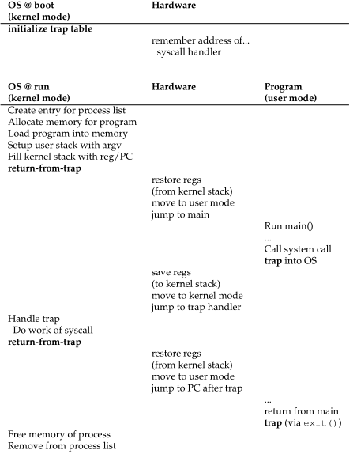
- Primero el sistema operativo inicializa la **tabla de trap** *(en donde están todos los números de direcciones de memoria)*
- El hardware recuerda las direcciones necesarias *(le decimos el nro de la base de la trap table)*
- El sistema operativo quiere crear un proceso, para ello agarra el primer lugar del **process table**, pide memoria y adecua la pila para que apunte al **argc y argv**, luego como el programa esta iniciando manda una señal al kernel como si lo hubieran interrumpido antes
- El hardware restablece los registros, cambia a modo de usuario y salta al punto de inicio del programa que es el main
- Luego el programa corre el main y luego hace un system call provocando una trap al sistema operativo
- El hardware guarda los registros en el stack de kernel, se cambia a modo kernel y salta a donde dice la tabla de traps para este trap en particular *(tabla la cual el sistema operativo definió al comienzo)*
- Vuelve al sistema operativo y ejecuta la rutina en **código de maquina** que se corresponde con el systemcall, hace lo que tenga que hacer y vuelve del trap
- Luego se restablecen los registros de nuevo *(desde el kernel stack)*, se cambia a modo usuario y vuelve a ejecutar el programa en el punto que lo estaba ejecutando
- Luego el programa hace sus cosas hasta que el programa llega a una llamada del sistema exit que trapea al kernel
- Por ultimo el sistema operativo libera la memoria que estaba usando el y borra el proceso de la lista de procesos
***Por la tanto vemos el que hardware es fundamental.*** 
Notemos que se pierde tiempo entrando y saliendo del kernel. También notemos que todo programa termina en modo kernel.
Los discos tienen latencia (por ejemplo desde que abro la canilla tarda en salir agua) entonces desde que pido un archivo tarda cierto tiempo en devolverlo
### Relación entre el espacio de usuario y espacio de kernel
Veamos como se relacionan entre si el espacio de usuario y espacio de kernel, para ello vamos a analizar la siguiente imagen:
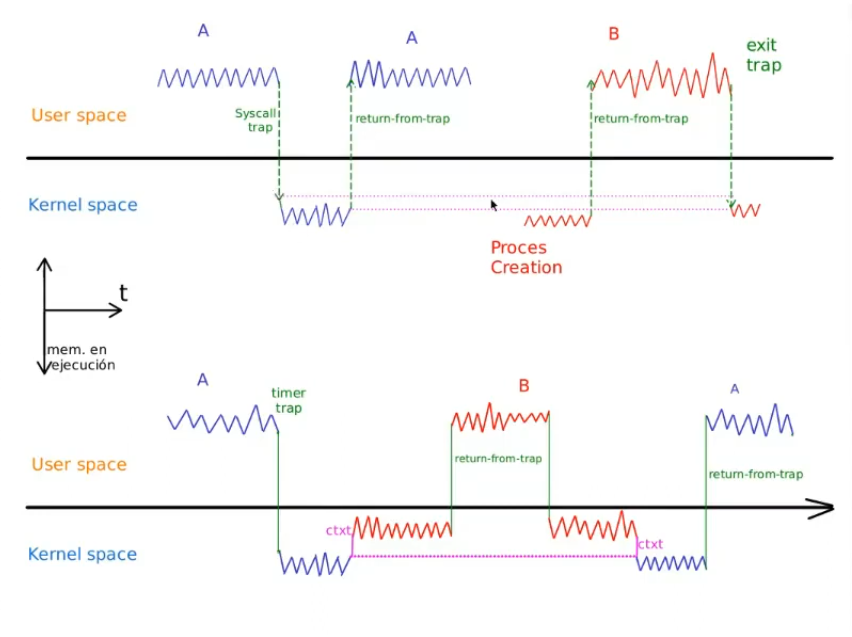
#### Primer programa (arriba)
- Los picos de las lineas de colores representan como se ejecuta o como avanza el **program counter(PC)** dentro de la memoria *(suponiendo que solo tenemos un procesador)*. En este caso como es un fork deberían ser iguales los picos aunque no lo son por estar mal dibujado
- Al final de los procesos deberían bajar a modo kernel para terminar ya que siempre al terminar se lo hace por medio de un exit
- En este caso el syscall es un fork entonces por eso se crea el proceso B
- Cuando se crea el nuevo proceso salta despues de la systemcall, salta al mismo punto en donde estaba el proceso A *(por eso esta en el mismo nivel de altura)* porque es proceso hijo del A
- Las lineas rosas indican la misma altura cuando se realiza la primer syscall en A y cuando se realiza la ultima syscall en B *(aunque en B esta mas abajo pero deberían tener la misma altura)* ya que indica la posición donde se esta ejecutando el programa en este momento *(ya que al hacer un syscall trapeo en el kernel y luego el entry point para entrar al kernel de nuevo es el mismo)*
- El punto para treapear y destrapear debería ser el mismo
- Durante la linea verde el hardware guarda todos los registros en el kernel stack, ademas pasa de modo usuario a modo kernel y empieza a ejecutar en un lugar especificado que le consulta a la trap table y luego comienza a ejecutar en modo kernel las rutinas necesarias. Cuando termina vuelve los registros a como estaban, salta para el proceso A y vuelvo a poner el stack en como estaba porque quiero que el proceso trabaje todos los datos en modo usuario siguiendo ejecutandose como si nada hubiera pasado. Entonces por eso me es posible pausar una ejecucion como en el programa B
- Cuando se produce un trap se switchea del user stack al kernel stack, el paso se hace por harware y es automático
#### Segundo programa (abajo)
- Tenemos una **timer trap** *(o sea que ocurre cada 100ms)* ***OJO NO NECESARIAMENTE SI HAY UN TIMER TRAP SE CAMBIA DE CONTEXTO***
- Arranca el proceso A, se hace la trap pasa a modo kernel, luego el kernel ejecuta la syscall de A durante un tiempo y decide cambiar de contexto y ejecutar en modo kernel para el proceso B, luego hace un return from trap, el proceso B hace sus cosas y de nuevo se ejecuta la syscall del proceso B, entra a modo kernel hace sus cosas y decide cambiar de contexto otra vez ahora el proceso A y luego hace un return from trap y vuelve al programa. Ahi deberia volver otra vez al kernel para finalizar por el exit
- Cuando en el modo kernel cambia de contexto, el proceso A pasa de running a ready *(los cambios de contexto solo se dan en modo kernel)*. Cuando se hace el cambio de contexto también se guardan los registros y hace un salto en el program counter
### Ejemplo de proceso modo usuario unicamente
Un ejemplo de un proceso que nunca cambia modo kernel es un `while(true)`, ya que esta linea de codigo no genera ninguna syscall entonces queda en un bucle infinito y constante en modo usuario.
### El kernel
El kernel rápidamente debe hacer sus cosas y volver a modo usuario, el SO quiere que estemos en modo kernel la menor cantidad de tiempo posible.
### Multitasking cooperativo
El multitasking cooperativo es utilizado en dispositivos muy lentos en donde yo no cambio a modo kernel, si no que le doy el control de forma voluntaria.
### Cache
La cache es la que nos permite tener mas cambios de contexto, mientras mas cache tenga mejor.

---
## **Planificación**
Es algo político, tomar decisiones, administrar los recursos lo cual es hago bastante difícil de hacer.
### Mecanismos
Con mecanismos nos referimos a entrar al kernel por alguna interrupción ya sea de software o de hardware, o sea que yo pido entrar o porque trapeo por algún necesidad. Este mecanismo permanece inalterable ya que no va a cambiar.
### Política
Tengo muchos procesos que quieren correr los cuales están en ready pero a su vez tengo pocas cpu capaces de correr esos procesos. Existe un algoritmo que decide cual de todos esos procesos va a pasar de ready a running.
### Mecanismos vs políticas
Existe una clara diferencia entre mecanismos y políticas. La parte de mecanismo es la que permanece igual a lo largo del tiempo mientras que la parte política es la que cambia, por ejemplo mediante un archivo de configuración, a través de una selección de un tiempo de ejecución. Hay una división entre el código que va a cambiar y el código que no va a cambiar.
### Tipos de planificadores
Vamos a suponer que tenemos una sola CPU. Recordemos que sigue existiendo la interrupción cada 100ms.

| POLITICA                 | ¿Apropiativa? | INTERACTIVA | ¿TENER EL TIEMPO? | ¿JUSTA?    | PROS                                | CONTRAS                                        |
| ------------------------ | ------------- | ----------- | ----------------- | ---------- | ----------------------------------- | ---------------------------------------------- |
| FIFO(first in first out) | No            | Lotes       | No                | Si         | Es muy sencilla de implementar      | Un proceso puede monopolizar                   |
| RR (round robin)         | Si            | Interactiva | No                | Si         | Protege ante monopolizacion del CPU | Pierde tiempo al tener que fijarse en la tabla |
| SJF                      | No            | Lotes       | SI                | Starvation | Throughput (rendimiento)            | Monopoliza                                     |
| STCF                     | Si            | Interactiva | Si                | Starvation | Throughput (rendimiento)            |                                                |
| Selfish                  |               |             |                   |            |                                     |                                                |
| MLFQ                     |               |             |                   |            |                                     |                                                |
*Aclaraciones:* 
- *Una política apropiativa(preintrive) es la que es capaz de agarrar un proceso que se esta ejecutando y cortarlo por alguna razón. Utiliza el cambio de contexto en medio de la ejecución y guarda todo el estado de proceso, registros y como estaba la memoria en la tabla de procesos.*
- *El tiempo t es el tiempo total de ejecución*
- *Que sea interactivo es que rápidamente los procesos pueden pasar a running*
- Justa significa que eventualmente atienda todos los procesos
Hablemos un poco mas en detalle de cada una:
#### FIFO (first in first out)
Es una politica basada en que quien llega primero se ejecuta primero. Es sencilla de implementar
Algunos ejemplos de diagramas de tiempo para FIFO son:

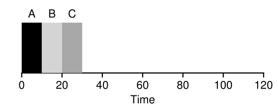
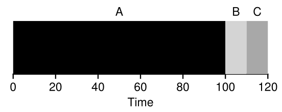

Entonces vemos procesos que se enumeran (en este caso por letras) ya que llegaron al mismo tiempo, vemos como se multiplexan por tiempo
Es de tipo por lote(Batch), primero todo A, luego todo B y luego todo C. Ademas como rápidamente permite pasar entre procesos es interactivo.
Es justa porque atiende a todos los procesos ya que no voy a ejecutar procesos infinitos
Se suele usar para super computadoras. En estas computadoras el planificador tiene distintas prioridades.
#### RR (round robin) - quanto (cantidad de tiempo que un proceso monopoliza la CPU)
Se basa en que un proceso no puede monopolizar la cpu tiene cierto tiempo para poder ejecutarse y pasado el tiempo vuelve al final de la cola.
El problema del round robin es que cuando ocurre una syscall perdemos mucho rendimiento. Ver impacto de las syscalls.
Por lo tanto depende mucho del **quanto**, uno muy pequeño daría lugar a que atendemos rápido y soltamos pero vamos a tener que hacer muchos cambios de contexto los cuales no son gratis. Si es uno muy grande estaríamos dedicándole tiempo extra a procesos que no lo necesitan.
Si aprieto una tecla despierto al proceso shell y este proceso no se va a ejecutar hasta que le toque el turno ni se va a adelantar. Por lo que por ejemplo si tengo muchos procesos voy a notar que al escribir va a tardar en mostrarse los caracteres en pantalla.
En cierta forma es similar a la FIFO, pero con la diferencia del quanto. Veamos las siguientes imágenes:

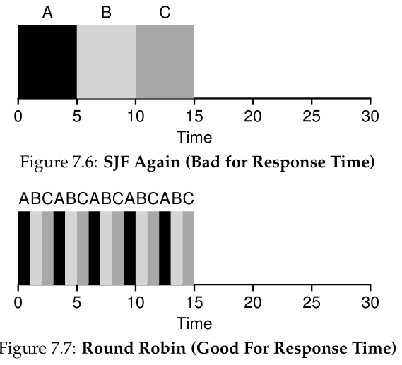

En esta vemos que un FIFO se puede transformar en un RR haciendo uso del quanto, en este caso el quanto es de 1. En el primer gráfico A es quien sale beneficiado, B depende de lo que haga y C sale perjudicado, ya que el tiempo para que se ejecute A es 5, para B es 10 y para C es 15
Pero a su vez por la gran cantidad de cambios de contexto que se dan en el segundo gráfico, el tiempo real va a ser distinto entonces podemos decir que el gráfico es incorrecto porque debería tardar un poquito mas
Es justa porque atiende a todos
Se suele usar para computadoras de escritorio o celulares debido a que necesito una gran interactividad
#### SJF (shortest job first)
Elijo al proceso mas corto y lo ejecuto por lotes. No es apropiativa.
Necesito tener el tiempo de los procesos.
No es justa porque al ejecutar al mas corto primero puede darse la situación que un proceso largo nunca se llegue a ejecutar debido a infinitos procesos cortos que llegan y se ejecutan primero.

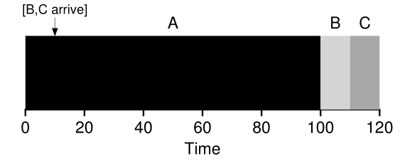

En este gráfico vemos como A se esta ejecutando y llegan B y C
#### STCF (shortest time to completion first)
Primero van los que tengan menor tiempo en completarse el trabajo, es distinto a SJF ya que ahora compara por tiempo que restante no tiempo total.
Es interactiva.
Lo que pasaría con la figura del SJF si fuera STCF es lo siguiente:

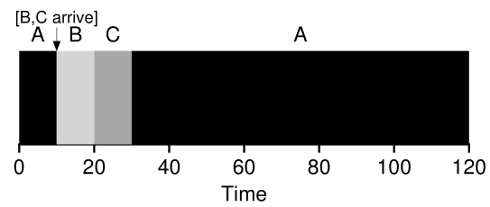

El A estaba ejecutándose y llegan B y C. Hay un context switch porque llegaron B y C entonces sea cual sea la forma por la que llegaron hubo un context switch o sea una interrupción.
Entonces como B y C le restan menos tiempo para terminar su ejecución los ejecuta primero y luego sigue con A.
Esta decisión se va tomando momento a momento.
Para esto es necesario que los procesos cuando lleguen anuncien su tiempo de ejecución.
También es starvation porque si llegan infinitos procesos muy rápidos de ejecutar el proceso largo nunca a se ejecutara.
#### Selfish (egoista)
Ejecuta lo que estaba en ejecución
#### MLFQ
Es mas complejo por eso esta detallado mas abajo
#### CFS (Completely fair scheduler)
Es el que usa linux. Esta muy optimizado provocando que las decisiones de scheduler que se tomen sean muy rapidas y ligeras a pesar de que haya muchas y sean agresivas (por ejemplo un estudio de los datacenter de google mostro que no sobrepasa el 5% de uso del CPU)

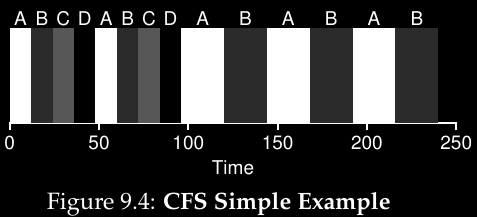

##### Virtual runtime
El objetivo de CFS es claro, dividir justamente el CPU entre los distintos procesos. Para ello hace uso de una técnica llamada **virtual runtime (vruntime)**. Cada proceso que corre acumula vruntime, en la mayoría de los casos aumenta de forma proporcional con el tiempo real. Luego cuando una decisión de scheduler ocurre CFS elige al proceso con menor vruntime para que sea el siguiente en correr.
Notemos que si CFS hace muchos switches aumenta la respuesta de la computadora (fairness) pero baja el rendimiento. Si no hay muchos switches aumenta el rendimiento.
##### Parámetros de control
Ahora, como hace CFS para saber o aproximar cuanto tiempo corre un programa. Para ello hace uso de varios parámetros de control:
##### sched_latency
Se usa para determinar cuanto tiempo debe correr un programa antes de hacer un switch. El típico valor es de 48ms. CFS divide este valor entre la cantidad de procesos corriendo en el CPU para determinar cuando se debe cambiar(time slice). *Por ejemplo si hay 4 proceso corriendo, el tiempo para cambiar seria de 12ms. CFS corre el primer proceso por 12ms y se fija si hay otro con menor vruntime y como en este caso si hay selecciona uno de los 3 disponibles y así sucesivamente*. **En la figura anterior se muestra este ejemplo.**
##### min_granularity
¿Que pasaria si hay muchisimos procesos corriendo? Para evitar que los procesos corran muy poco tiempo existe el *min_granularity* que usualmente es de 6ms el cual es el tiempo mínimo que los procesos correrán antes volver a block. *Por ejemplo si hay 10 procesos corriendo, el sched_latency seria de 4.8ms pero debido al mun_granularity van a correr minimamente 6ms*
##### Niceness
CFS tambien permite controlar la prioridad para los procesos mediante un nivel conocido como **nice** que puede ir de -20 hasta 19 siendo 0 el valor por defecto. Mientras mas alto sea el nivel, o sea mas nice seas menor prioridad vas a tener y mientras mas bajo mayor prioridad. Entonces la formula para calcular el time slice es

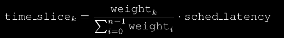

##### Red black trees
Como dijimos anteriormente el foco de CFS es su eficiencia pero ¿Como hace para eligir el próximo proceso que correrá de manera rápida?. Para ello mantiene los procesos en un **red-black tree** *(es un tipo de árbol balanceado, los cuales mantienen mas información que los arboles binarios y se aseguran que las operaciones sean algotirmicas y no lineales en tiempo)*. CFS no mantiene todos los procesos en el árbol, si no que solo los procesos que están en running o ready se mantienen ahí. Por ejemplo si un proceso necesita de un I/O se va a block y sale del árbol.
Notar que los procesos en el árbol se orden según su vruntime de izquierda a derecha (es un poco rara).
##### I/O
Notar que también hay un problema con los procesos I/O ya que al irse a block pierden vruntime haciendo que si este proceso hubiera empezado a correr con otro proceso haga que se cuando vuelva a running se deje de atender al otro proceso porque el proceso que volvió tiene menor vruntime. Para solucionar esto CFS hace que un proceso que vuelve a running tenga el mínimo valor de vruntime que se encuentre en ese momento en el tree.
#### Uso de recursos
Entonces el gran truco de las computadoras es hacer un optimo uso de los recursos que dispongo

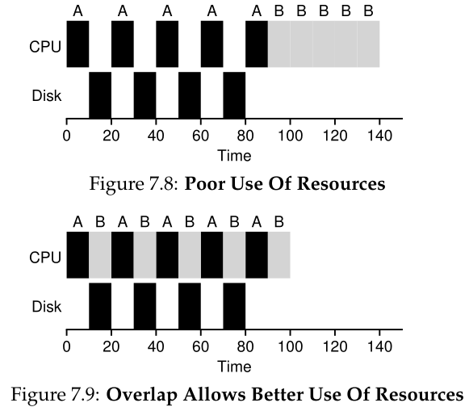
- El primer diagrama es un I/O-bound, un tipo de proceso limitado por entrada/salida
- El otro diagrama es un CPU-bound, un tipo de proceso limitado por CPU
Del buen uso de los recursos surgen los TSS (time sharing system), los sistemas de tiempo compartido. Antes de esto si yo tenia un programa A corriendo y tenia que ir al disco que es lento y durante todo ese tiempo A estaba esperando a que el disco responda y durante todo ese tiempo la CPU no hacia nada.
Entonces lo que se los ocurrió fue aprovechar ese tiempo donde esta operando el disco y meter parte de otros procesos. Entonces vemos que las políticas de planificación cambian porque están activos un tiempo haciendo procesamiento en CPU y están inactivos cierto tiempo porque están haciendo entrada y salida.
#### Interactividad
Entonces vemos que prácticamente todos los procesos son interactivos. Por ejemplo la consola es altamente interactiva porque esta todo el tiempo esperando que yo tipee algo y cuando lo hago lo ejecuta. Por lo tanto **los procesos nunca son puramente de I/O ni puramente de procesamiento de CPU**.
Entonces aprovechando el sistema de cambio de contexto se logra encajar pedacitos de otros programas mientras el CPU no hace nada.

---
## **Impacto de las syscall**
Veamos el siguiente diagrama:

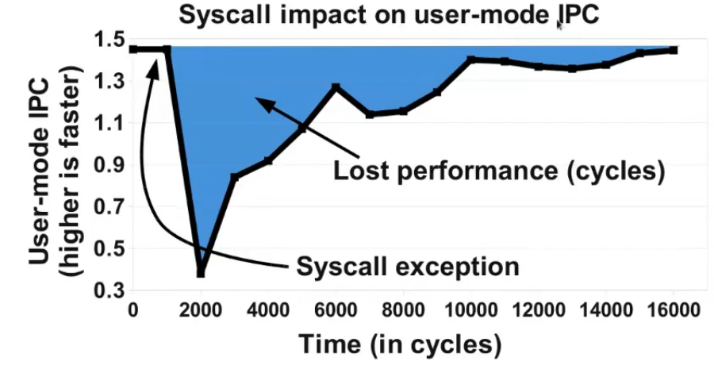

*IPC es Instrucciones por ciclo*
Sabemos que por cada ciclo de reloj se ejecuta una instrucción, o sea que el  **Instruction per cicle = 1**. Ahora los procesadores son superescalares, pueden ejecutar mas de una ejecución por ciclo.
El gráfico muestra cual es el IPC de la instrucciones cuando ocurre en medio de una syscall. Venia ejecutando 1.5 instrucciones por ciclo (promedio) y de golpe llega la syscall y ejecuto muchísimo menos y a medida que pasa el tiempo vuelvo a retomar el ritmo a los 16000 ciclos vuelvo al mismo ritmo que tenia antes. *Es como si estuviera haciendo algo, me desconcentro y vuelvo a concentrarme al cabo de unos segundos.*
Entonces vemos que el **problema del round robin** es que cuando hay una **syscall perdemos rendimiento**

---
## **MLFQ (Multi level feedback queue)**
### Superposicion de computo
Es hacer algo mientras estamos esperando una entrada.
### Idea del MLFQ
La idea es una cosa que se adapte automáticamente entre los procesos que toman muy poco tiempo y devuelven rápidamente el control y los procesos que son pesados en computo y por lo tanto CPU-bound.
Por lo tanto vemos que intenta ser todos los otros tipos de planificadores a la vez.
**En lugar de tener una cola donde se hace el RR vamos a tener muchas colas donde se hace:**

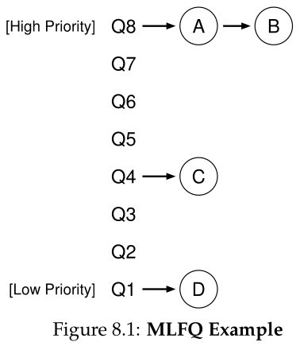

Las primeras colas son de alta prioridad mientras que las ultimas son de baja prioridad. **Las de alta prioridad tienen que quanto muy pequeño y las de baja prioridad tienen el quanto grande**. *(La cola ordena procesos listos para correr, o sea procesos ready)*
Lo que se trata de hacer es poner los procesos I/O-bound como alta prioridad y los CPU-bound como baja prioridad. Pero hay un problema, sabemos que no es posible a ciencia cierta calcular exactamente cuanto va tardar un proceso en ejecutarse. Ademas tampoco puedo saber si un proceso va a ser CPU-bound o I/O-bound, o si va a cambiar durante el tiempo. 
Entonces la idea es hacer un proceso adaptivo que todo el tiempo este evaluando si tiene que bajar o subir de prioridad
### Procesos dinámicos
Por ejemplo pi 1000000 tiene una fase CPU-bound que es cuando los calcula y una parte I/O-bound que es cuando muestra el resultado, por ende todos los procesos son dinámicos
### Regla
La regla que se plantea es: la cola superior que tenga algo va a ejecutar ese. Por lo tanto la cola Q1 va a ejecutar si solo si todas las colas que tiene por encima están vacías (Notar que los procesos A, B, C y D están listos para correr)
Por lo tanto si hay algo en Q8 se ejecuta, si no se mira Q7 y se ejecuta, si no Q6 y se ejecuta y asi sucesivamente...
En cierta forma clasifica los procesos según su calibre, ya que no puedo saber como van a ser los procesos por eso tengo que averiguarlo yo y por eso arranco desde Q1 y a medida que lo necesite muevo el proceso a una cola inferior.
Notar que **hasta ahora** tenemos regla de degradación pero no de promoción, entonces vemos que es una especie de RR (quédate acá mientras no se venza el quanto, cuando se venza baja, entonces eventualmente todos los procesos terminarían en Q1)
### Trampa a la regla
Hagamos un ejemplo con los procesos A y B tal cual en la imagen anterior.
Si se el tamaño de Q8 podría hacer un timer  (por ejemplo de 10ms) y voy a computar hasta 9.99ms y en ese momento hago *¿¿sketkill, schetgill??* (proceso para hacer CPU dependiente), entonces en ese momento el proceso se va hasta el fondo de la cola y empieza a correr B. Luego corre B que cae a Q7, Q6... por lo tanto el proceso A se quedaría siempre en Q8
### Regla parte 2
La regla para subir los procesos es algo rara, se denomina S y cada cierto tiempo sube todos los procesos hacia arriba. Si no hacemos esto, podria darse el caso de que aparezcan muchos procesos chiquitos y que un proceso en Q1 sufra de starvation (que nunca se ejecute)
### Solución a la trampa
Para que no hagan uso de la syscall y hacer caso omiso a las reglas, el planificador decide no tener en cuanta lo que uso actualmente el proceso si no que va sumando todo lo que fue usando desde su creación, entonces por mas que sea un proceso I/O-bound va a acumular CPU y por lo tanto eventualmente bajara 

---
## **Ciclos**
Un ciclo es el tiempo mas largo de una instrucción. Los procesadores super escalares ejecutan mas de una instrucción por ciclo, se llama paralelismo a nivel de instrucciones.
### Tiempos de ejecución
**El tiempo de ejecución en el CPU puede ser mayor que el real**, por ejemplo la ejecución de programa que se ejecuta en 4 nucleos y si tarda 1seg en cada nucleo el tiempo de ejecución es de 1 segundo pero el tiempo de CPU es de 4 segundos. **El tiempo de CPU es la suma de todo el tiempo que estuvo en cualquiera de los nucleos.**
### CPU Migrations
**Por default esta activado el CPU migration** que hace que un proceso se pueda ir a otro nucleo. Las migraciones se producen para tratar de evitar de poner un proceso en un nucleo que esta ocupado con otras cosas
### Sistemas operativos
**Sistemas operativos tiene como misión tratar de mantener la maquina funcional lo mejor posible**
### Fork
Fork hace un clon exacto del ese proceso ejecutando de ese punto exacto donde se hizo el fork copiando absolutamente todo en otro proceso nuevo independiente

---
## **RAM**
Cada proceso que uno forkea cree que tiene toda la RAM disponible, no hay forma de hacer que sepan que hay RAM ocupada.
El hilo es una forma de tener ejecución múltiple dentro de un proceso compartiendo toda la ram que tiene. El hilo esta adentro de un proceso y todos los procesos adentro de ese hilo ven la misma RAM.
Es imposible que un proceso pueda ver la memoria de otro ya que todos los procesos mapean en la misma memoria, por ejemplo dos procesos pueden escribir en la misma memoria. Cada proceso cree que vive en un espacio de memoria para el solo.
### Heap y Stack
Stack es donde se ponen los argumentos de función y la dirección de retorno de los argumentos de función. Si tenemos un programa recursion el stack crece mucho
Heap es donde se hacen los malloc y free. Si tenemos un programa que pide mucha memoria crece mucho el heap.
El stack crece para abajo y el heap para arriba enfrentados de forma tal que si no utilizamos mucho uno el otro si se pueda usar mucho. La suma de los espacios esta fija.

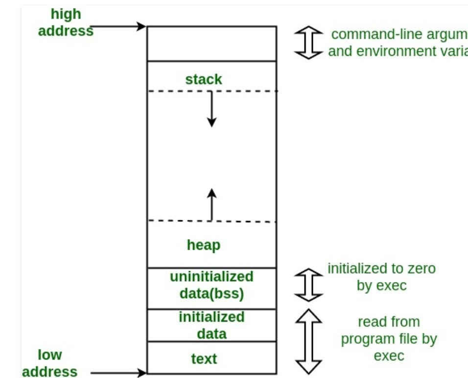

Lo único que no se comparte es el stack. También hay un mecanismo de protección para que no se toquen el stack y el heap.
High address es el punto de quiebre de la memoria.
Text es el programa.
En el stack tengo que acordarme a que punto volver, o sea la dirección de retorno.
*Si el stack creciera indefinidamente podría tocar el programa, por eso es que la memoria inicilizada y el text no lo puedo tocar y esta protegida, así no puedo hacer moco.*
Todo lo que ocupe la memoria del kernel no se puede leer, escribir, acceder ni ejecutar
**Ambos son dinámicos.**
**En el heap se guarda la memoria que pido con malloc mientras que en el stack se guardan los argumentos de función y las direcciones de retorno.**
### Desbordamiento de buffer
Si el stack creciera tanto que termina pisando al heap y al código del programa se produce un error conocido como desbordamiento de buffer, es una vulneracion al SO que realizan programas maliciosos o mal hechos haciendo crecer al stack de forma artificial a través de parámetros muy largos hasta pise el código del programa con datos que yo quiero para obtener el control del programa que se esta ejecutando a través de parámetros de entrada.
Para evitar esto es que se pone el stack arriba y el heap abajo, se le deja al stack un espacio pequeño y entre el final del espacio libre del stack y el inicio del código de programa se pone un **bollero**(alambre), cuando el stack intenta pasar ese bollero el código es terminado para protegerse y se liberan los recursos del programa.
### Sistema operativo
Es importante entender que todos los elementos que declaro en un programa tienen que estar en algún lado. Ademas el sistema operativo también debe estar en la memoria ya que necesito llamarlo. *Aunque ahora esta bastante oculto pero en cierta parte podemos decir que forma parte de la memoria.* **Ahí es donde se ejecutan todas las syscalls y se ejecutan todos los traps ya sean por hardware o software.**

---

## **Virtualizacion de la RAM**
Virtualizar la RAM es un proceso mediante el cual hacemos creer a los programas que disponen de toda la memoria fisica disponible para ellos solos. Se hace mediante distintas tecnicas con ayuda tanto del software como del hardware multiplexando. Es importantisimo poder virtualizar la memoria no solo por la efeciencia sino por la seguridad.
## Objetivos
1. ***Transparencia***: queremos que el SO implemente la memoria virtual de una manera la cual sea invisible para otros programas de manera tal que estos no sepan que su memoria es virtualizada y crean que disponen de toda la memoria física
2. ***Eficiencia***: Hacer que todos los procesos crean que tienen toda la RAM impone una carga por lo que el SO debe hacer la virtualizacion lo mas eficientemente posible tanto en tiempo (que la virtualizacion no ralentice los programas) como en espacio (que las estructuras necesarias para virtualizar no necesiten mucha memoria). Para lograr esta eficiencia el SO se debe apoyar del hardware por características como TLBs.
3. ***Protección***: El SO debe proteger un proceso de otro de manera tal que entre ellos no puedan ver, acceder o modificar lo que tienen entre si, solo pueden hacerlo ellos mismos generando la sensación de que cada proceso esta aislado. No tengo que poder a través de los mecanismo de leer y escribir memoria poder tocar el kernel, leer el kernel, corromper el código ya sea a través del stack o el heap. Estos mecanismo de protección me los debe brindar la abstracción conocida como el espacio de dirección.

### Administrar memoria
Veamos un ejemplo de que pasa con la memoria. Supongamos que tenemos el siguiente código:
`int *p = malloc(1* sizeof(*p));`
Este pide memoria al heap mediante malloc *(recordemos que malloc devuelve un puntero)*, luego int hace que este puntero se guarde en el stack. Pero ademas como el programa esta hecho en código, el código del programa se guarda en program code
### Variables automáticas
Todas las variables que declaro sin necesidad de pedir memoria son de tipo automática, estas no las tengo que liberar manualmente. Por ejemplo un int, un string, un int *p*, y demás.
Se usa el tipo de estructura **pila** en la que las variables nuevas van por encima de las viejas.
*Por ejemplo si no declaramos argc como parametro de la funcion pero si como una variable esta va a ser distinta.*
**El SO siempre pone en el stack que define por defecto el argc y el argv aunque no los use o los declare.**
### Pedir memoria
Puedo pedir memoria de manera manual. Para ello puedo utilizar malloc el cual necesita que le pasemos el tamaño que queremos como argumento. Luego de pedir la memoria y utilizarla necesito liberar la memoria, aunque puede que en algunos casos no sea estrictamente necesario hacerlo es una buena practica, lo hago usando free(p) sin ponerle la estrellita ya que estrellita es el valor que se almacena en la memoria, yo lo tengo que decir es liberarme el puntero que apunta a esa dirección de memoria.
### Scopping - Ámbito de vida la de variable
Puedo utilizar las llevas para declarar ahí dentro variables que solo funcionaran ahí dentro. Por ejemplo siguiendo el ejemplo anterior podría hacer:
`#include <stdlib.h>`
`int main(int argc, char ** argv) {`
`int *p = malloc(1*sizeof((*p));`
`{`
`int *p = NULL;`
`int j = 0;`
`}`
`j = 1;`
`free(p);`
`}`
De esta manera estrellita p vale NULL solo dentro de las llaves al igual que j=0 solo dentro de la llave, una vez que se cierra j no existe mas y por lo tanto j=1 va a dar error.
*Notar también que podríamos seguir haciendo eso, crear mas variables dentro de llaves que a su vez están dentro de llaves. Entonces estaríamos creando variables que luego se van destruyendo a medida que salen.*
**A medida que voy creando cosas dentro de la llave estas se van creando arriba de la pila.** Creo el primer p en la pila, luego el que esta dentro de la llave lo crea arriba de ese, el que sigue arriba, el que le sigue arriba y así... Luego hago pop y bajo del stack.
### Mostrar valor de un registro del stack
Podríamos mostrar el valor de un registro del stack que no conocemos de manera simple:
```c
#include <stdlib.h>
#include <stdio.h>
int main() {
int a;
int *q = &a;
printf("%d\n", *(q+2));
return 0;
}
```
De esta imprimimos el valor de q+2 el cual es desconocido para nosotros.
#### Stack smash
Sabemos que el argc esta en el stack pero no sabemos exactamente donde esta, por ende podríamos recorrerlo para tratar de encontrarlo. A priori sabemos que si tenemos un programa que no toma parámetros su valor debe ser 1
```c
#include <stdlib.h>
#include <stdio.h>
int main() {
	int a;
	int *q = &a;
	for (int i=0; i<16; i++)
		printf("%d\n", *(q+i));
	
	return 0;
}
```
Luego si nos ponemos a agregar parámetros cuando llamamos al programa veremos que uno de los valores aumenta, entonces ese es el argc.
Ahora para saber en que posición esta modificamos un poco el programa:
```c
#include <stdlib.h>
#include <stdio.h>
int main() {
	int a;
	int *q = &a;
	for (int i=0; i<16; i++)
		printf("%d: %d\n", i, *(q+i));
	
	return 0;
}
```
Este es el principio de una técnica de seguridad informática llamada stack smash.
**Es importante entender la memoria del proceso que esta ejecutando como un arreglo lineal de memoria** donde tengo el stack por un lado que crece decrementando las posiciones de memoria, tengo el heap en un lugar que incrementa las direcciones de memoria.
#### Ver las syscall que hace
```c
#include <stdlib.h>
#include <stdio.h>
int main() {
	int *p = malloc(1*sizeof(*p));
}
```
Luego compilo con para que no haga syscalls linkers y demas 
`gcc -static malloc.c`
Luego si hago 
`strace ./a.out`
Veremos todas las syscalls que hace el programa.
Vemos que ocurren varias syscalls, entre ellas execvp, brk, arch_protect, uname, readlink, brk, mprotect, exit.
Pero no vemos explicitamente que pida memoria en ningún momento. Esto es porque **malloc tiene un llamado a una función de librería**. Si ejecutamos sin el -static podremos ver que hace otras cosas un poco raras que son llamadas a la librería.
#### ltrace
Es como el strace pero nos muestra las librerías, por ejemplo nos dice que hay una llamada a malloc con 4 bytes y nos muestra el valor de retorno que es una dirección de memoria (el valor del puntero que se almacena en estrellita p).
Luego si quiero filtrar los resultados solo para ver los llamados que hace a malloc puedo hacer: 
`ltrace -emalloc pi 100`
Y eso me muestra solo las lineas que tengan algo relacionado a malloc
#### Malloc y free
Malloc y free son llamadas a una rutina, a una ficha. Cuando hago un malloc o free algo se toca en el heap.
Notar que es una mala practica hacer un malloc pidiendo una cantidad fija de memoria. Por ejemplo:
```c
#include <stdlib.h>
#include <stdio.h>
int main() {
	long *p = malloc(1*sizeof(*p));
	long *q = malloc(4);
}
```
Vemos que esto compila pero eso no significa que sea correcto nuestro código. La primer linea si es correcta ya que pedimos la cantidad de memoria que devuelva la función sizeof la cual devuelve un sizeof_t que va a depender de la arquitectura de nuestra computadora entonces siempre vamos a tener la cantidad de bytes necesaria. *Creo que eran 64bits para los long -> 8bytes.*
Mientras que en la segunda linea solo pedimos 4bytes y como un long tiene 8bytes nos quedamos cortos.
#### Mangled y demangle
Los nombres raros que tienen partes que se entienden y partes que no con muchas letras y nros se llaman mangled y le sirven a la biblioteca de enlace dinámicos, pero a nosotros no nos sirve. Por ejemplo:
`ZN3cl19cl_free_heap_objectEPNS_7cl_heapE`
Luego si cuando ejecuto el programa hago
`ltrace -emalloc pi 100
Se hace el demangle y me muestra algo que ya puedo entender mejor diciéndome cada una de las llamadas a malloc que hubo.
#### Valgrind
Valgrind es emulación pura, sirve para ver la memoria utilizada y fijarse si no hay memleaks. Lo que hace es ir instrucción por instrucción del código de maquina y también todas las llamadas a bibliotecas las va ejecutando en un emulador (emula un procesador) y por eso se hace tan lento.
#### ASLR
Si hacemos:
```c
#include <stdlib.h>
#include <stdio.h>
int main() {
	int *p = (int *) malloc(1*sizeof(*p));    //o tambien int p* = malloc(4);
	int *q = (int *) malloc(4);
}
```
Y luego hacemos 
`ltrace ./a.out`
Veremos que el salto de la dirección entre los valores va a ser de 32bytes. Esto es debido al **ASLR (Address space layout randomization)** es una técnica que implementa el SO en conjunto con la biblioteca de carga dinámica para tratar que la seguridad del código sea lo mejor posible. Entonces si pedimos 1 solo byte también estaríamos generando ese espacio de 32 bytes, por lo tanto seria un gran desperdicio de bytes *(o sea uso 1 byte y los siguientes 32bytes están vacíos)* Entonces si pido 1byte desperdicio el 96% de la memoria, si pido 4bytes el 87%, si pido 8bytes el 75%.
Pero ojo, malloc pide 32bytes hasta el malloc(25), luego empieza a pedir mas bytes. Esto es debido a que malloc me permite usar hasta 24 bytes, los otros 8 los reserva para hacer sus cosas. El heap tiene un control muy estricto de lo que se tiene adentro.
#### free():Invalid pointer
Tenemos que notar que yo solo puedo hacer un free de la memoria que previamente pedí, no puedo hacer free de algo que no pedí, por ejemplo no podría hacer:
```c
#include <stdlib.h>
#include <stdio.h>
int main() {
	long *p = (long *) malloc(1);
	free(p-1);
}
```
El heap tiene que recordar todas las direcciones de memoria que dio cuando se hizo el malloc. No puedo hacer free de un puntero que no esta guardado en ningún lado. Nos devuelve un error invalid pointer.
Notemos que al free no le pasamos cuanta memoria liberamos, sino el puntero del que queremos liberar. Ahora nos podemos preguntar **¿Donde se almacena el tamaño? La respuesta es en los ultimos 8bytes que no podiamos usar del malloc.**
#### Double free y heap smashing
Cuando hago free(p) luego debo poner p=NULL. SI no lo hago y luego pongo otro free(p) estaría generando un error de double free.
Pero hay que tener cuidado porque con el double free podríamos atacar el heap generando un ataque conocido como heap smashing.
#### Variable no inicializada
Si declaro una variable pero no la inicializo podría darme error o no ya que tendrá el valor que tenia antes esa variable si es que existía. La memoria nunca esta vacía, tendrá en el caso de que no había nada antes basura.

---

## Virtualizar memoria
### MMU (Memory managment unit)
Los procesadores tienen una unidad especializada en administrar la memoria. Esta parte es muy importante porque nos brinda **protección**. Antiguamente esto no solía estar ya que era muy caro y difícil de implementar por ende los programas en memoria podían acceder a cualquier parte de la memoria sin ningún tipo de restricción.
Entonces si queríamos tenes dos programas funcionando a la vez era complicado porque un programa podía comerse a otro.
**El MMU debe ser muy rápido y no producir ninguna sobrecarga al sistema**, porque a diferencia de ejecutar instrucciones para las cuales no hay ninguna capa intermedia, para las direcciones de memoria si hay una capa intermedia.
### Como funciona un programa y procesador respecto a los accesos a memoria
Veamos un programa que es raro ya que se basa en un problema matemático sin resolver:
```c
#include <unisdt.h>
void _start(start) {
	unsigned long x = 931386509544713451UL; //https://en.wikipedia.org/wiki/Collatz_conjeture
	while (1<x) {
		if (x%2==0) x = x/2;
		else x = 3*x+1;
	}
	_exit(0);
}
//gcc -01 -nostartfiles -s -static collatz.c
```
Cuando x es 1 para. La pregunta es si desde todo numero inicial yo eventualmente llego a 1 aplicando esos pasos, es algo que todavía no se sabe porque no esta probado para todos los números.
Notemos que ejecutar un código implica acceder a la memoria ya que von Neumman lo ingenio de esta forma, por lo tanto para ejecutar un programa hay que leer si o si la memoria.
### Otro ejemplo
Veamos otro ejemplo con el siguiente programa:
```c
#include <unistd.h>
#define N 1024

int a[N] = {0}; //un int ocupa 4bytes => ocupa 4Kbytes

void _start(void) {
	for(int i=0; i<N; ++i)
		a[i]=i;
	exit(0);
}
//gcc -01 -nostartfiles -s -static global_array.c
```
Luego si hacemos objdump de esto podremos ver el hexa. Luego si lo analizamos nos daremos cuenta que la parte del loop es la siguiente:

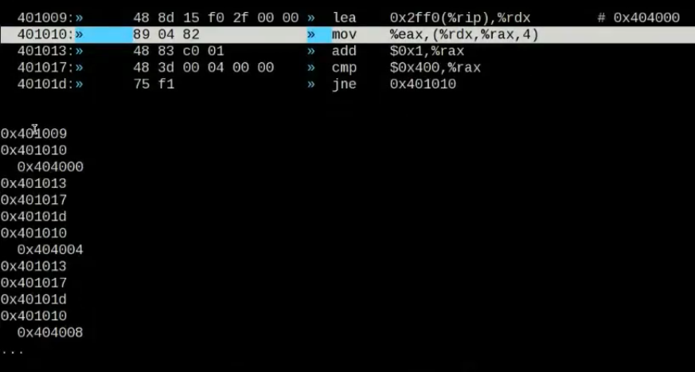

Luego esta hecha una tabla con las direcciones de memoria a las que se accede. Lo importante es resaltar que las que tienen un tab son las con una sola instrucción acceden a dos posiciones de memoria distintas (porque son el mov).
### Memoria virtual a física
Es muy importante entender que cada acceso a memoria necesita traducir de memoria virtual a física, ya que siempre los programas creen que tienen toda la memoria a su disposición y que empiezan desde la posición 0.
### Traducción de direcciones
Es necesario revisar que cada dirección este en el rango adecuado. El **MMU** es el encargado de revisar que cada acceso a memoria no se sale afuera y después si no se sale tiene que transformar esa dirección virtual a la dirección física. **Esto se hace con cada dirección**, ya sea que sea para traer instrucción o leer y escribir memoria es necesario traducirla. Ese proceso se llama traducción de direcciones.
### Emulación
Es muy importante resaltar que en la RAM todas las instrucciones que se ejecutan no se ejecutan como tal como sucede con el procesador, sino que se **emulan** porque se ejecutan es un espacio de direcciones que no es real, es virtual.
### Proceso que se hace
El proceso que se realiza con la memoria es el siguiente:
- Primero el SO debe saber y mantener registros de que partes de las memoria física están en uso y que partes no. Caso contrario no podría decidir con claridad en que lugar forkear los programas.
- Las direcciones de memoria pasan por un comparador que revisan que las posiciones de memoria están dentro de los limites.
- Pasan por un traductor que traduce de memoria virtual a memoria física.
### Address translation (o dynamic relocation)
Toda dirección que el procesador acceda se la va a sumar a al **registro base**, o sea una dirección virtual se pasa a una dirección física sumándole el registro base. Luego cada memoria generada por el proceso es en una dirección virtual.
	***physical address = virtual address + base***
En código seria algo así lo que sucede:
```c
v2p(void *vaddr) {
	if (vaddr<limit)
		paddr = vaddr+base;
	else
		raise TRAP.SEGFAULT;

return paddr;
}
```
**Este programa esta en CPU**, es imposible que este en SO debido a que necesita hacerse extremadamente rápido.
Ahora nos podríamos preguntar que pasa con el registro limite. Bueno este ayuda con la protección ya que antes de hacer nada el MMU verifica que la dirección de memoria este dentro de los limites. Si un proceso genera una dirección de memoria negativa o mayor o igual al limite el CPU devolverá un error conocido como excepción **(segmentation fault)** y el proceso sera terminado.
#### Operación privilegiada
Ademas tenemos que notar que cambiar y leer el registro base y limite es una **operación privilegiada** la cual se ejecuta en modo kernel
#### Ejemplo
	base = 16384
	limite = 4096
	v = 0 -> p = 0 + 16384 = 16KiB
	v = 1024 -> p = 1024 + 16384 = 17KiB
	v = 3000 -> p = 3000 + 16384 = 19384
	v = 5000 -> fuera de rango, **SEGFAULT** *(porque sobrepasamos el limite de 4096)*
Vemos que los limites actúan sobre la memoria virtual.
Entonces cuando sucede un segfault, se para el proceso, se libera toda la memoria relaciona a el y se vuelve al kernel, y del kernel vamos al próximo programa.
#### Segmentacion en la actualidad
Hoy día segmentación es algo que no se usa porque estaba hecho para 32bits, hoy en día se usa pacciona.
#### Preguntas y respuestas
***¿Que tipo de estructura de datos forman los registros (base, limite)?***
Forman una tupla de datos. La maneja el microprocesador, luego el código que tengo impreso adentro del microprocesador utiliza esa estructura de datos para chequear cada acceso a memoria ya sea por instrucciones, carga o almacenamiento.
***Si tengo 10 procesos en mi SO ¿Cuantos registros (base, limite) tengo en el procesador?***
1 par
***¿Cómo hago para cambiar de proceso si cada proceso tiene un (base, limit) distinto?***
Guardo (base, limit) en el struct proc (PCB). Cuando cambio de contexto cambio de registro base y limite, gracias a la multiplexacion en tiempo del procesador hace que se multiplexe en espacio la memoria.
***¿Quien establece inicialmente los registros (base, limite)?***
El SO cuando inicia la computadora.
***¿Un programa de usuario puede tocar (base, limite)?***
No ya que eso es una operación privilegiada, para hacerlo debo estar en modo kernel.

---

## **Segmentación**
Hasta ahora, poníamos enteros los espacios de memoria de cada proceso en la RAM, pero podemos notar que hay un gran espacio que muchas veces no es aprovechado entre el heap y el stack, que a pesar de que no este siendo utilizado por el proceso ocupa espacio de la memoria física.
Para solucionar este problema surge la **segmentación**, la idea es que en lugar de tener solo un registro base y limite en el MMU tener un par por cada segmento lógico del espacio.
### Segmento
Un segmento es una parte (continua) del espacio de dirección de un largo en particular. Nosotros tenemos 3 segmentos lógicos en nuestro espacio:
- code
- stack
- heap
**Lo que la segmentación le permite al SO es poner cada uno de estos segmentos en distintos lugares de la memoria física.** Para ello se necesita que el hardware soporte segmentación.
#### Ejemplo
Veamos un ejemplo de como se mapea la memoria en segmentación con la siguiente situación, tenemos los siguientes registros en memoria fisica:

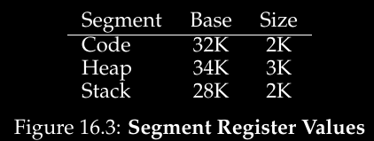

*Supongamos que una referencia es hecha hacia la dirección virtual 100, que en este caso supongamos que esta en el segmento del code, usemos con referencia las siguientes posiciones de memoria virtual:*

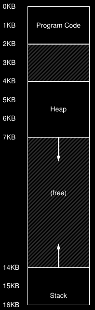

*Cuando se haga el instruction fetch, el hardware va a sumar el valor del offset(**100 en este caso**) a la dirección base del segmento para encontrar la posición de memoria física* **100+32K(32768) = 32868**. *Luego verificara si la dirección virtual (100) esta dentro de los limites (2K) y si lo esta hace la referencia hacia 32868.*
#### Ejemplo 2
*Ahora supongamos que la dirección virtual es 4200 por lo tanto estaría en el heap. Si simplemente agregáramos la dirección virtual al registro base del heap tendríamos 4200+34816 = 39016* **la cual no es la dirección física correcta**.
**Lo que debemos hacer es encontrar el offset correcto**, o sea restar el registro donde inicia el segmento a la dirección virtual ya que caso contrario estaríamos dando una dirección incorrecta porque no hay 4199 registros antes en el heap.
**Entonces el offset seria 4200-4096 = 104**
Luego sumamos el offset al registro base **104+34816 = 34920 y esta es la dirección de memoria física.**
***Por lo tanto como va a estar organizada la memoria virtual y física pueden ser totalmente distintas.*** El proceso piensa que esta organizado como lo esta en la memoria virtual, el SO sabe que en realidad esta organizado como lo esta en la memoria física.
### Como saber a que segmento nos referimos - forma explicita
Una forma de saber a que segmento de nos referimos es hacerlo mediante una aproximación **explicita**, para ello se divide el espacio de memoria en segmentos según los bits mas significativos.
Pasaríamos de tener algo así:
`(ba, bo)`
A tener algo así:
`((ba0, bo0), (ba1, bo1), (ba2, bo2))`
(donde ba=base y bo=borde)
De esto se encarga el hardware.
#### Ejemplo
Por ejemplo, supongamos que tenemos 3 segmentos, entonces con tener dos bits nos alcanzaría para distinguirlos. Entonces si tuviéramos 14bits y usamos los 2 primeros seria algo así nuestra dirección virtual:

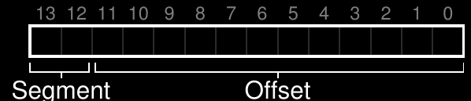

Ahora, sigamos con el ejemplo de antes y supongamos que 00 hace referencia al code, 01 al heap.
Supongamos que queremos ver como se traduce la dirección virtual 4200:

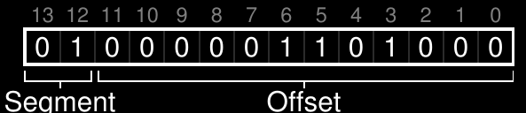

Entonces los 2bits mas significativos indican que estamos haciendo referencia al heap y los otros 12 son el offset que en hexa seria 0x068 o 104 en decimal.
#### Problemática
Notemos que al usar dos 2bits y tener solo 3 segmentos un segmento del espacio estaría sin usar. Para aprovecharlo, los SO suelen poner el code junto al segmento heap y así poder usar solo 1bit para indicar a que segmento nos referimos.
Un problema de esta implementacion es que cada segmento esta limitado a una cantidad de bits máxima. *En nuestro ejemplo ese limite seria de 4KB ya que teníamos 16KB que se dividieron en 4 segmentos de 4KB cada uno porque usamos 2bits para distinguir los segmentos.* Entonces si un programa quisiera agrandar su segmento no podría.
Existen otros métodos para determinar los segmentos.
#### Forma implícita
También existe una forma implícita de identificar a que segmento se refiere. Esto sucede en los procesadores intel detectando a través del tipo de instrucción si accede al code, stack o heap.
¿Como lo hace?
- Si ingresa al code se da cuenta porque hace un instruction fetch
- Si ingresa al stack porque hace push, eax, pop, edx
- Si ingresa al heap el resto, o sea todos los mov
### Que sucede con el stack
*El stack es complicado de llenar, tendría que hacer funciones recursivas las cuales no se suelen utilizar.*
El stack fue relocalizado en la memoria fisica pero con el detalle que ahora **crece para arriba**, *entonces siguiendo el ejemplo de antes ahora inicia en 28KB y crece hasta 26Kb*
Para que esto sea posible el hardware debe saber que hay segmentos que crecen para abajo, entonces nuestro diagrama de segmentos de un ejemplo anterior quedaría de la siguiente forma:

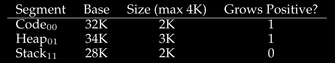

Entonces el hardware debe hacer las operaciones de manera distinta para soportar que el stack crezca al revés.
La base del stack esta en la parte de abajo y el limite en la parte de arriba indica cuento puede crecer, esto es lo que lo diferencia de los otros segmentos.
#### Ejemplo
Supongamos que queremos acceder a la dirección virtual 15KB la cual debería mapear a la dirección 7KB física. En binario la dirección virtual seria la siguiente:
`11 1100 0000 0000 (0x3C00 en hexa) => 15KB`
El hardware usuaria los 2bits mas significativos para obtener el segmento lo que nos estaría dejando con un offset de 3KB
`1100 0000 0000 => 0xC00 => 3072 => 3KB`
Pero le estaríamos errando porque ahora no crece para abajo sino que para arriba.
Para obtener el offset negativo correcto debemos restar el tamaño máximo del segmento al offset que tenemos (o sea 3KB).Por lo tanto en este caso seria:
`3KB-4KB = -1KB`
Luego a nuestro offset le tenemos que sumar el el registro base del segmento, en este caso es:
`-1KB+28KB = 27KB`
Entonces la dirección de memoria física correcta es 27KB.
### Code sharing
Existen situaciones en las que podría ser útil compartir segmentos de memoria entre diferentes espacios de memoria, en especial compartir el code.
Para poder hacer eso se necesita que el hardware soporte algo conocido como **protección de bits**. Para ello se añaden algunos bits por segmentos indicando si un programa puede o no leer o escribir un segmento, ademas de si puede ejecutar código que resida en ese segmento.
Si un segmento es indicando como solo lectura el mismo código puede ser compartido por múltiples procesos sin problemas de aislamiento ya que cada proceso piensa que tiene su propia memoria mientras en realidad el SO comparte la memoria entre distintos procesos.
Siguiendo los ejemplos anteriores, la tabla quedaría de la siguiente forma:

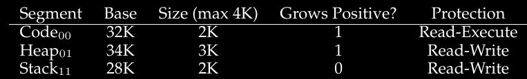

Con los protection bits el algoritmo descrito anteriormente también cambiaría:
Ademas de tener que chequear que la dirección virtual este dentro de los limites el hardware debe verificar si cada acceso esta permitido. Si un proceso trata de escribir sobre un proceso solo de lectura se producirá una excepción.
*Por ejemplo podría ser útil si se hace un fork ya que el code seria exactamente el mismo para ambos procesos.*
*Notemos que el code no crece, el stack si y el heap tambien.*
#### Ejemplo
Si se hace un fork, se va a dar el siguiente caso:
`P0: ((ba0, bo0), (ba1, bo1), (ba2, bo2))`
`P1: ((ba0, bo0), (ba1, bo1), (ba2, bo2))`
Donde en ambos procesos vamos a tener la misma secuencia de registros, puedo hacer que dos procesos en memoria apunten al mismo segmento de code, stack o heap. Esto tiene mucho sentido con el code.
Si hago execvp agrego un nuevo segmento de code.
### Fine grainded and coarse grained
Existen distintas divisiones de segmentos, las mas comunes son:
- **Coarse grained** es cuando se dividen los segmentos en espacios relativamente grandes.
- **Fine grained** es cuando se dividen los segmentos en espacios pequeños.
### Segment table
Para soportar distintos segmentos se necesita que el hardware tenga una **segment table** para almacenar los valores en memoria.
### Problemas de la segmentación
Ya nos podemos dar una idea de como funciona la segmentación:
Partes del espacio de memoria son re ubicados en la memoria física a medida que el SO se ejecuta logrando así un gran ahorro de memoria física comparado a tener solo un par de registros limite y base.
Pero la segmentación también trae consigo varios problemas:
1. El primero es ¿Que debe hacer el SO durante un context switch? Por ahora sabemos que el SO debe guardar los registros del segmento y restaurarlos cuando sea necesario.
2. El segundo es cuando la interacción con los segmentos crece. *Por ejemplo cuando un proceso llama a malloc, en algunos casos el heap va a ser capaz de atender ese llamado y darle espacio pero en otros casos no y necesitara crecer. Para este ultimo caso la librería memory-allocation va a hacer una syscall para hacer crecer el heap. Luego el OS debe decidir si darle mas memoria (usualmente es lo que sucede) o si denegar la petición ya sea por falta de memoria física o porque el proceso ya uso demasiada memoria*
3. El tercero es manejar el espacio libre en la memoria física. Cuando un nuevo proceso es creado el SO debe ser capaz de encontrar memoria física disponible para los segmentos de ese proceso. Pero esto no es sencillo ya que lo segmentos varían según el proceso tanto en numero como en tamaño. Rápidamente la memoria física se llena de pequeños espacios libres haciendo complicado ubicar nuevos segmentos o hacer crecer los existentes. Este problema se llama **external fragmentation.**
### External fragmentation y compactar memoria física
Veamos un ejemplo para entenderlo mejor. Supongamos que aparece un proceso y queremos ubicar un segmento de 20KB. Tenemos 24KB libres pero no son contiguos por lo tanto el SO no podría ubicarlo. Estamos ante un claro caso de external fragmentation, tenemos la cantidad de memoria necesaria pero no podemos ubicar el segmento.
La solución a este problema viene dada por **compactar la memoria física** *(compact physical memory)* reorganizando los segmentos actuales.
*Por ejemplo el SO podria detener los procesos corriendo, copiar su informacion a una posicion contigua, cambiar sus registros de segmentos para que apunten a la nueva direccion fisica y asi obtener optimizar el uso de la memoria fisica*
#### Problema de compactar memoria
Pero compactar memoria es muy laborioso, ya que copiar los segmentos es una peticion intensiva tanto para la RAM como la la CPU. Ademas existe un fenómeno conocido como **memory wall** debido a que la velocidad de los procesadores crecio mucho pero la velocidad de acceso a la memoria por mas que tengamos las mas rapidas.
Usualmente no se mueven las cosas porque es muy caro el hacerlo.

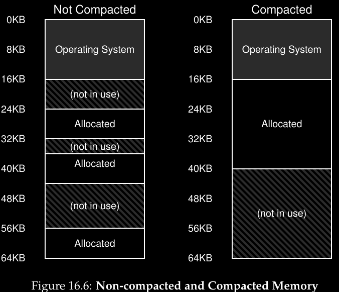

Existen otros muchos algoritmos para aprovechar los espacios de memoria como:
- **best-fit** (tiene una lista con los espacios libres y retorna el que tenga el valor mas cercano al que se necesita)
- **worst-fit**
- **first-fit**
- **buddy algorithm**
**Pero a pesar de que existan tantos el external fragmentation va a seguir existiendo, el objetivo del algoritmo es minimizar los casos en que sucedan.**
***Aunque segmentacion ya no se usa, lo que usan las computadoras actuales es paginacion.***

---

## **¿Cómo manejar el espacio libre?**
Manejan el espacio libre puede ser sencillo si tenemos el espacio divido en unidades de tamaños fijo, pero si son unidades de distinto tamaño se hace mucho mas complicado
Notemos que los espacios no deben ser de tamaño fijo ya que podría traer problemas como fragmentacion interna(por ejemplo si son todos de 4KB pero solo necesito 1byte desperdicio memoria) o que seria muy fácil hacer varios pedidos de malloc y dejar usar toda la memoria.
### Asumimos
Para responder a esta problemática vamos a asumir que malloc() y free(), específicamente `void *malloc(size_t size)` toma un solo parámetro **size** y devuelve un puntero apuntando a la ubicacion con ese tamaño.
`void free(void *ptr)` toma un puntero y libera el espacio correspondiente.
### Internal fragmentation
Los asignadores o "**allocators**" son aquellos encargados de manejar una región continua de bytes. Por ejemplo pueden pedir que una región crezca cuando necesite mas memoria. Estos pueden sufrir de un problema conocido como **internal fragmentation** (*no confundir con external fragmentation*).
Si un allocator maneja o distribuye porciones de memoria mayores a las solicitadas habría espacios de memoria sin utilizar. Esos espacios de memoria se consideran como internal fragmentation.
### Splitting y coalescing
Splitting y coalescing es una tecnica muy usada por los alocators, vienen de la mano una con la otra.
Supongamos que tenemos una lista como la siguiente:


Vemos que tenemos 30bytes en un heap donde los 10 primeros están libres, los 10 de en medio ocupados y los últimos 10 libres. La lista que contiene los bytes libres se llama ***free list***(se divide en chunks). Vemos que en este caso la free list de este heap tendría dos elementos:
1. Uno que describe los 10 primeros bytes (bytes 0 a 9)
2. Otra que describe los 10 últimos (bytes 20 a 29)


*(El addr:0 indica que empieza en la posición 0 y leng:10 indica el largo, luego addr:20 indica que hay otro lugar libre en la posición 20 y len:10 que el largo es de 10)*
Cualquier pedido que necesite mas de 10bytes va a devolver un NULL porque no hay ningun espacio continuo de esa cantidad disponible. Si se piden exactamente 10bytes cualquiera de los dos espacios disponibles va a poder atender el pedido. ¿Pero que pasa si viene un pedido de menos de 10bytes?
#### Splitting
Por ejemplo, supongamos que viene un pedido de un solo byte. En este caso el allocator va hacer algo conocido como **Splitting**: encuentra un **chunk**(*espacio de memoria de un determinado tamaño*) que pueda satisfacer el pedido y lo divide en 2. El primer chunk va a retornar al que lo llamo y el segundo va a seguir en la free list.
*En nuestro ejemplo, vino un pedido de 1byte y el allocator decidio usar el segundo chunk para atender la petición, el malloc() va a retornar 20(la dirección donde nos paramos ya que es el comienzo de ese chunk y ahí va a alojar el byte nuevo) Entonces la lista va ahora va a ser tal que así:*


Entonces la lista permanece casi igual salvo que ahora hay 1byte mas y que la región libre que antes empezaba en 20 ahora lo hace en 21 con un largo de 9.
La técnica de slipt es comúnmente usada por allocators cuando las peticiones son menores que cualquiera de los chunks libres.
#### Coalescing
Es un corolario del sliptting. *Sigamos con el ejemplo de antes, donde teníamos 10bytes libres, 10 ocupados y 10 mas libres:*
**¿Que pasaría si en esa situación hacemos un free(10)?**
Lo obvio seria pensar que simplemente liberamos la memoria y listo, pero sucederia algo como lo siguiente:


A pesar de que tenemos todo el heap libre no podríamos atender una petición de 20bytes porque los espacios libres no son contiguos.
Para solucionar este problema, los allocators ***juntan (coalesce)*** los espacios libres cuando un chunk de memoria es liberado si es que esta contiguo a otro que esta libre ya sea a izquierda o derecha haciendo así un chunk mas grande.


*Notemos que así lucia el heap antes de realizar ninguna allocation*

### Seguimiento del tamaño de las regiones asignadas
`free(void *ptr)` no toma ningun parametro de pero sabemos que dado un puntero determina la direccion de memoria y la libera.
Para poder llevar a cabo esta tarea la mayoria de allocators guardan un poco mas de informacion en un **header block** que se guarda en la memoria.
Ejemplo: examinemos un bloque de 20bytes al que ptr apunta. Imaginemos que se llama a un malloc() que guarda los resultados en ptr (ptr = mallor(20);). Nos basamos en lo siguiente:

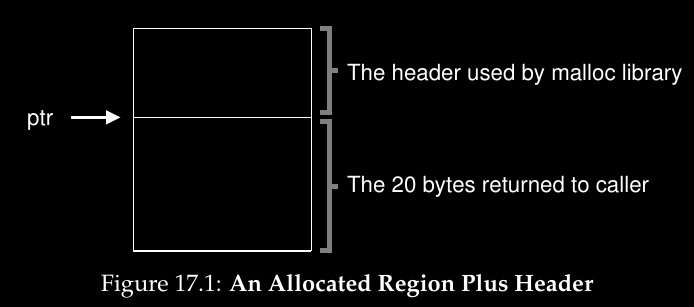

El header minimamente va a contener el tamaño de la region asignada (en este caso es 20), puede contener otros punteros y va a contener un **numero magico** que lo usamos para chequear que la memoria no fue alterada. Supongamos que header es de la siguiente forma:
```c
typedef struct {
int size;
int magic;
} header_t;
```

Este ejemplo va a ser algo como lo siguiente:

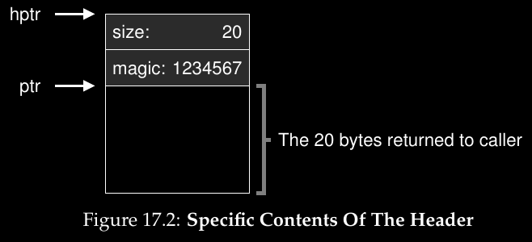

Cuando se llama a free(ptr) la libreria usa simple pointer arithmetic para encontrar donde comienza el header.
```c
void free(void *ptr) {
header_t *hptr = (header_t *) ptr - 1;
...
```
Después de obtener el puntero al header, la librería puede determinar si el numero mágico es el esperado o no haciendo uso del assert:
` (assert(hptr->magic == 1234567))` y luego calcular el tamaño total de le nueva región libre mediante matemática.
### Correcto tamaño de la región libre
Notemos que el tamaño de las regiones libres son:
`tamaño del header + espacio asignado por el usuario`
*Por lo tanto cuando el usuario pide N bytes la libreria no busca un espacio de N bytes sino que busca un chunk de N bytes + el tamaño del header*
### Meter datos en una free list
Asumamos que tenemos un chunk de 4096KB (con heap de 4KB). Para manejar esto como una free list primero debemos inicializarlo. La lista va a tener sola una entrada de 4096KB-tamaño del header = 4088.
El head pointer contiene el inicio de la dirección virtual, supongamos que es 16KB. Entonces hasta ahora tendríamos algo de la siguiente forma:

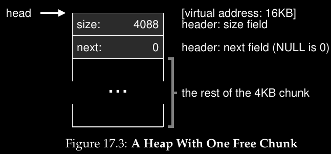

Ahora imagenemos que tenemos una peticion de 100bytes. Para atenderla la libreria debe encontrar un chunk con espacio suficiente. Como solo hay un chunk de 4088B ese va a ser elegido. Luego el chunk va a ser dividido en dos:
- Un chunk lo suficientemente grande como para atender la solicitud
- Y el chunk que estará formado por el resto que queda libre
Asumiendo que el head es de 8bytes el espacio ahora sera el siguiente:

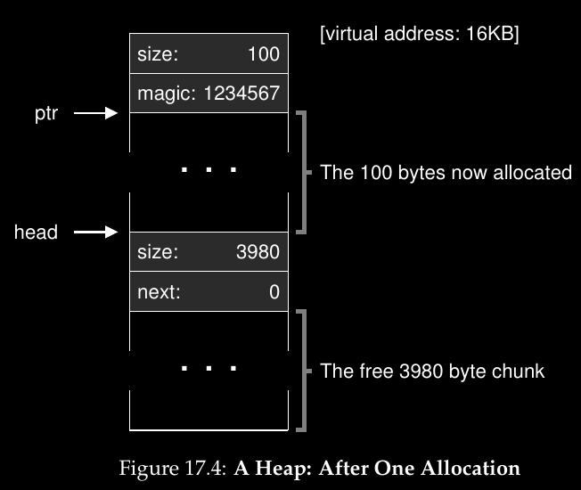

Entonces notar que la solicitud de 100bytes ocupa 108bytes porque es **espacio solicitado+head**
Si hubiera 3 solicitudes iguales el gráfico seria así:

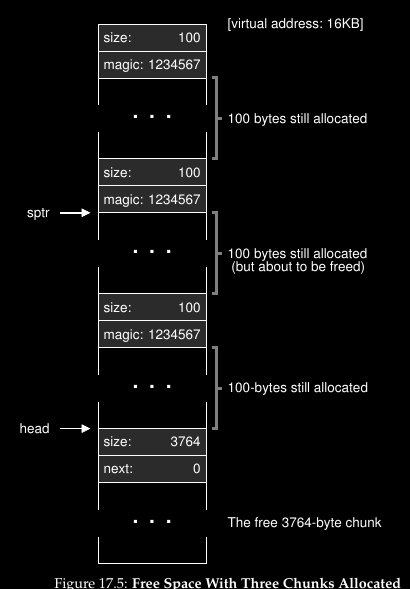

Entonces 324bytes del heap estan asignados, hay 3 heads de 8bytes cada uno y 3 espacios de 100bytes cada uno. La free list tiene 3764bytes.
**¿Que pasaria se se llama a un free?**
Supongamos que hacemos un free(16500) liberando asi el chunk del medio *(16500 = 16384(comienzo de la memoria)+108(del chunk previo)+8(del head previo))*. El resultado seria algo así:

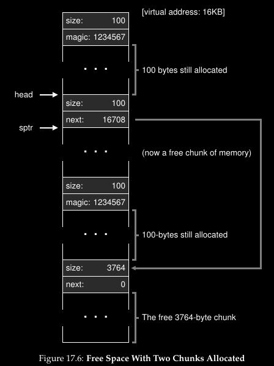

La libreria nota el tamaño del chunk liberado y la añade a la free list.
*Entonces lo que tenemos es una lista que empieza con un chunk de 100bytes a la cual apunta el head y un espacio libre de 3764bytes. Notar que el espacio esta fragmentado pero es algo comun que esto suceda*
Ahora hagamos un ultimo ejemplo, supongamos que los dos ultimos chunks están libres, si no los juntamos terminaríamos con fragmentacion como es el caso del siguiente gráfico:

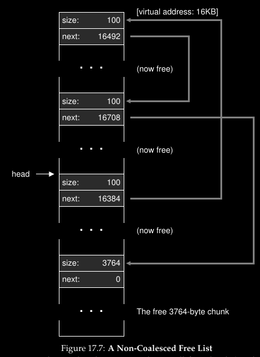

### Hacer crecer el heap
¿Que sucede cuando el heap se queda sin espacio?
Podría darse el caso en que devuelva NULL fallando o podría suceder que el heap pida memoria para agrandarse y poder tener mas chunks (*en los sistemas UNIX se solía hacer mediante sbrk, para ello el SO encontraba paginas físicas libres y mapeaba en ellas las direcciones de los espacios de los procesos devolviendo el valor final del nuevo heap*)
### Estrategias para manejar el espacio libre
Existen diferentes métodos y estrategias para manejar el espacio libre. Los allocators idealmente deben ser rápidos y minimizar la fragmentacion pero no existe una estrategia perfecta. Algunos de los métodos mas conocidos son:
#### Best fit
Es simple, primero busca entre la free table los chunks con espacio mayor o igual al que se necesita y luego selecciona al menor de ellos (*que vendría a ser el best-fit chunk o smallest fit chunk*).
Best fit trata de reducir el espacio desperdiciado. Pero hacer esto tiene un costo ya que las búsquedas reducen el rendimiento y si por ejemplo sucede una búsqueda sin sentido (ya sea porque el primero era el candidato ideal o lo que fuere) perjudicaría usando muchos recursos para ello.
#### Worst fit
Es lo contrario a best fit, busca en la free table el chunk con mas espacio disponible entre todos y lo devuelve dejando así el espacio restante de este en la free list el cual sera grande.
Worst fit trata de dejar chunks grandes libres en lugar de chunks pequeños. Otra vez el problema es el rendimiento porque debe hacer una búsqueda entera entre los chunks.
#### First fit
Es un método simple, busca el primer chunk con memoria suficiente para poder responder a la solicitud y lo devuelve con ese fin.
Tiene como ventaja que es un método rápido al no tener que hacer búsquedas exhaustivas pero como desventaja que suele llenar los primeros espacios de la free table con solicitudes pequeñas.
Un enfoque distinto se le puede dar si se usa **address-base ordering** para mantener free table ordenada según la dirección de espacios libres facilitando juntar espacios libres y reduciendo la fragmentacion.
#### Next fit
Deja un puntero extra en el ultimo lugar en que se busco de esta forma las búsquedas se hacen mas uniformemente evitando el *¿splittering?* al comienzo de la free table.
El rendimiento es similar a first fit ya que evita las búsquedas exhaustivas.
#### Segregated lists
Si un proceso en particular tiene una solicitudes que hace con frecuencia (llamemosla popular) mantiene separada una lista específicamente para atender solicitudes de ese tamaño mientras que el resto de solicitudes son atendidas de manera general.
Teniendo un chunk dedicado a esto, la fragmentacion es menos común y los allocations y free se hacen mas rápido.
Pero esto nos introduce a un sistemas mas complicado y preguntas como cuanta memoria debería dedicarse a este chunk o cuanta se debería dedicar a atender solicitudes en general pueden surgir
#### Buddy allocation (binary buddy allocation)
Esta diseñado para hacer los coalescing mas simples (o sea juntar memoria de manera mas sencilla). La memoria esta pensada como un espacio de ***2 elevado a la N***.
Cuando una solicitud es hecha la búsqueda por espacio libre se divide en 2 de manera recursiva hasta que un bloque con suficiente memoria es encontrado y se lo devuelve.
Por ejemplo, supongamos que tenemos 64KB de memoria total. Queremos retornar 8KB de memoria entonces cuando el allocator lo hace **verifica si el "buddy" (o sea quien esta al lado) esta libre o no**, si lo esta los junta formando 16KB y repite el proceso hasta encontrar un buddy en uso.

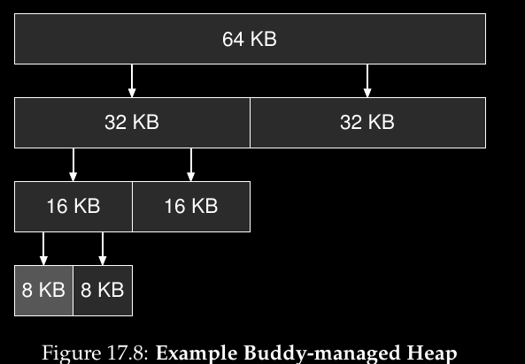

Como vemos es un proceso recursivo con forma de árbol.
#### Ejemplos
Supongamos que tenemos la siguiente free list con 3 elementos de tamaño 10, 30 y 20 respectivamente (ignoremos los heads y otros detalles)


**Asumamos que viene una solicitud de 15:**
Best-fit buscaría por toda la lista hasta encontrar que 20 es el mejor candidato resultando la siguiente lista donde vemos que el chunk de 20 ahora es de 5:


Worst-fit hace la misma búsqueda pero en vez de seleccionar el chunk con 20 selecciona el de 30 resultando en la siguiente lista:


First-fit encuentra el mismo chunk que worst-fit pero con la diferencia que no tuvo que buscar en toda la lista.

---

## Paginacion
Para resolver los problemas de espacios de memoria hicimos un primer acercamiento con segmentacion pero esa técnica tenia la gran desventaja de sufrir de fragmentacion al dividir los espacios en tamaños variables. Tiempo mas tarde surge otra idea la cual soluciona en gran medida los problema anteriores y esta es ***paginacion*** (en memoria virtual). Esta se basa en dividir el espacio de memoria en pedazos de tamaño fijo. En lugar de dividir el espacio de memoria de un proceso en un numero de segmentos con tamaño variable (code, stack, heap, etc) lo dividimos en **unidades de tamaño fijo conocidas como paginas**. 
### Paginacion y segmentación
Paginacion es básicamente segmentación con algunas restricciones:
- El bounds va a ser siempre del tamaño de los bits que sobran en la dirección
- la base va a ser un múltiplo del tamaño en bits que sobran en la dirección
- Y luego algunos cambios
### Ventajas
Paginacion tiene varias ventajas respecto a otros métodos para administrar la memoria, la mas importante es la ***flexibilidad*** ya que el SO va a ser capaz de soportar la abstracción de un espacio de memoria sin importar como el proceso la use, *entonces por ejemplo no vamos a asumir mas sobre la dirección del heap, como el stack crece y demás...*
Otra importante ventaja es la ***flexibilidad*** que ofrece, por ejemplo cuando el SO quiere ubicar nuestra memoria de 64B en las 8 paginas de memoria física, simplemente debe encontrar 4 paginas libres las cuales normalmente el SO lleva una lista de ellas conocida como la **free list** y simplemente las agarra de acá.
### Memoria física
En cuanto a la memoria física, la veremos como un arreglo posiciones de tamaño fijo que llamaremos **page frames**, las cuales a su vez están compuestas por **virtual-memory page** (o sea las posiciones)
### Ejemplo
Veamos un ejemplo de paginacion donde tenemos 64B de memoria las cuales están divididas en 4 paginas de 16B cada una (paginas virtuales 0, 1, 2 y 3). La memoria física es mas grande

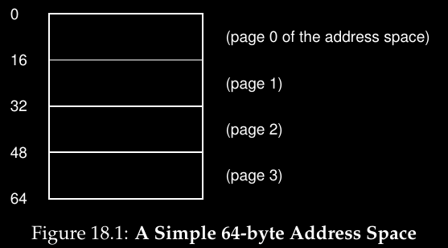

Ahora veamos otro ejemplo pero sobre la memoria física. En este caso tenemos 8 pages frames haciendo un total de 128B de memoria física. Como se puede ver, las paginas virtuales fueron puestas en posiciones de memoria física no contiguas, ademas de que la memoria física tiene un espacio reservado para el SO.

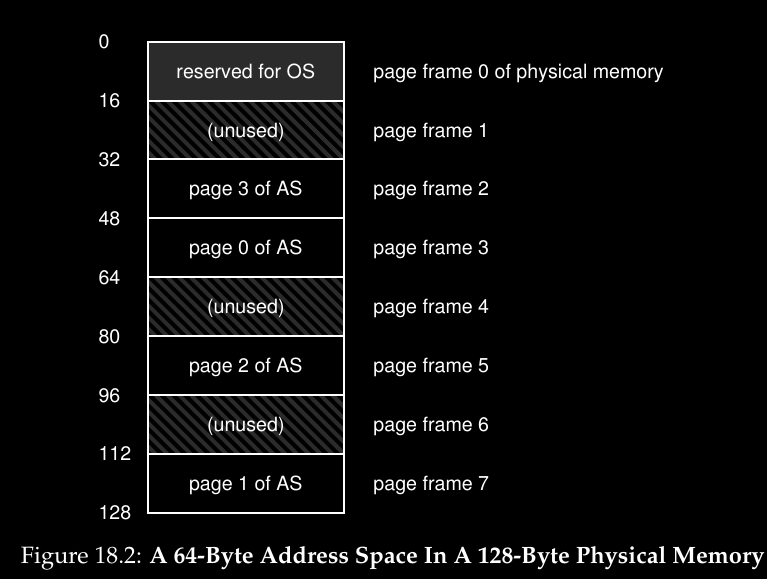

### Page table
Para guardar donde cada pagina virtual de la memoria esta en la memoria guardada en la memoria física, los SO suelen tener una estructura de información por proceso (o per-process data structure) conocida como **page table**. El objetivo de las page table es guardar las ***address translations*** *(o traducción de direcciones)* para cada pagina virtual del espacio de memoria dejándonos así saber donde reside cada pagina en la memoria.
**Guarda las traducciones de memoria virtual a memoria física. Hay una de estas tablas por proceso y al ser flexibles los SO modernos pueden manejarlas.**
#### Veamos algún ejemplo
Siguiendo el ejemplo anterior, la tabla de direcciones seria de la siguiente forma:
```js
(Virtual page 0 -> Physical Frame 3)
(VP1 -> PF7)
(VP2 -> PF5)
(VP3 -> PF2)
```
Es importante recordar que esta tabla es una estructura de información por proceso (per-process data structure) por lo que si otro proceso quiere correr el SO deberá manejar otra page table para ese proceso
### Translate o traducir
Ahora imaginemos que el proceso con 64B quiere hacer un acceso a memoria, lo que seria algo del estilo:
``` js
movl <virtual address>, %eax
```
Específicamente prestemosle atención a la carga de información de **< virtual address >** al registro **%eax**.
Para poder traducir esta dirección virtual que el proceso genero es necesario dividir en dos componente:
- **virtual page number (VPN)**
- **offset**
#### Ejemplo
Sigamos con el ejemplo de 64B, entonces como 2⁶=64 solo necesitamos 6bits para representar la dirección virtual quedando de la siguiente forma:


Donde V5 es el mas significativo.
Luego como sabemos que las paginas son de tamaño de 16bits podemos dividir la dirección virtual de la siguiente manera:

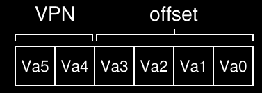

Como el tamaño de las paginas es de 16bits en un espacio de memoria de 64bits necesitamos una manera de seleccionar una de las 4 paginas disponibles, para ello es que están los 2bits del VPN mientras que los restantes (offset) dicen en que byte de la pagina estamos interesados.
#### Ejemplo 2
Cuando un proceso genera una dirección virtual, el SO y el hardware deben trabajar en conjunto para traducir esa dirección en una física. Por ejemplo ahora al ejemplo anterior demosle una dirección virtual numérica, por ejemplo queremos hacer:
```js
movl 21, %eax
```
Entonces 21 se transforma a 010101 en binario, entonces podemos ver como esta dirección virtual se pone como una virtual page number y su offset:

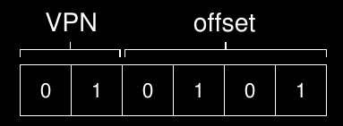

Entonces, vemos que la **dirección virtual se coloca en la posición 5** (0101, offset) **del byte de la pagina 01** (primer lugar, vpn) entonces ahora podemos indexear la page table para descubrir la dirección física de la pagina 01.
Si vemos la tabla que teníamos antes (porque estamos siguiendo ese ejemplo) nos daremos cuenta que su **physical frame number** (PFN, o también llamado phyisical page number, PPN) **es 7** (111 en binario). Entonces ahora podemos traducir la dirección virtual simplemente **reemplazando el VPN por el PFN:**

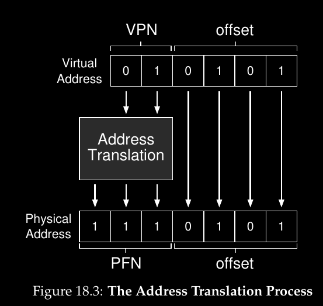

Notemos que el offset permanece igual porque solo nos dice que byte de la pagina queremos.
Entonces nuestra dirección final es: 1110101 (117 en decimal) y exactamente donde queremos cargar y luego buscar la información.

### Ejemplo 3
Veamos un ejemplo de esquema de paginacion lineal de 32bits con paginas de 4KB.
Entonces primero veamos cuantos bits se necesitan para forman 4KB:
	4KB = 4 x KB = 4 x 2¹⁰ = 2² x 2¹⁰ = 2¹²
	Entonces necesitamos 12bits para formar los 4, por ende estos 12bits van desde el bit menos significativo hasta el bit12
	------------------------
	01001100011011101100101001111111
	                    °°°°° °°°°°°°
	Por lo tanto nuestro esquema sera el siguiente:
	Esquema (20, 12) => 20 bits para indicar la pagina y 12 para el desplazamiento
Cada PTE (Page Table Entry) tiene 32bits con 1byte=8bits entonces cada PTE tiene 4bytes.
Si cada entrada de la Page Table tiene 4bytes y tengo 1048576 entradas ¿Cuanto ocupa page table entera? Ocupara 4MB
#### Virtudes
- Paginacion es absolutamente versátil
#### Problemas
- Tremendamente pesado en consumo de memoria, entonces las page table estan en RAM porque no pueden entrar en el CPU (Cap 19 TLB)
- Duplica la cantidad de accesos a memoria (Cap 20 Smaller Tables)

#### Ejemplo 4
Al ejecutar un programa que tiene el siguiente rastro de memoria virtual:
0, 5, 128, 8, 10, 256, 13
Cada acceso a memoria => Otro acceso a la page table

### ¿Donde se almacenan las page table?
Las page table pueden ser muy largas, *por ejemplo imaginemos un espacio de memoria de 32bits con 4KB paginas. La dirección virtual se divide en 20bits para el VPN y 12bits para el offset)*
*Notemos que 20bits de VPN implican que hay 2²⁰ traducciones que el SO debe manejar para cada proceso.. Asumiendo que necesitamos 4bytes por cada entrada de la page table(**PTE, Page Table Entry**) para guardar la traducción y demás cosas tendríamos la inmensa cantidad de 4MB de memoria necesaria para cada page table lo cual es mucho incluso para hoy día ya que si por ejemplo tuviéramos 100 procesos necesitaríamos 400MB para manejar solo las traducciones.*
Entonces como las tablas son muy grandes tampoco se pueden guardar en la CPU. Se guardan en algún lugar de la memoria, por ahora asumamos que viven en la memoria física para luego llegar a la conclusión que viven en la memoria virtual.

### ¿Que hay en la page table?
Hablemos un poco de la organización de la page table, esta es solo una estructura que es usada para mapear direcciones virtuales (en realidad mapea **virtual page numbers**) con direcciones físicas (**physical frame numbers**). Entonces en cierta forma podemos pensar que es un array
#### Bits
Hay ciertos bits especiales que se almacenan, entre ellos los mas destacables son:
- Valid bit: indica si la traducción es valida
- Protection bits: indica si la pagina puede ser leída, escrita o ejecutada. (*Si no esta permitido hacer algo de esto se generara un trap*)
- Present bit: Indica si la pagina esta en memoria física o virtual (*por ejemplo, si fue swapped out*)
- Dirty bit: Indica si la pagina fue modifica desde que llego a memoria
- Reference bit: usado para hacer un seguimiento sobre si la pagina fue accedida recientemente, es útil para determinar las paginas populares y mantenerlas en memoria. (*Tambien se lo conoce como accessed bit*)
- Muchos otros mas
Entre ellos el que parece mas complejo es el valid bit, veamos un ejemplo de este:
*Cuando un programa inicia tiene code y heap al final de su espacio de memoria y el stack al comienzo. Todo el espacio sin usar entre medio va a ser marcado como **invalid** y si el proceso trata de acceder se genera una trap y se termina el proceso. Entonces simplemente marcando paginas sin usar como invalidas ahorramos memoria*
Ejemplo de los bits importantes en x86:

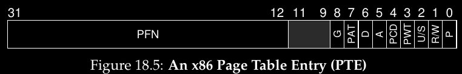

El ejemplo contiene un present bit (P), read/write bit (R/W), user/supervisor bit (U/S) determina si los procesos user-mode pueden acceder a la pagina, algunos bits de (PWT, PCD, PAT y G) que determinan como el cache del hardware funciona para las paginas, un bit de acceso (A), un dirty bit (D) y un page frame number (PFN)
Notemos que en el ejemplo no tenemos un bit de valid y uno de present, porque están los dos juntos en el present bit (P). Si P=1 significa que la pagina es present y valid. Si P=0 significa que la pagina no es valid o no es present (las dos no pueden no ser).

### Paginacion es lenta
La paginacion puede ralentizar, por ejemplo:
```js
movl 21, %eax
```
que a simple vista parece una simple instrucción puede ralentizar mucho.
Veamos que es lo que sucede con esta instrucción:
**Primero debemos traducir su dirección virtual (21) a dirección física** (117). Antes de buscar la dirección de la dirección 117 el SO primero debe buscar la entrada correcta de la page table de las page tables del proceso y realizar la traducción y luego cargar la información desde la memoria física. *Para poder hacer esto el hardware debe saber donde esta la page table del proceso que corre. Asumamos que solo tenemos una page table. Para encontrar la PTE(page table entry) el hardware debe realizar las siguientes funciones:*
```js
VPN = (VirtualAddress & VPN_MASK) >> SHIFT
PTEaddr = PageTableBaseRegister + (VPN * sizeof(PTE))
```
*En nuestro ejemplo VPN_MASK debería ser 0x30 (110000 en binario) que toma los VPN bits de la dirección virtual. Luego SHIFT es 4 debido a que debe ser la misma cantidad de bits que el offset de modo que mueve los bits de VPN hacia abajo para formar el nro de pagina virtual correcto. Por ejemplo con el nro virtual 21 (010101) el masking transforma este valor en 010000 y luego el shift lo transforma en 01 lo que quiere decir que es la page 1*
Una vez que conocemos la dirección de memoria física el hardware puede buscar la PTE de la memoria, extraer el PFN (physical frame number) y concatenarlo con el offset de la dirección virtual para formar la dirección física
```js
offset = VirtualAddress & OFFSET_MASK
PhysAddr = (PFN << SHIFT) | offset
```

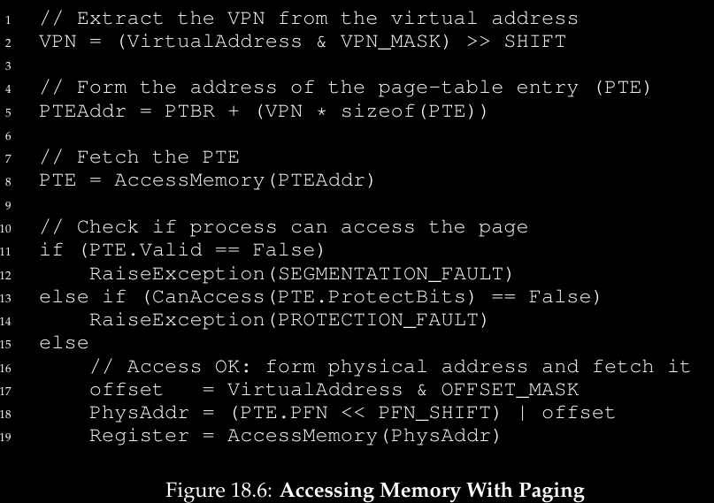

Entonces podemos decir que las referencias a memoria tienen dos principales problemas:
- ***Son lentas***
- ***Consumen mucha memoria***
### Traza de memoria
Veamos un ejemplo sencillo mostrando todos los accesos a memoria que ocurren cuando se usa paginacion. Es un código largo llamado array.c que esta en el libro pero la parte que nos interesa es la siguiente:
```c
int array[1000];
...
for (i=0; i<1000; i++) {
	array[i]=0;
}
```
Luego compilamos y corremos con los siguientes comandos:
```js
prompt> gcc -o array array.c -Wall -O
prompt> ./array
```
Obviamente asumimos que usamos objdump para ver las instrucciones assembly, estas son las que nos interesan:
```js
1024 movl $0x0, (%edi, %eax, 4)
1028 incl %eax
1032 cmpl $0x03e8, %eax
1036 jne 1024
```
Lo que hace este código es lo siguiente:
*La primera instrucción mueve el valor 0 hacia la dirección de memoria virtual del arreglo, dirección que esta dada por los contenidos de %edi sumados a los de %eax multiplicado 4. Notemos que %edi contiene la dirección base del arreglo, mientras que %eax contiene el el indice i del array. Multiplicamos por 4 debido a que el arreglo es un arreglo de entero y los enteros son de 4ytes*
*La segunda instrucción incrementa el valor del indice del arreglo guardado en %eax.*
*La tercera instrucción compara los contenidos de %eax con 0x03e8 (o 1000 en decimal). Si la comparación muestra que los dos valores no son iguales (que es lo que jne verifica) la cuarta instrucción hace que saltemos de nuevo a la posición 1024 ingresando otra vez al loop*
#### Entendiendo los accesos a memoria
Para entender los accesos a memoria primero debemos asumir ciertas cosas. Primero asumamos que tenemos un espacio de memoria de 64KB y que las paginas son de 1KB. Asumamos también que tenemos una page table lineal (o sea un array) que esta ubicada en la dirección 1024(1KB) de la memoria física.
Entonces como el tamaño de las paginas es de 1KB, la dirección virtual de 1024 se ubica en la segunda pagina del espacio virtual (VPN=1, ya que la 0 es la primera seria desde 0 hasta 1023). Luego asumamos que esta pagina virtual mapea al frame 4 físico, o sea (VPN 1 -> PFN 4).
Luego esta el arreglo en si. Su tamaño es de 4000 bytes(1000 int) y vamos a asumir que esta en la posiciones virtual 40000 hasta 44000 (sin incluir el ultimo byte). Las paginas virtuales para el array son VPN=39, VPN=40, VPN=41, VPN=42. Luego asumamos el mapeo en direcciones fisicas para el array: (VPN 39 -> PFN 7), (VPN 40 -> PFN 8), (VPN 41 -> PFN 9), (VPN 42 -> PFN 10).
Ahora estamos listos para correr el programa. Cuando lo haga cada instrucción buscara generar dos referencias a memoria:
- Una a la page table para encontrar el physical frame donde reside la instrucción y otra a la instrucción en si.
- Ademas hay una referencia a memoria explicita debido al uso de mov ya que este añade acceso a la page table primero (para traducir la dirección virtual a física) y luego hacia el arreglo en si.
Seria algo así:

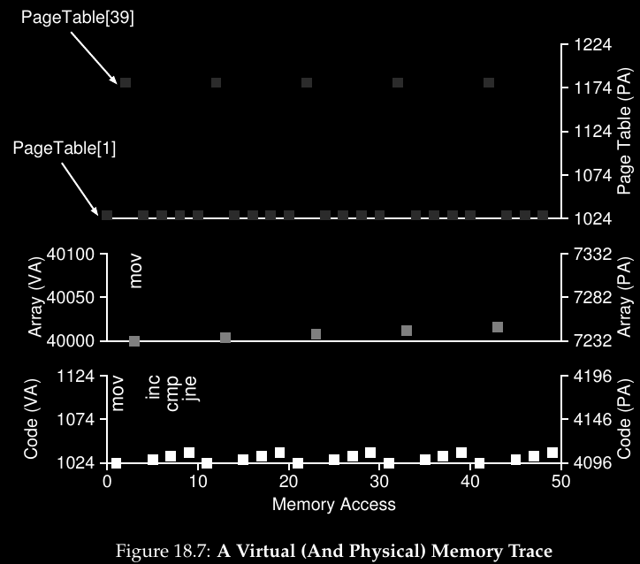

El proceso entero para las primeras 5 iteraciones del loop están descritas en el gráfico.
La parte mas baja del gráfico muestras las referencias a instrucciones de memoria en el *eje Y* en blanco (con las direcciones virtuales a la izquierda y las direcciones físicas a la derecha).
El gráfico del medio muestra los accesos al arreglo en gris claro(virtual izq, física der).
El gráfico de arriba muestra los accesos a memoria del page table en gris oscuro (solo memoria física porque las page table de este ejemplo solo residen en memoria física).
El eje X de la traza entera muestra los accesos a memoria a lo largo de las 5 iteraciones del loop, hay 10 accesos a memoria por loop que incluyen las 4 búsquedas de instrucciones, una actualización de memoria explicita y los 5 accesos a las page table para traducir esas 4 búsquedas y la actualización de memoria