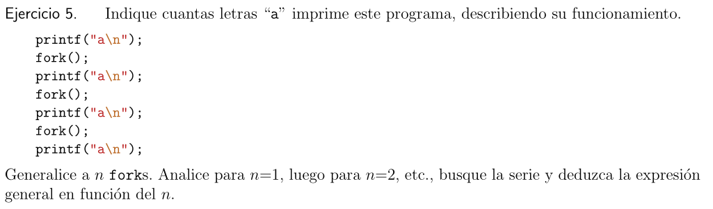

# Mecanismos


Analicemos las lineas:
1. Hay un solo proceso corriendo en la CPU. Notemos que Wall > cputime porque debe haber perdida de tiempo en los context switch
2. Hay dos procesos corriendo. Walltime > cputime. Como el tiempo siguie siendo muy similar a cuando habia un solo core debe haber al menos dos cores.
3. Un solo proceso. Walltime > cputime. Tarda mas de Walltime porque debe haber otros procesos ademas de este corriendo en la CPU, por eso el cputime es el mismo.
4. Cuatro proceosos. Vemos que Walltime > cputime. Como el walltime ahora es el doble que cuando habia solo 2 procesos nos quiere decir que solo tenemos 2 nucleos.
5. Tres procesos. Vemos que tarda la mitad de tiempo extra que tardaba cuando habia 4 procesos. Entonces ya es mas claro que hay 2 nucleos.
6. Dos procesos. Probablemente hay mas procesos compitiendo por eso el cputime sigue igual pero el walltime es mayor.
7. Cuatro procesos corriendo. Nuevamente debe haber procesos compitiendo y por eso el cputime es siempre el mismo.

Respondamos a las preguntas:
- **a)** El sistema tiee 2 nucleos.
- **b)** El cputime es menor al walltime porque es la suma del tiempo que corre en cpu, por este casi siempre es menor al walltime. Ademas de que probablementte haya context switch en nuestro programa.


El SO calcula el cputime sumando todo el tiempo que paso en cada nucleo. Por ende si mi programa se divide en dos cpu a la vez y en cada uno tarda 0.5s el cputime sera de 1seg, mientras que el walltime sera de 0.5 o similar que es lo que tardo en la vida real.


**user<real** (cpu<wall): Porque pueden haber context switch o cambios de proceso
**user=real**: Se ejecuta enteramente el proceso sin context switch en medio
**user>real**: Porque mi proceso se ejecuta en varios hilos o nucleos y hace que yo espere menos tiempo pasando mas tiempo en la cpu


a) Vale 100 porque el fork hace una copia exacta de los fd
b) Una vez creados no se interfieren entre si salvo que usemos execvp, por lo tanto no pasaria nada
c) Seguiria todo bien porque se respaldan los valores al hacer trap y return from trap



Veamos en orden cuantas imprime:
```c
printf("a\n");   //1a
fork();          //1 * 2 => 2procesos 
printf("a\n");   //2procesos + 1a = 3a
fork();          //2 * 2 = 4a
printf("a\n");   //4a + 3a = 7a
fork();          //2 * 2 * 2 = 8procesos
printf("a\n");   //8procesos + 7a = 15a
```

Notar que solo imprimo con los printf.
A los roks duplican su cantidad con cada iteracion y a eso le tengo sumar el nro anterior de a's que hay en los prints.
Ahora si generalizamos para n fork tendrimos lo siguiente:
f(n) = (2^n)-1 donde consideramos como n los prints


0 porque el execv no deberia fallar entonces el codigo que sigue no se ejecuta. Si fallase se imprimiria una sola a.


Primer programa: Toma dos argumentos (un entero argc y un arreglo de punteros que apuntan a argv). Chequea si 0 es menor que el decremento de argc (primero decrementa y luego chequea). Si lo es la posicion indicada por argc se establece como NULL y se llama a execvp ocn argv[0] y argv como parametros. En caso de que de false no hace nada y devuelve 0.

Segundo programa: Toma dos argumentos, luego verifica si la cantidad de argumentos en <=1, si lo es hace return y termina. Si no lo es hace un fork y lo almacena en rc. Verifica si el fork es valido, y si lo es verifica si es el hijo y termina. Si no es el hijo y es valido entonces es el padre por lo que guarda en arcv(argv-1) NULL y hace un execvp.


El primer programa cierra la salida estandar, abre salida.txt en el fd 1 porque es el mas cercano y hace un print en donde apunta ese fd.

El segundo programa abre salida.txt y lo "guarda" en un fd, luego cierra la salida estandar y duplica ese fd para hacer printf a ese fd.

Ambos programas vemos que escriben en el fd. dup es util para poder duplicar los fd de un proceso sin tocar los de otro. Generalmente se usan cuando hacemos fork.


Este programa lo que hace es llenar nuestra computadora de procesos que nunca terminan ya que while(1) es un loop infinito. Es posible mitigar sus efectos si creo un archivo que me limite la cantidad de procesos que puede crear un shell. Por defecto es algo alta.


Supongamos que quitamos una de las flechas:
- **I/O: done**: Los procesos que requieren de Input o Output no se ejecutarian nunca o tendrian que pasar directamente a running
- **I/O: initiate**: Cuando un proceso necesite de un I/O no se cambia a blocked, sino que se queda en running esperando hasta que reciba lo que esperaba.
- **Scheduled**: Los procesos nunca pasarian de ready a running, basicamente el ready desaparece y solo tendriamos blocked y running
- **Descheduled**: Los procesos nunca pasarian a running por lo que nada andaria


No se no quiero buscar el archivo


**a)** Si es posible que el tiempo de kernel+cpu z< wall. Por ejemplo si mi proceso requiere mas de un ciclo para atenderse y tengo varios procesos en cola hasta que termine de atender a mi proceso el tiempo real va a ser alto mientras que el tiempo de cpu y de kernel bajo.

**b)** Falso, pueden usar la misma direccion virtual e incluso la misma direccion fisica si tienen una parte igual, por ejemplo un fork.

**c)** Verdadero. Ademas tengo que multiplexar en espacio, la ram, el heap y el stack

**d)** Falso, no puedo ejecutar instrucciones de kernel

**e)** Verdadero, pueden haber varias traps por timer pero eso no implica que deban cambiar de contexto

**f)** Verdadero

**g)** Verdadero

**h)** Falso, cuando el padre muere antes que el hijo el SO sabe que no va a recibir un wait entonces el hijo tiene como nuevo padre a init

**i)** Falso. Las comunicaciones posibles entre padres e hijos son de la forma padre => hijo => padre
- padre => argc y argv
- hijo => return y waitpid()

**j)** Falso, si execvp falla si se ejecuta el codigo que sigue

**k)** Verdadero. Cuando un padre se queda esperando a que su hijo termine se que daun estado zombi.

# Politicas


Entonces como tenemos 3 procesos que todas llegan en tiempo 0 y la cantidad de tiempo que tardaran en CPU son 30, 20 y 10 => 60 tiempo total. Entonces podemos dividir cada intervalo de tiempo en 10 y nos haran falta 6 intervalos totales (por el 0 quedan hasta el 50 que vendria a ser el 59)

FCFS(First Come First Serve) = FIFO(First In First Out)
Primero decido cual atender y debo respetar mi politica. Decido que sea en orden de PID considerando en este caso el abecedario como PID.

| 0   | 10  | 20  | 30  | 40  | 50  |
| --- | --- | --- | --- | --- | --- |
| A   | A   | A   | B   | B   | C   |
SJB(Shortest Job First)
Atiendo al que tarda menos tiempo primero

| 0   | 10  | 20  | 30  | 40  | 50  |
| --- | --- | --- | --- | --- | --- |
| C   | B   | B   | A   | A   | A   |
Ahora recordemos que

TurnAroundtime = Es el tiempo que tarda desde que empezo su ejecucion hasta que termino

Responsetime = El tiempo que tarda desde que llega el proceso hasta que es atendido

Entonces para FCFS:
- TurnAroundtime:
	- A = 30
	- B = 20
	- C = 10
- Responsetime:
	- A = 0
	- B = 30
	- C = 50

Entonces para SJB:
- TurnAroundtime:
	- A = 30
	- B = 20
	- C = 10
- Responsetime:
	- A = 30
	- B = 10
	- C = 0


Tenemos un Quanto de 2 para el Round Robin

Hay 3 procesos, vemos que llegan en distintos tiempos y tienen distintos tiempos de ejecucion.

***STCF(Shortest Time to Completion First)***

**Linea de tiempo:**

| Tiempo  | 0   | 1   | 2   | 3   | 4   | 5   | 6   | 7   |
| ------- | --- | --- | --- | --- | --- | --- | --- | --- |
| Running | B   | B   | B   | A   | C   | A   | A   | A   |
| Arribo  | B   |     | A   |     | C   |     |     |     |
| Ready   |     |     | A   |     | A   |     |     |     |
**Tabla de politicas:**
Recordemos que es cada uno de estos tiempos:

**Tfirstrun:** Cuanto tarda en ser ejeutado por primera vez
**Tcompletition:** Cuanto tiempo total tarda en ser terminado
**Tturnaround:** Cuanto tiempo tarda en terminar desde que fue ejecutado por primera vez
**Tresponse:** Es el tiempo que tarda desde que llega hasta que es ejecutado por primera vez

| Proceso | Tarrival | TCPU | Tfirstrun | Tcompletition | Tturnaround | Tresponse |
| ------- | -------- | ---- | --------- | ------------- | ----------- | --------- |
| A       | 2        | 4    | 3         | 7             | 4           | 1         |
| B       | 0        | 3    | 0         | 2             | 2           | 0         |
| C       | 4        | 1    | 4         | 4             | 0           | 0         |
***RR(Round Robin)***

| Tiempo  | 0   | 1   | 2   | 3   | 4    | 5   | 6   | 7   |
| ------- | --- | --- | --- | --- | ---- | --- | --- | --- |
| Running | B   | B   | A   | A   | C    | B   | A   | A   |
| Arrival | B   |     | A   |     | C    |     |     |     |
| Ready   |     |     | B   | B   | A, B |     |     |     |
En el tiempo 4 decido como politica que voy a atender a los procesos que entran. Luego decidio ejecutar el que hace mas tiempo no es ejecutado.

**Tabla de politicas:**

| Proceso | Tarrival | TCPU | Tfirstrun | Tcompletition | Tturnaround | Tresponse |
| ------- | -------- | ---- | --------- | ------------- | ----------- | --------- |
| A       | 2        | 4    | 2         | 7             | 5           | 0         |
| B       | 0        | 3    | 0         | 5             | 5           | 0         |
| C       | 4        | 1    | 4         | 0             | 0           | 0         |


Recordemos que batch es cuando podemos tener procesos que no sean atendidos por un largo tiempo.
Las interactivas son las que cortan por quanto.

|      | Batch/interactive | ¿Necesita saber Tcpu? |
| ---- | ----------------- | --------------------- |
| FCFS | batch             | no                    |
| SJF  | batch             | si                    |
| STCF | 50/50             | si                    |
| RR   | interactiva       | no                    |
| MLFQ | interactiva       | no                    |

STCF no es interactiva pero tampoco batchera porque solo lo podria ser si llegan muchos procesos pequeños lo cual es raro.


Minimamente vamos a necesitar 25 tiempos de CPU (sumo la cantidad que hay + )
Notemos que tenemos un RR con Quanto=2

|    Tiempo     |  0  |  1  |  2   |  3  |  4   |  5   | 6   | 7   | 8   | 9   | 10  | 11  | 12  | 13  | 14   | 15  | 16   | 17   | 18  | 19  | 20  | 21  | 22  | 23  | 24  | 25  | 26  |
| :-----------: | :-: | :-: | :--: | :-: | :--: | :--: | --- | --- | --- | --- | --- | --- | --- | --- | ---- | --- | ---- | ---- | --- | --- | --- | --- | --- | --- | --- | --- | --- |
| Running (CPU) |  A  |  A  |  C   |  A  |  B   |  B   | B   | B   | C   | C   | B   | B   | A   | A   | B    | B   | C    | B    | B   | A   | B   | B   | B   | B   | C   | C   |     |
| Blocked (I/O) |     |     |      |  C  | C, A | C, A | A   | A   | A   | A   | C   | C   | C   | C   | C, A | A   | A, B | A, C | C   | C   | C   |     |     |     |     |     |     |
|    Arrival    |  A  |  C  |  B   |     |      |      | C   |     |     |     | A   |     |     |     |      | C   |      | B    | A   |     |     | C   |     |     |     |     |     |
|     Ready     |     |  C  | A, B |  B  |      |      | C   | C   | B   | B   | A   | A   | B   | B   |      | C   |      | B    | A   | B   |     | C   | C   | C   |     |     |     |
|   Finished    |     |     |      |     |      |      |     |     |     |     |     |     |     |     |      |     |      |      |     |     | A   |     |     |     | B   |     | C   |
En el tiempo 2 tengo que decidir la politca. Decido que quien haya estado esperando por mas tiempo va a ser el proximo en ejecutarse (comparo sus arribos). Si ambos llevan el mismo tiempo decido que sea por PID (orden alfabetico).
Podria haber definido algo mejor, como por ejemplo evitar hacer context switch


Recordemos que la MLFQ se basa en una cola de prioridades, mientras mas alta mejor, mientras mas baja mas batchero es el proceso. En este caso si ejecuta un quanto baja, si ejecuta 2 baja, si ejecuta 4 baja y luego baja si ejecuta 8. En este caso ninguno va a ejecutar 8. Notemos ademas que al referirnos a ejecutar nos referimos que ejeucta esa cantidad de veces en ese cuento para bajar. Por ejemplo para bajar del Q1 al Q2 debe ejecutar 2 eveces. Del Q2 al Q3 4 veces. Por lo tanto vemos que en este caso ninguno siquiera va llegar al Q3 porque para ello necesitaria minimo de 1+2+4 = 7 tiempos de cpu + los que vaya a seguir corriendo y el mas lasrgo que tenemos tiene justo 7 y por eso cuando tendria que bajar va a terminar.
Notar que siempre tiene prioridad para ejecutarse lo que esta mas arriba. Luego el orden de prioridad es por PID (abecedario)

Supongo que tendremos 22 tiempos como minimo

| Tiempo | 0       | 1       | 2       | 3         | 4       | 5          | 6         | 7       | 8          | 9         | 10        | 11       | 12       | 13      | 14      | 15        | 16        | 17        | 18        | 19       | 20      |     |
| ------ | ------- | ------- | ------- | --------- | ------- | ---------- | --------- | ------- | ---------- | --------- | --------- | -------- | -------- | ------- | ------- | --------- | --------- | --------- | --------- | -------- | ------- | --- |
| Q0     | ***A*** | ***B*** | ***C*** |           | ***D*** |            |           | ***E*** |            |           |           |          |          |         |         |           |           |           |           |          |         |     |
| Q1     |         | A       | AB      | ***A***BC | ABC     | ***A***BCD | ***B***CD | BCD     | ***B***CDE | ***C***DE | ***C***DE | ***D***E | ***D***E | ***E*** | ***E*** |           |           |           |           |          |         |     |
| Q2     |         |         |         |           |         |            | A         | A       | A          | A         | A         | AC       | AC       | AC      | AC      | ***A***CE | ***A***CE | ***A***CE | ***A***CE | ***C***E | ***E*** |     |
| Q3     |         |         |         |           |         |            |           |         |            |           |           |          |          |         |         |           |           |           |           |          |         |     |

Marco con negrita cual se esta ejecutando. 
En el tiempo 9 B desaparece porque ya termino (ultima ejecucion en 8)
En tiempo 13 D termino. (ultima ejecucion en 12)
En el tiempo 19 A ya termino. (ultima ejecucion en 18)
En el tiempo 21 E ya termino (ultima ejecucion en 20)


**a)** Falso, se puede devolver por ejemplo si el proceso termina antes del quanto.

**b)** Recordemos que TurnAroundTime es el tiempo que tarda desde que comezo a ser ejecutado hasta que termina. => Verdadero. FCFS tiene uno de los mejores TunAroundTime ya que desde que comienza a ejecutarse no hace ningun context switch a otro proceso. Mientras que en SJF puedo estar ejecutando algo, y que vengan varios procesos cortos haciendo que haga un conetext switch alargando el Turn AroundTime.

**c)** Verdadero

**d)** Verdadero, es por ello que existe esa cola de prioridad, para evitar la starvation

**e)** Verdadero, con MLFQ evito que un proceso pueda hacer yield (pedir que otro se ejecute) y que luego este se siga ejecutando asi infinitamente (por ejemplo porque es malicioso y agrega tiempo cada vez que hace el yield)
