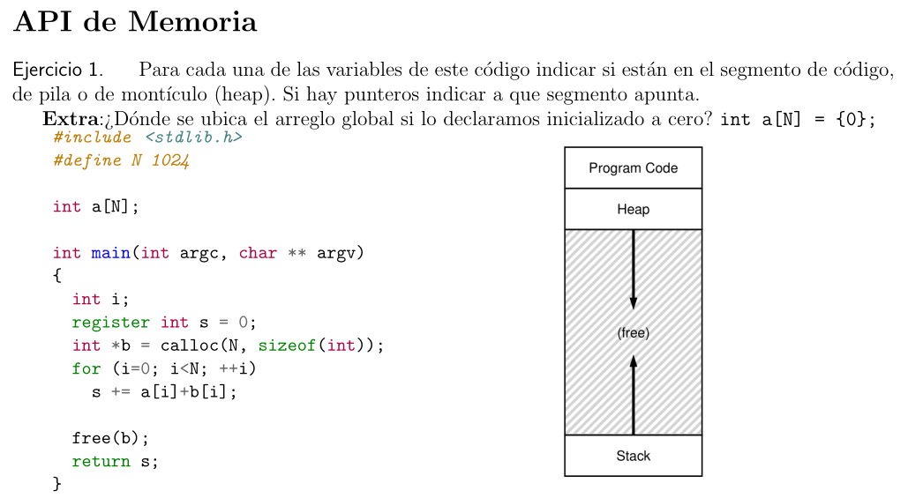
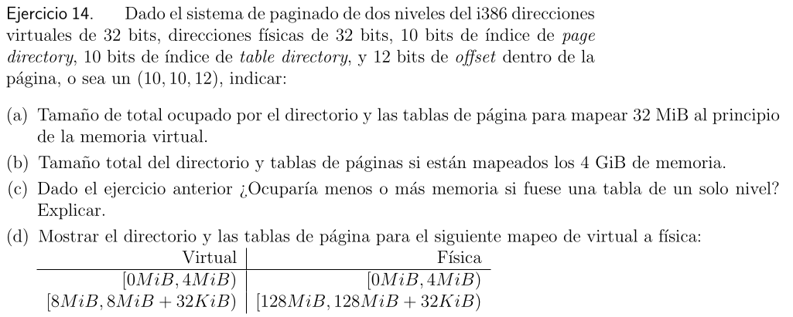
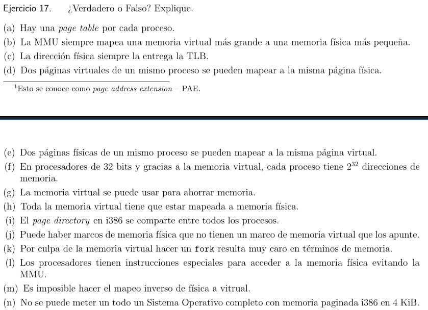

# API de memoria


| Variable | Lugar                                         |
| -------- | --------------------------------------------- |
| N        | program code 1024                             |
| a        | bss (esta entre pc y el heap, por ser global) |
| argc     | stack (variable preformada)                   |
| argv     | stack (variable preformada)                   |
| i        | stack                                         |
| s        | cpu (por ser register)                        |
| b        | stack (direccion de memoria)                  |
| *b       | heap (contenido de la variable)               |
| return s | stack                                         |

Si iniciamos un arreglo `int a[N] = 0` se inicia en el bss ya que aca se almacenan las variable globales sin inicializar (o sea con 0)


```c
char *s = malloc(512);
gets(s);
```
El gets es algo que segun el man no se debe usar nunca. Ademas de que no usammos sizeof y por ende pedimos 512bytes de memoria lo cual para un cchar puede ser mucho y seguro lo sea.

```c
char *s = "Hello Waldo";
char *d = malloc(strlen(s));
strcpy(d,s);
```
Falta el +1 en strlen(s), caso contrario no va a copiar el ultimo caracter.
char *d = malloc(strlen(s)+1);

```c
char *s = "Hello Waldo";
char *d = malloc(strlen(s));
d = strdup(s);
```
No tenemos que hacer malloc, el strdup es como un dup pero para cadenas de texto, copia la cadena y la guarda en otro lado, en este caso la va a guardar en `char *d` por lo que no es nesario pedir memoria. La forma correcta seria:
`char *d = strdup(s);`

```c
int * a = malloc(16);
a[15] = 42
```
Reserva 16bytes y los enteros suelen ocupar 4. La forma correcta seria:

`int *a = malloc(sizeof(int)*16));`


**a)** Falso, es una funcion de una libreria de C

**b)** Falso, puede reutilizar la memoria que hay en el heap sin necesidad de hacer una syscall

**c)** Verdadero. Si necesita pedir memoria hace una syscall (brk o derivados)

**d)** Verdadero. Si necesita liberar mucho espacio llama a una syscall para avisar que hay un pedazo de memoria importante libre, si no simplemente libera la memoria y queda en el heap.

**e)** Falso. Solamente reserva la memoria que indico, la cantidad en general no influye.


```js
0: movl $128, %ebx
5: movl (%ebx), %eax
8: shll $1, %ebx
10: movl (%ebx), %eax
13: retq
```
Notemos que se lee de izq a derecha (xq por ej con la primer linea no puedo cargar el valor ebx a un registro que se llame 128)

El programa hace lo siguiente:
- Primero carga el valor 128 en el registro ebx (indico con un $ que es un nro y con un % que es un registro)
- Segundo leo la direccion de memoria ebx y lo que hay ahi lo copio hacia eax
- Tercero multiplico por dos el contenido del registro de ebx. O sea hago 128x2 = 256
- Cuarto leo la dirrecion de memoria ebx y guardo eso en eax (o sea ahora ebx=256)
- Quinto hago return

Notemos que el registro base es 4096 y el bounds es 256
Luego la secuencia de accesos a memoria es la siguiente (hacemos memoria fisica + memoria virtual):

- 4096 + 0 = 4096(por ser registro base + 1ra direccion virtual)
- 4096 + 5 = 4101 (base + dv) ; 4096 + 128 = 4224 (base+llamada del registro)
- 4096 + 8 = 4104 (base + dv) 
- 4096 + 10 = 4106 (base + dv) ; 4096 + 256 = 4352 (base+llamada del registro) pero como este esta fuera del limite => SEGMENTATION FAULT

# Manejo de espacio libre


Primero recordemos como son los ajustes:

- First fit: Devuelve el primer chunk con memoria disponible que pueda satisfacer la solicitud.
- Best fit: Primero busca todos los chunks de memoria con tamaño mayor al de la peticion y devuelve el de menor tamaño entre ellos
- Worst fit: Devuelve el chunk de memoria mas grande posible con el objetivo de dejar solo chunks grandes de memoria
- Next fit: Deja un puntero en el ultimo chunk de memoria que se busco funcionando como un first fit pero usando el puntero como partida.

Entonces tenemos los siguientes chunks de memoria ordenados de la siguiente manera:
```js
10KiB, 4KiB, 20KiB, 18KiB, 7KiB, 9KiB, 12KiB, 15KiB
  c1    c2    c3     c4     c5    c6    c7     c8 //Solo es para nombrarlos
```
Y tenemos que atender la siguiente solicitud:
```js
12KiB, 10KiB, 9KiB
```

Veamos como se comportan las distintas politicas ante estas peticiones:

***First fit***: 
```js
//12KiB => Uso el chunk3
10KiB, 4KiB, 8KiB, 18KiB, 7KiB, 9KiB, 12KiB, 15KiB
//10KiB => Uso el chunk1
0KiB, 4KiB, 8KiB, 18KiB, 7KiB, 9KiB, 12KiB, 15KiB
//9KiB => Uso el chunk4
0KiB, 4KiB, 8KiB, 9KiB, 7KiB, 9KiB, 12KiB, 15KiB
```

***Best fit***:
```js
//12KiB => Uso el chunk7
10KiB, 4KiB, 20KiB, 18KiB, 7KiB, 9KiB, 0KiB, 15KiB
//10KiB => Uso el chunk1
0KiB, 4KiB, 20KiB, 18KiB, 7KiB, 9KiB, 0KiB, 15KiB
//9KiB => Uso el chunk6
0KiB, 4KiB, 20KiB, 18KiB, 7KiB, 0KiB, 0KiB, 15KiB
```

***Worst fit***:
```js
//12KiB => Uso el chunk3
10KiB, 4KiB, 8KiB, 18KiB, 7KiB, 9KiB, 12KiB, 15KiB
//10KiB => Uso el chunk4
10KiB, 4KiB, 8KiB, 8KiB, 7KiB, 9KiB, 12KiB, 15KiB
//9KiB => Uso el chunk7
10KiB, 4KiB, 8KiB, 8KiB, 7KiB, 9KiB, 12KiB, 6KiB
```

***Next fit***: (No estoy muy seguro de este)
```js
//12KiB => Uso el chunk3
10KiB, 4KiB, 8KiB, 18KiB, 7KiB, 9KiB, 12KiB, 15KiB
//10KiB => Uso el chunk4
10KiB, 4KiB, 8KiB, 8KiB, 7KiB, 9KiB, 12KiB, 15KiB
//9KiB => Uso el chunk5
10KiB, 4KiB, 8KiB, 8KiB, 7KiB, 0KiB, 12KiB, 15KiB
```

# Paginacion


Tenemos un nivel de eficiencia del 95% (lo optimo es 100%) => tenemos 95% TLB hit y 5% TLB miss

Obtener un valor de la TLB tarda 10ns(supongo que esto tarda cuando es un TLB miss) y la memoria principal tarda 120ns(supongo que tarda en leer toda la memoria)

Entonces recordemos que el tiempo que va a tardar va a estar dado por lo que tarda en obtener el valor + leer toda la memoria.

Entonces recordemos que si es un TLB hit es inmediato el obtener el valor, mientras que si no lo es hay que buscar en la memoria. Pero nos pide calcular un promedio

```python
Promedio = 0.05 * (10ns + 120ns)
Promedio = 6.5ns
```


Tenemos paginas de 4KiB y un TLB con 64 entradas.

```c
int x[N];                   //Declaro arreglo de tamaño N
int step = M;               //Declaro step = M
for (int i=0; i<N; i+=step) //Itero haciendo i= i+setp
	x[i] = x[i]+1;          //x[i] es el siguiente que deberia
```
**a)** Para que esto falle necesitamos un **M > 1024**. De esta forma como los valores son **int (4bytes)** tengo 64 entradas, cuando itere dentro del for va a hacer (**4x1025 = 4100 > 4KiB**) lo cual es sobrepasa el limite de nuestras paginas.

**N** no influye en nada.

**b)** Despues de hacerlo mas de 64 veces, estariamos sobrepasando el limite de nuestra memoria y escribiriamos en un lugar indebido.


Tenemos un tamaño de pagina de 4KiB = 2¹²bytes.

Entendamos un poco la tabla:
- Vemos que la direccion virtual 0 mapea en la direccion fisica 0 y es valida
- [ ] V 1 -> F 111 valida 
- [x] V 2 -> F 000 no valida
- [ ] V 3 -> F 101 si
- [ ] V 4 -> F 100 si
- [ ] V 5 -> F 001 si
- [x] V 6 -> F 000 no
- [x] V 7 -> F 000 no
- [ ] V 8 -> F 011 si
- [ ] V 9 -> F 110 si
- [ ] V10 -> F 100 si
- [x] V11 -> F 000 no
- [x] V12 -> F 000 no
- [x] V13 -> F 000 no
- [x] V14 -> F 000 no
- [ ] V15 -> F 010 si
Vemos que hay 16bits

Ahora veamos el tema de los bits de redireccionamiento:
Nuestro tamaño de pagina es de 4KiB, tenemos que ver cuantos bits nos hacen falta para formarlo:

`4KiB = KiB * 4 = 1024 * 4 = 2¹⁰ * 2² = 2¹²`

Entonces vemos que nos hacen falta 12bits que estos son de redireccionamiento, osea de offtset (van del menos significativo al mas significativo). Luego los otros bits restantes son de VPN (en este caso seria 16-12 = 4). Por lo tanto tenemos:

**a)**
- bits de redireccionamiento virtual:
	- VPN + offset = 4 + 12 = 16
- bits de redireccionamiento fisico:
	- PFN + offset = 3 + 12 = 15 

***b)*** Determinar direcciones fisicas a partir de virtuales:
```python
#Queremos determinar la direccion fisica de la direccion virtual 49424
39424B / 4096B = 38KiB + 512B / 4KiB
			   = 9 + 2KiB + 512B
			   = 9 + 2560B = VPN + offset

39424B / 4096B = 9 + 0.625*1024
			   = 9 + 640*4
			   = 9 + 2560B

#Entonces mi pagina virtual es 9, mi pagina fisica es 6 y mi offset es 2560
direccion fisica = pagina fisica * tamaño de pagina + offset
direccion fisica = 6 * 4096 + 2560
direccion fisica = 27136
```

```python
#Queremos determinar la direccion fisica partiendo de la direccion virtual 12416
12416 / 4096 = 3.03125 = 3 + 0.03125*1024*4 = 3 + 128B
											  pv offset
pagina virtual = 3 (valida)
pagina fisica = 5 (miro virtual de la tabla)

direccion fisica = pagina fisica * tamaño de pagina + offset
direccion fisica = 5 * 4096 + 128
direccion fisica = 20608
```

```python
#Direccion virtual 26112
26112 / 4096 = 6 + 0.375*1024*4 = 6 + 1536B
pagina virtual = 6 (no es valida. Termino)
```

```python
#Direccion virtual 63008
63008 / 4096 = 15 + 0.3828125*1024*4 = 15 + 1568
pagina virtual = 15 (valida)
pagina fisica = 2

direccion fisica = pagina fisica * tamaño de pagina + offset
direccion fisica = 2 *4096 + 1568
direccion fisica = 9760
```

```python
#Direccion virtual 21760
21760 / 4096 = 5 + 0.3125*1024*4 = 5 + 1280B
pagina virtual = 5 (valida)
pagina fisica = 1

direccion fisica = pagina fisica * tamaño de pagina + offset
direccion fisica = 1 + 4096 + 1280
direccion fisica = 5376
```

```python
#Direccion virtual 32512
32512 / 4096 = 7 + 0.9375*1024*4 = 7 + 3840B
pagina virtual = 7 (No valida. Termino)
```

```python
#Direccion virtual 43008
43008 / 4096 = 10 + 0.5*1024*4 = 10 + 2048B
pagina virtual = 10
pagina fisica = 4

direccion fisica = pagina fisica * tamaño de pagina + offset
direccion fisica = 4 * 4096 + 2048
direccion fisica = 18432
```

```python
#Direccion virtual 36096
36096 / 4096 = 8 + 0.8125*1024*4 = 8 + 3328B
pagina virtual = 8
pagina fisica = 3

direccion fisica = pagina fisica * tamaño de pagina + offset
direccion fisica = 3 * 4096 + 3328
direccion fisica = 15616
```

```python
#Direccion virtual 7424
7424 / 4096 = 1 + 0.8125*1024*4 = 1 + 3328B
pagina virtual = 1
pagina fisica = 7

direccion fisica = pagina fisica *tamaño de pagina + offset
direccion fisica = 7 * 4096 + 3328
direccion fisica = 32000
```

```python
#Direccion virtual 4032
4032 / 4096 = 0 + 0.984375*1024*4 = 0 + 4032
pagina virtual = 0
pagina fisica = 0

direccion fisica = pagina fisica * tamaño de pagina + offset
direccion fisica = 0 * 4096 + 4032
direccion fisica = 4032
```

**c)** Ahora tenemos que determinar la direccion virtual a partir de la fisica
```python
#Direccion fisica 16385
16385 / 4096 = 4 + 0.000244141*1024*4 = 4 + 1B
pagina fisica = 4
pagina virtual = 10

direccion virtual = pagina virtual * tamaño de pagina + offset
direccion virtual = 10 * 4096 + 1
direccion virtual = 40961
```

```python
#Direccion 4321
4321 / 4096 = 1 + 0.054931641*1024*4 = 1 + 225B
pagina fisica = 1
pagina virtual = 5

direccion virtual = pagina virtual * tamaño de pagina + offset
direccion virtual = 5 *4096 + 225
direccion virtual = 20705
```


Primero notemos que el esquema es de la forma (10, 10, 12). O sea primero 10bits, luego 10bits y ultimo 12bits. El primero es el idxpage, el segundo el idxpagetable y el ultimo el offset.

El idxpage me dice que vaya a la tabla de arriba, ver las posiciones que arriba no tiene nada ni abajo tampoco. El idxpagetable me dice que vaya a la tabla de abajo.

Tengo que traducir 3 direcciones virtuales a fisicas. Veamos una:
```js
0x003FF666
0000 0000 0011 1111 1111 0110 0110 0110

Primeros 10 = 0000 0000 00 => idxpage = 0
Segundos 10 = 11 1111 11111 => idxpagetable = 1023
Ultimos  12 = 0110 0110 0110 => offset = 0x666

Entonces la direccion fisica es = 0xCAEEA666
```

```js
0x00000AB0
0000 0000 0000 0000 0000 1010 1011 00000

idxpage      = 0000 0000 00 => 0
idxpagetable = 00 0000 0000 => 0
offset       = 1010 1011 0000 => AB0

Entonces la direccion fisica es = 0xCAFECAB0
```

```js
0x00800B0B
0000 0000 1000 0000 0000 1011 0000 1011

idxpage      = 0000 0000 10 => 2 (no sabemos que hay ahi, no suficiente info)
idxpagetable = 00 0000 0000 => 0
offset       = 1011 0000 1011 => B0B

Entonces la direccion fisica es = ?????B0B
```



Tenemos direcciones virtuales de 32bits, direcciones fisicas de 32bits. 10 bits de indice de page directory, 10bits de indice de table directory y 12bits de offset (o sea un esquema (10 10, 12) como el anterior)

**a)** 
```js
//Primero notemos que la estructura es (10, 10, 12) por lo tanto nuestra oage directory va a tener 10bits y nuestro offset 12. Entonces nuestra page directory va a de 0 a 1023 y el offset es 2¹² => 4KiB.
//Nuestro page directory tambien vale 4KiB xq es 1024*4 = 4096
//Entonces la cantidad de paginas a mapear esta dada por cantidad de memoria a mapear / offset
//Cantidad de paginas mapeadas = cantidad de memoria a mapear / offset
32MiB = 32 * 2²⁰ = 2⁵ * 2²⁰ = 2²⁵ / offset
                            = 2²⁵ / 2¹²
		                    = 2¹³ paginas

//Luego como cada page table apunta a 1023 paginas, vamos a necesitar 32MiB = 4KiB * N donde N es la cantidad de page tables
1024KiB * 8 = 32MiB => Necesitamos 8 page tables
//Luego el tamaño ocupado por el directorio y las tablas es de tamaño del page directory + (cantidad de page table * offset)
4KiB + (8 * 4KiB) = 36KiB
```

**b)** 
```js
//Queremos calcular cuanto ocupa tener los 4GiB de memoria lleno
//Primero veamos cuantas pagians tendriamos
4GiB = 4* 2³⁰ = 2³² / offset
			  = 2³² / 2¹²
			  = 2²⁰ = 1024 * 1024
//Entonces como cada page table apunta a 1024 paginas, y tenemos 1024 page table, el total ocupado por el directorio y las page table sera de:
4KiB + (1024*4KiB) = 4KiB + 40KiB = 41KiB
```

**c)** Si fuera una tabla de un solo nivel ocuparia menos memoria ya que no haria falta el espacio para el page directory. O sea como se reserva 4KiB ocuparia todo menos eso.

**d)** Primero notemos que tenemos las direccion virtual de la forma:

```js
[0MiB, 4MiB] => Mapea a la page table completa ya que va del rango 0 hasta 4MiB.
//Como el primer valor es 0MiB entonces apunta a la entrada 0 del page directory

[8MiB, 8MiB + 32KiB] => Mapea a una page table con 8 entradas porque va desde 8MiB hasta 8MiB + 32KiB (4KiB es lo que ocupa una page)
//Como el primer valor es 8MiB entonces apunta a la entrada 2 del page directory
```


No se puede mapear nunca toda la memoria en casi ningun sistema porque hay cierta parte de la memoria que esta reservada para si mismo.


Agregando 4bits a las direcciones fisicas. 



**a)** Falso, generalmente son multinivel y hay tablas para cada proceso cuya cantidad puede ser mayor que 1.

**b)** Falso, puede mapear una direccion virtual a la direccion fisica equivalente.

**c)** Falso, puede que la direccion no este en la TLB y la tenga que ir a buscar en la memoria

**d)** Verdadero, el caso mas comun es que dos procesos compartan el code

**e)** Falso, podria darse el caso en que las direcciones virtuales coincidan numericamente pero no serian las mismas ya que cada proceso vive en su mundo. Por lo tanto podemos afirmar que cada direccion virtual se corresponde solo una direccion fisica.

**f)** Verdadero aunque hay paginas que no se pueden acceder

**g)** Verdadero, gracias a ella se ahorra mucha memoria fisica. Por ejemplo compartir el code, o no duplicar las cosas hasta que se escriba en ella.

**h)** Falso, puede haber paginas marcadas como ausentes los cuales no estan mapeadas

**i)** Creo que no, la gran mayoria de SO mantiene su propio page directory para cada proceso.

**j)** Verdadero, cuando hay memoria libre sucede

**k)** Falso, gracias a la memoria virtual hacer un fork es muy barato, es simplemente copiar los fd. Si no existiera la memoria virtual seria muy caro.

**l)** Creo que no, solamente pueden guardar registros en el CPU pero no acceder a la memoria fisica

**m)** Falso, ya lo hicimos en un ejercicio anterior, es casi lo mismo que hacerlo de virtual a fisica

**n)** Falso, con tablas recursivas es posible


```c
a)
0xFFC00000
1111 1111 1100 0000 0000 0000 0000 0000
idxpage      = 1111 1111 11 => 1023
idxpagetable = 00 0000 0000 => 0
offset       = 0000 0000 0000
Entonces vemos que apunta a la ultima entrada la cual a su vez apunta a la base del page directory

b)
0xFFFE00000
1111 1111 1111 1110 0000 0000 0000 0000
idxpage      = 1111 1111 11 => 1023
idxpagetable = 11 1110 0000 => 513
offset       = 0000 0000 0000
Entonces vemos que apunta a la ultima entrada de la page de otra page table, osea al comienzo de la page table 513

c)
0xFFFFF000
1111 1111 1111 1111 1111 0000 0000 0000
idxpage      = 1111 1111 11
idxpagetable = 11 1111 1111
offset       = 0000 0000 0000
Entonces vemos que apunta a la ultima entrada de la ultima page table, por ende apunta a la primer entrada de la primer page table
```